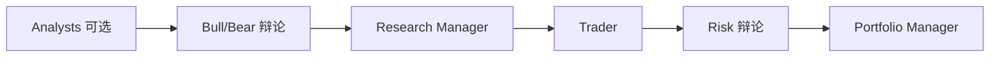

# 量化与金融 Agent（领域）

> **设计导读** · 完整项目矩阵与路径：[_archive/18-quant-stock-agents.md](./_archive/18-quant-stock-agents.md)  
> **TradingAgents 架构深潜**：[23-browser-use-vs-trading-agents.md](./23-browser-use-vs-trading-agents.md) §3（与 browser-use 对照见全文）  
> **关联**：[04-multi-agent](./04-multi-agent.md) MA6 · [HARNESS-SPECTRUM](./HARNESS-SPECTRUM.md)

---

## 1. 一句话

金融/量化 Agent 多为 **Tier 2 领域 Harness**——价值在 **固定辩论拓扑 + 领域工具**，不是通用 coding loop；对比时单独一栏，勿与 Tier 1 混排。

---

## 2. 领域 Harness 的共性

| 维度 | 领域特点 | 通用 Harness 差异 |
|------|----------|-------------------|
| **编排** | 固定 StateGraph / 辩论轮次 | 即兴 ReAct |
| **工具** | 行情、财报、回测 API | bash/git |
| **状态** | 结构化金融 state | messages 为主 |
| **输出** | 报告、仓位建议 | 代码 diff |
| **合规** | 免责声明、不可执行交易 | 相对弱 |

---

## 3. 代表项目（设计级）

| 项目 | 编排 | 多 Agent 模式 | 备注 |
|------|------|-----------------|------|
| **TradingAgents** | 固定图 | MA6 牛熊辩论 → Risk → PM | `max_debate_rounds` |
| **TradingAgents 类 fork** | 同族 | Analyst 可选前置 | Tier 2 |
| **FM-Agent 等** | 管道 + 外部 CLI | 弱 Harness | 非完整对比项 |

---

## 4. 与 Tier 1 的借鉴点

| 可借鉴 | 勿照搬 |
|--------|--------|
| 固定拓扑控制成本 | 整个 graph 硬编码进 coding agent |
| 轮次上限防发散 | 金融 tool 直接进生产 shell |
| 角色专精 prompt | 无沙箱的行情 API |

---

## 5. 设计法则

1. **领域图与通用 Loop 分仓** — 不要一个 repo 两套真源。  
2. **辩论轮次要有硬 cap**。  
3. **工具返回结构化** — 便于 state merge。  
4. **人类审批在下单类 action** — 即使回测也要门控。  
5. **Tier 2 不抬进 Tier 1 矩阵主表** — 见 [01-overview §2.2](./01-overview.md)。

---

## 6. 深潜

项目清单、源码路径、配置项 → [_archive/18-quant-stock-agents.md](./_archive/18-quant-stock-agents.md)
