# Goal 图集：架构 / 模块 / 类 / 端到端流程 / 时序

> **先读主文**：[22-goal-mode.md](./22-goal-mode.md) 的 [§0 / §0.5 / §0.6](./22-goal-mode.md#0-先分清四种goal)（白话 + 术语表）及各节 **白话导读**；图以主文 §2–§16 为准。本文仅为同套图的翻阅副本。  
> **不贴源码**。闭源（Cursor）标「推断」。

---

## 目录

- [2 CodeWhale](#2-codewhale)
- [3 Prime](#3-prime)
- [4 pi-goal](#4-pi-goal)
- [5 DeepSeek Harness](#5-deepseek-harness)
- [6 Codex ext/goal](#6-codex-extgoal)
- [7 Grok Build](#7-grok-build)
- [8 OpenHands](#8-openhands)
- [9 Penguin](#9-penguin)
- [10 nanobot](#10-nanobot)
- [11 Cursor](#11-cursor)
- [12 Hermes](#12-hermes)
- [13 AgentScope](#13-agentscope)
- [14 Strands](#14-strands)
- [15 GenericAgent](#15-genericagent)
- [16 LongHorizon](#16-longhorizon)

---

## 2. CodeWhale

### 模块图

命令、纯决策、会话状态、Turn 接缝、跨 Turn 宿主、落盘记账六块；决策 crate **禁止**做 I/O。

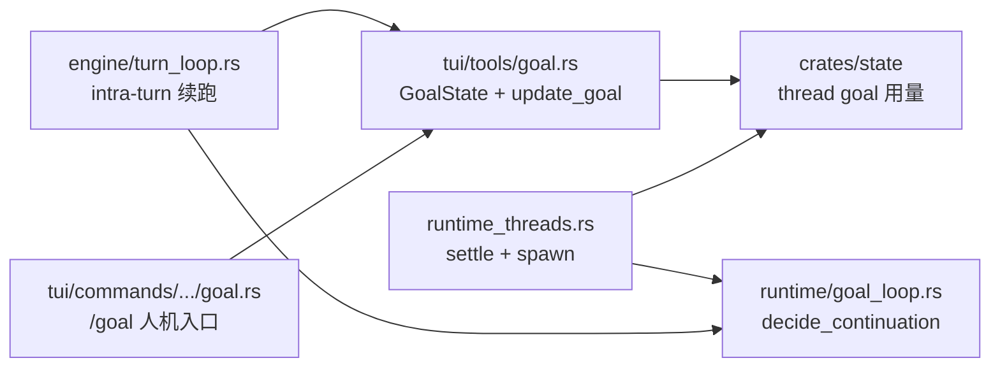
```mermaid
flowchart LR
    CMD["tui/commands/.../goal.rs<br/>/goal 人机入口"]
    TOOL["tui/tools/goal.rs<br/>GoalState + update_goal"]
    DEC["runtime/goal_loop.rs<br/>decide_continuation"]
    ENG["engine/turn_loop.rs<br/>intra-turn 续跑"]
    HOST["runtime_threads.rs<br/>settle + spawn"]
    ST["crates/state<br/>thread goal 用量"]

    CMD --> TOOL
    ENG --> DEC
    ENG --> TOOL
    HOST --> DEC
    HOST --> ST
    TOOL --> ST
```

### 架构图

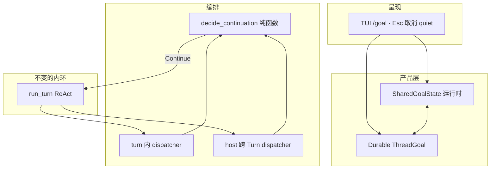
```mermaid
flowchart TB
    subgraph UI["呈现"]
        TUI[TUI /goal · Esc 取消 quiet]
    end
    subgraph PROD["产品层"]
        GS[SharedGoalState 运行时]
        TG[Durable ThreadGoal]
    end
    subgraph ORCH["编排"]
        D[decide_continuation 纯函数]
        IN[turn 内 dispatcher]
        HO[host 跨 Turn dispatcher]
    end
    subgraph L1["不变的内环"]
        RT[run_turn ReAct]
    end
    TUI --> GS
    TUI --> TG
    RT --> IN
    IN --> D
    RT --> HO
    HO --> D
    D -->|Continue| RT
    GS <--> TG
```

### 类图

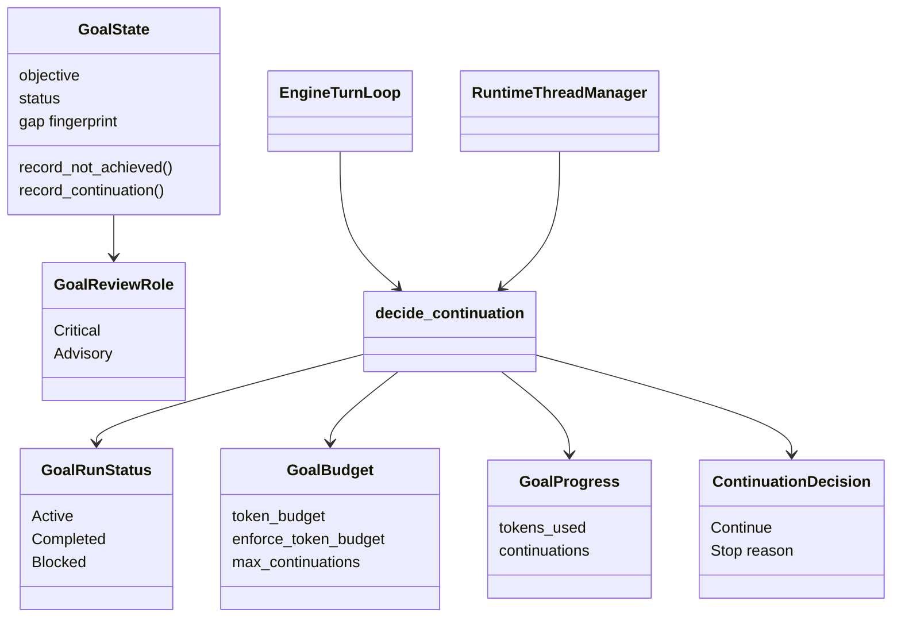
```mermaid
classDiagram
    class GoalRunStatus {
        Active
        Completed
        Blocked
    }
    class GoalBudget {
        token_budget
        enforce_token_budget
        max_continuations
    }
    class GoalProgress {
        tokens_used
        continuations
    }
    class ContinuationDecision {
        Continue
        Stop reason
    }
    class GoalState {
        objective
        status
        gap fingerprint
        record_not_achieved()
        record_continuation()
    }
    class GoalReviewRole {
        Critical
        Advisory
    }
    decide_continuation --> GoalRunStatus
    decide_continuation --> GoalBudget
    decide_continuation --> GoalProgress
    decide_continuation --> ContinuationDecision
    GoalState --> GoalReviewRole
    EngineTurnLoop --> decide_continuation
    RuntimeThreadManager --> decide_continuation
```

### 流程注释（逐步）

```
① 用户 /goal <objective> [budget]
   命令层写入 durable ThreadGoal = Active，并 sync SharedGoalState。
   这一步不跑模型。

② 引擎开普通 run_turn（内环未改）
   工具表若无 update_goal → 后面整条续跑管道直接短路（否则永无 complete 路径）。
   Goal 活跃时 max_steps 提到 1000。

③ 模型在本 Turn 内工作
   可 update_goal(complete|blocked|paused)、可触发 Critical review。
   Advisory 只追加笔记，不能改终态。
   Critical 报同一 gap 集合：按 continuation pass 计数，满 3 → Pause(NoProgress)。

④ Turn 干净结束
   ④a intra-turn：goal_continuation_allowed → decide_continuation
      终态 / 强制 token / max_continuations → Stop，不进 quiet。
      Continue → 可配置 delay（Esc 取消优先于定时器）。
      wait 后再读 live 状态：pause/clear/换 goal_id → 不计数、不发消息。
      通过则 continuation_count+1，发出 continuation 文案，本 Turn 内再进 run_turn。
   ④b host settle（host-managed）：Turn 必须 Completed。
      镜像 cap / 强制预算为 durable Paused。
      catalog 无 update_goal → park。
      否则 spawn_goal_continuation(delay)。
      失败 Turn 保持 Active，不自动再开火。

⑤ 两条路径禁止对同一次续跑双计；quiet 上限 24h。
```

### 端到端流程图

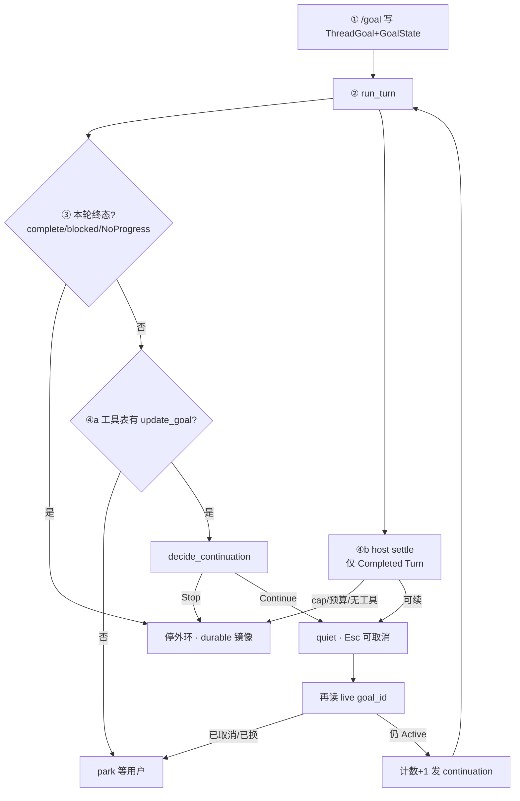
```mermaid
flowchart TD
    A["① /goal 写 ThreadGoal+GoalState"] --> B["② run_turn"]
    B --> C{"③ 本轮终态?<br/>complete/blocked/NoProgress"}
    C -->|是| Z[停外环 · durable 镜像]
    C -->|否| D{"④a 工具表有 update_goal?"}
    D -->|否| P[park 等用户]
    D -->|是| E[decide_continuation]
    E -->|Stop| Z
    E -->|Continue| F[quiet · Esc 可取消]
    F --> G[再读 live goal_id]
    G -->|已取消/已换| P
    G -->|仍 Active| H["计数+1 发 continuation"]
    H --> B
    B --> I["④b host settle<br/>仅 Completed Turn"]
    I -->|cap/预算/无工具| Z
    I -->|可续| F
```

### 时序图

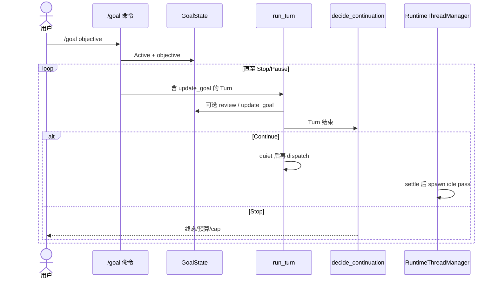
```mermaid
sequenceDiagram
    actor U as 用户
    participant Cmd as /goal 命令
    participant GS as GoalState
    participant E as run_turn
    participant D as decide_continuation
    participant H as RuntimeThreadManager

    U->>Cmd: /goal objective
    Cmd->>GS: Active + objective
    loop 直至 Stop/Pause
        Cmd->>E: 含 update_goal 的 Turn
        E->>GS: 可选 review / update_goal
        E->>D: Turn 结束
        alt Continue
            E->>E: quiet 后再 dispatch
            H->>H: settle 后 spawn idle pass
        else Stop
            D-->>U: 终态/预算/cap
        end
    end
```

---

## 3. Prime

### 模块图

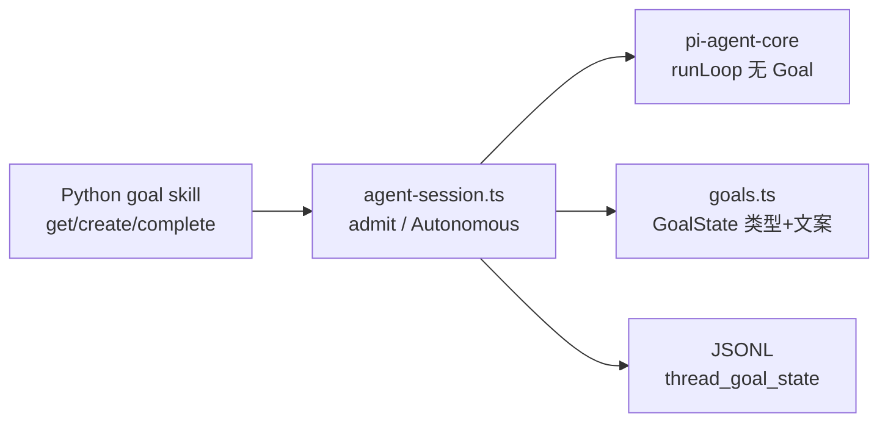
```mermaid
flowchart LR
    CORE["pi-agent-core<br/>runLoop 无 Goal"]
    GS["goals.ts<br/>GoalState 类型+文案"]
    AS["agent-session.ts<br/>admit / Autonomous"]
    SK["Python goal skill<br/>get/create/complete"]
    JL["JSONL<br/>thread_goal_state"]

    AS --> CORE
    AS --> GS
    AS --> JL
    SK --> AS
```

### 架构图

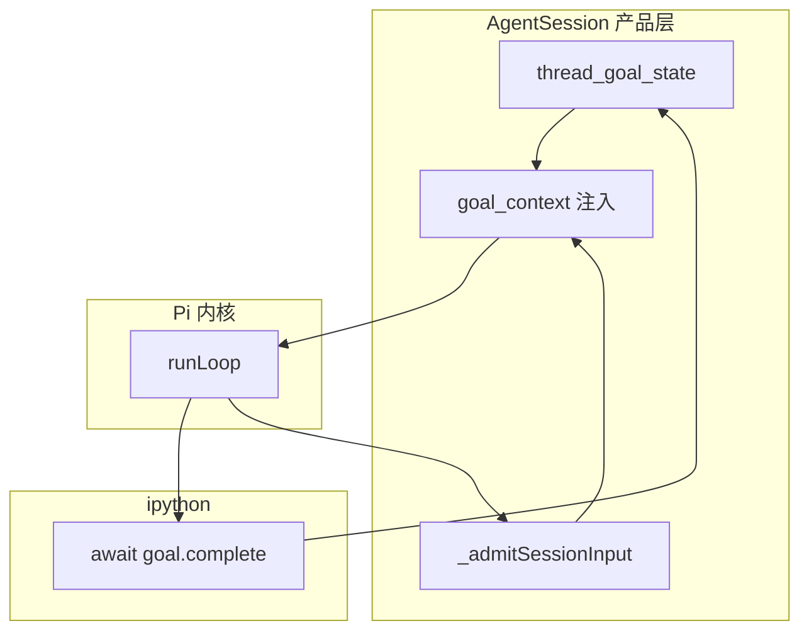
```mermaid
flowchart TB
    subgraph SESSION["AgentSession 产品层"]
        ST[thread_goal_state]
        CX[goal_context 注入]
        AD[_admitSessionInput]
    end
    subgraph LOOP["Pi 内核"]
        RL[runLoop]
    end
    subgraph PY["ipython"]
        GC[await goal.complete]
    end
    ST --> CX --> RL
    RL --> GC
    GC --> ST
    RL --> AD
    AD --> CX
```

### 类图

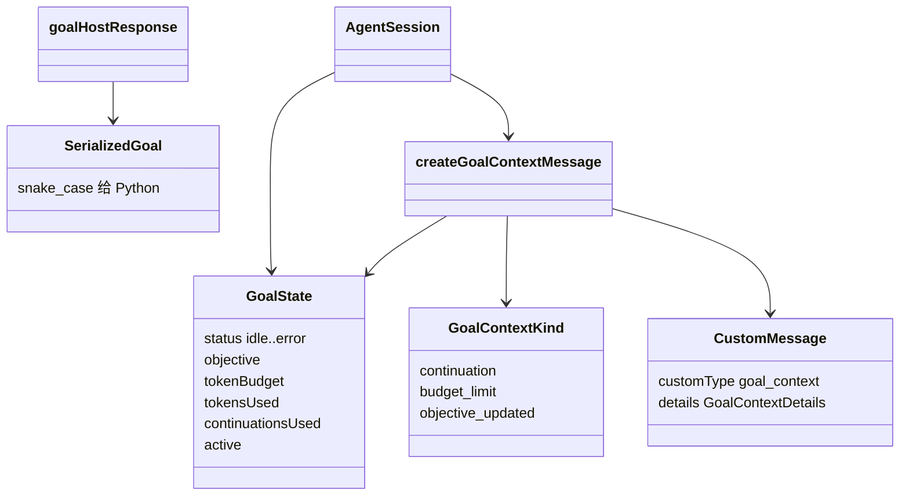
```mermaid
classDiagram
    class GoalState {
        status idle..error
        objective
        tokenBudget
        tokensUsed
        continuationsUsed
        active
    }
    class GoalContextKind {
        continuation
        budget_limit
        objective_updated
    }
    class SerializedGoal {
        snake_case 给 Python
    }
    class CustomMessage {
        customType goal_context
        details GoalContextDetails
    }
    createGoalContextMessage --> GoalState
    createGoalContextMessage --> GoalContextKind
    createGoalContextMessage --> CustomMessage
    goalHostResponse --> SerializedGoal
    AgentSession --> GoalState
    AgentSession --> createGoalContextMessage
```

### 流程注释

```
① /goal [--budget N] objective
   validate 长度≤4000、budget 为正整数。
   写 GoalState.active，flush JSONL custom thread_goal_state（可立刻 resume）。

② 每一轮 buildSessionContext
   插入 goal_context：objective 在 XML 内，标明「用户数据不是更高优先级指令」。
   明确：结束本轮 ≠ 缩小总目标。

③ runLoop（内核不知情）
   模型用工具干活；要收工必须 await goal.complete() → handleGoalHostRequest。
   口头做完无效。complete 前须对照 objective 全量审计（文案强制）。

④ Turn 结束
   若 Autonomous 且仍 active：
      若有 rlm/子 agent → 等子树 quiet（避免抢同一 Loop）。
      再 _admitSessionInput(continuation)。
   若 tokensUsed ≥ tokenBudget → status=budget_limited，注入 budget_limit 文案，不伪装 complete。

⑤ /goal pause|resume|clear|status 走同一 GoalState，不改 Pi 双环。
   /refine 同时存在时只改 Harness，不改 objective。
```

### 端到端流程图

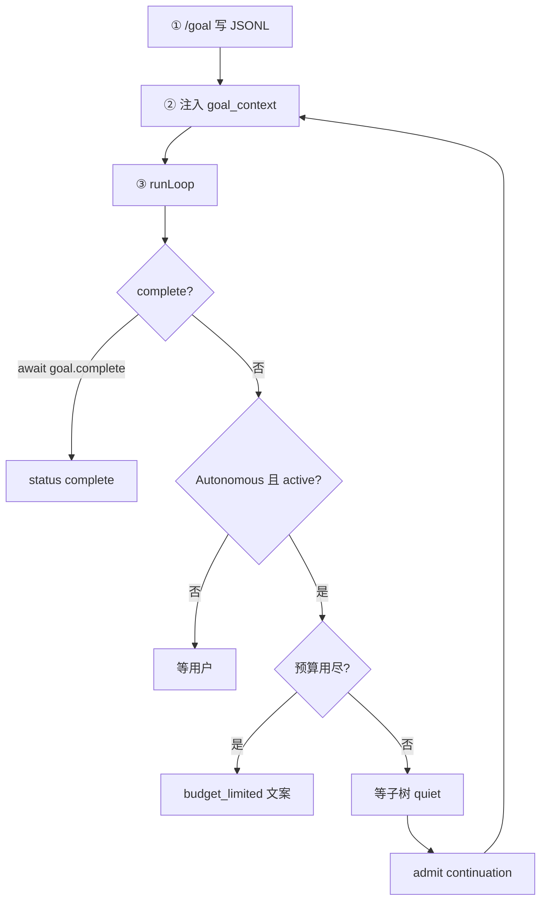
```mermaid
flowchart TD
    A[① /goal 写 JSONL] --> B[② 注入 goal_context]
    B --> C[③ runLoop]
    C --> D{complete?}
    D -->|await goal.complete| Z[status complete]
    D -->|否| E{Autonomous 且 active?}
    E -->|否| W[等用户]
    E -->|是| F{预算用尽?}
    F -->|是| BL[budget_limited 文案]
    F -->|否| G[等子树 quiet]
    G --> H[admit continuation]
    H --> B
```

### 时序图

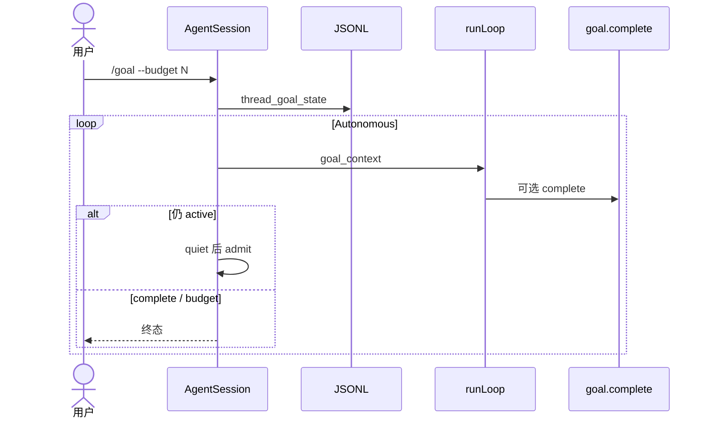
```mermaid
sequenceDiagram
    actor U as 用户
    participant AS as AgentSession
    participant J as JSONL
    participant L as runLoop
    participant K as goal.complete

    U->>AS: /goal --budget N
    AS->>J: thread_goal_state
    loop Autonomous
        AS->>L: goal_context
        L->>K: 可选 complete
        alt 仍 active
            AS->>AS: quiet 后 admit
        else complete / budget
            AS-->>U: 终态
        end
    end
```

---

## 4. pi-goal

### 模块图

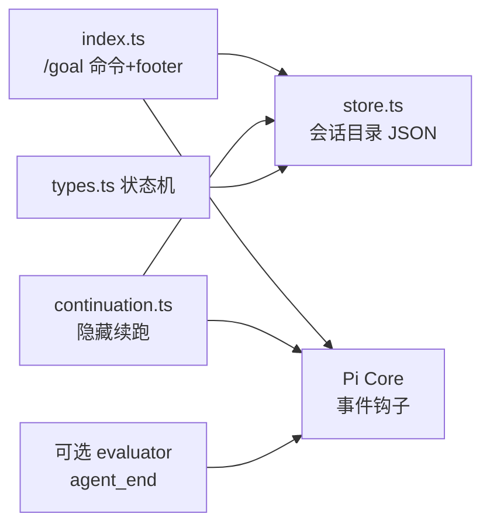
```mermaid
flowchart LR
    IDX["index.ts<br/>/goal 命令+footer"]
    ST["store.ts<br/>会话目录 JSON"]
    CT["continuation.ts<br/>隐藏续跑"]
    TY["types.ts 状态机"]
    EV["可选 evaluator<br/>agent_end"]
    PI["Pi Core<br/>事件钩子"]

    IDX --> ST
    IDX --> PI
    CT --> PI
    CT --> ST
    EV --> PI
    TY --> ST
```

### 架构图

```mermaid
flowchart TB
    subgraph PLUGIN["pi-goal 扩展"]
        C[/goal 命令]
        T[get/create/update_goal]
        H[turn_end / agent_end 钩子]
    end
    subgraph CORE["Pi 418 行内核"]
        Q[sendUserMessage 队列]
        L[runLoop]
    end
    C --> Q
    H -->|干净结束| Q
    Q --> L
    L --> T
```

### 类图

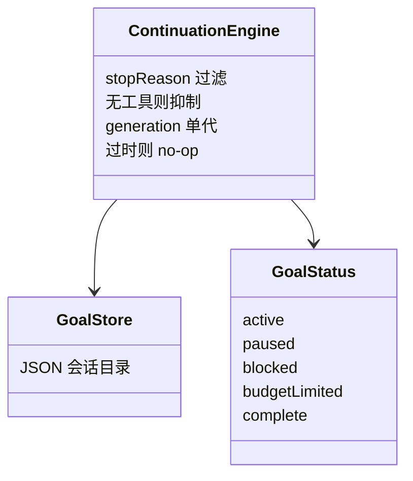
```mermaid
classDiagram
    class GoalStatus {
        active
        paused
        blocked
        budgetLimited
        complete
    }
    class ContinuationEngine {
        stopReason 过滤
        无工具则抑制
        generation 单代
        过时则 no-op
    }
    class GoalStore {
        JSON 会话目录
    }
    ContinuationEngine --> GoalStore
    ContinuationEngine --> GoalStatus
```

### 流程注释

```
① /goal <obj> → store 写 active（无持久会话则退扩展目录）。
② 模型只能 update_goal{complete}，不能自己 pause（人用 Esc / /goal pause）。
③ turn 结束看 stopReason：仅 stop/toolUse/length 且 active 才续。
④ 本轮零工具调用 → 视为无进展，不续（防空转闲聊）。
⑤ 注入隐藏 continuation：objective XML 转义。
⑥ turn 期间 clear/pause/replace → 已排队续跑改写为 no-op 并中止（过时保护）。
⑦ 同一时刻只允许一代 continuation（generation 调度）。
⑧ 非交互 --goal：agent_end 用 evaluator 读完整 messages → Met 清目标 / Impossible 停 / Not yet sendUserMessage(continue)。
```

### 端到端流程图

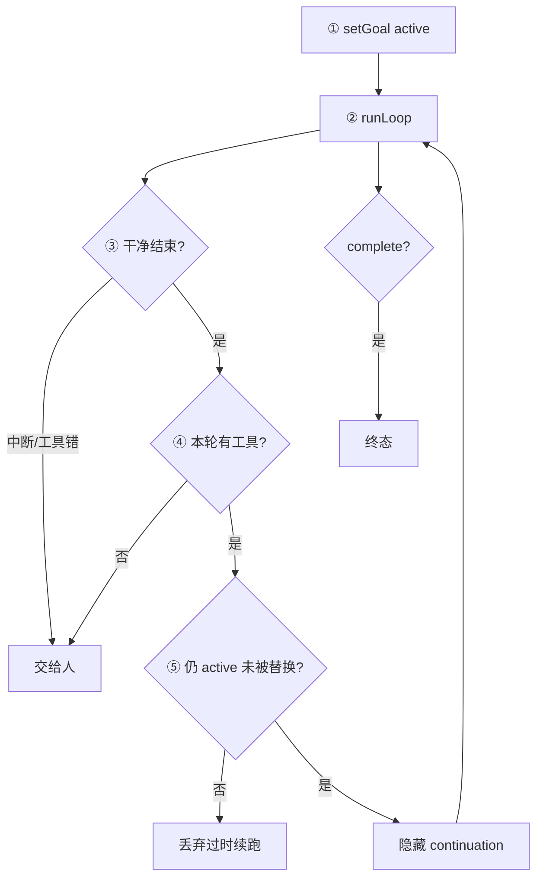
```mermaid
flowchart TD
    A[① setGoal active] --> B[② runLoop]
    B --> C{③ 干净结束?}
    C -->|中断/工具错| W[交给人]
    C -->|是| D{④ 本轮有工具?}
    D -->|否| W
    D -->|是| E{⑤ 仍 active 未被替换?}
    E -->|否| N[丢弃过时续跑]
    E -->|是| F[隐藏 continuation]
    F --> B
    B --> G{complete?}
    G -->|是| Z[终态]
```

### 时序图

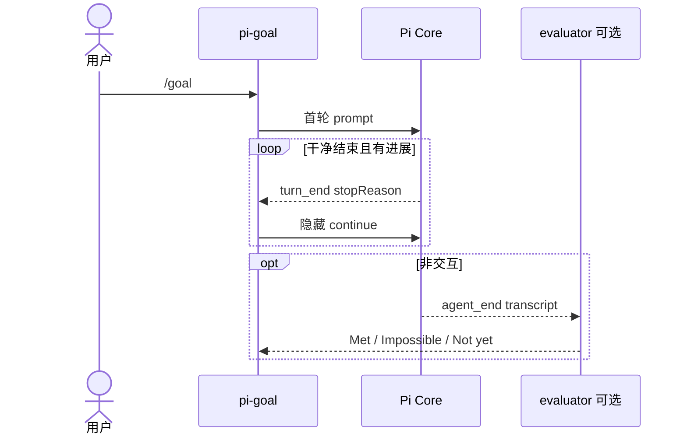
```mermaid
sequenceDiagram
    actor U as 用户
    participant P as pi-goal
    participant C as Pi Core
    participant E as evaluator 可选

    U->>P: /goal
    P->>C: 首轮 prompt
    loop 干净结束且有进展
        C-->>P: turn_end stopReason
        P->>C: 隐藏 continue
    end
    opt 非交互
        C-->>E: agent_end transcript
        E-->>P: Met / Impossible / Not yet
    end
```

---

## 5. DeepSeek Harness

### 模块图

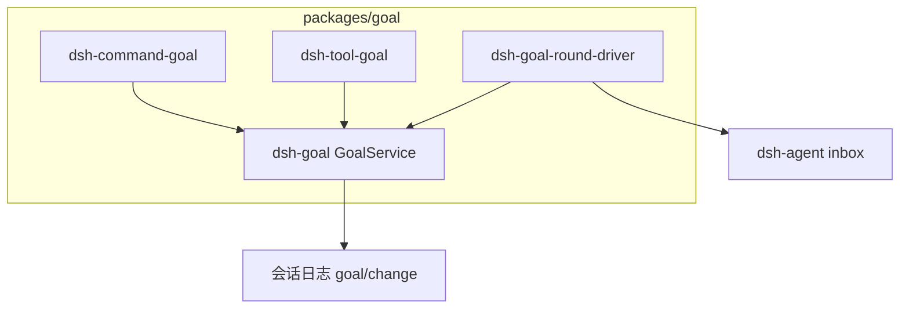
```mermaid
flowchart TB
    subgraph PACK["packages/goal"]
        SVC[dsh-goal GoalService]
        TOOL[dsh-tool-goal]
        CMD[dsh-command-goal]
        DRV[dsh-goal-round-driver]
    end
    LOG[会话日志 goal/change]
    AG[dsh-agent inbox]
    SVC --> LOG
    CMD --> SVC
    TOOL --> SVC
    DRV --> SVC
    DRV --> AG
```

### 架构图

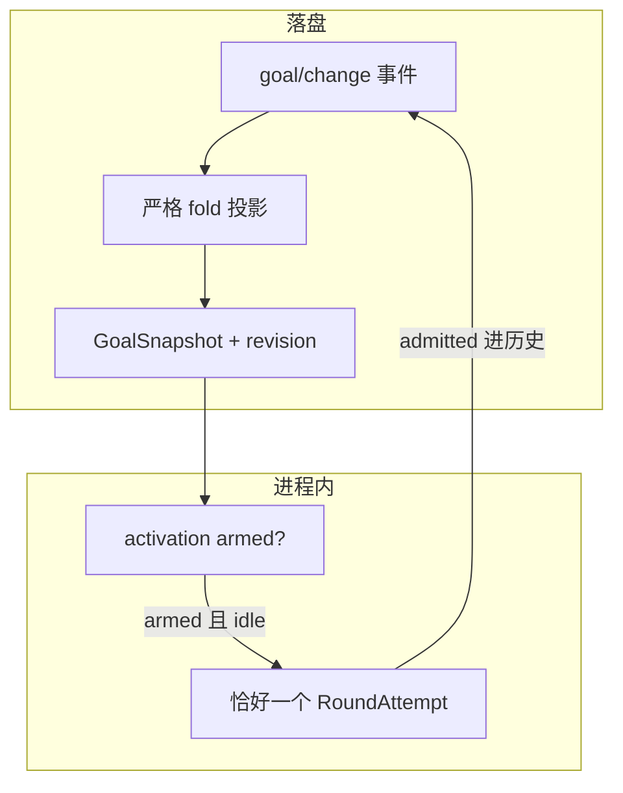
```mermaid
flowchart TB
    subgraph DURABLE["落盘"]
        EV[goal/change 事件]
        FOLD[严格 fold 投影]
        SNAP[GoalSnapshot + revision]
    end
    subgraph LIVE["进程内"]
        ACT[activation armed?]
        ATT[恰好一个 RoundAttempt]
    end
    EV --> FOLD --> SNAP
    SNAP --> ACT
    ACT -->|armed 且 idle| ATT
    ATT -->|admitted 进历史| EV
```

### 类图

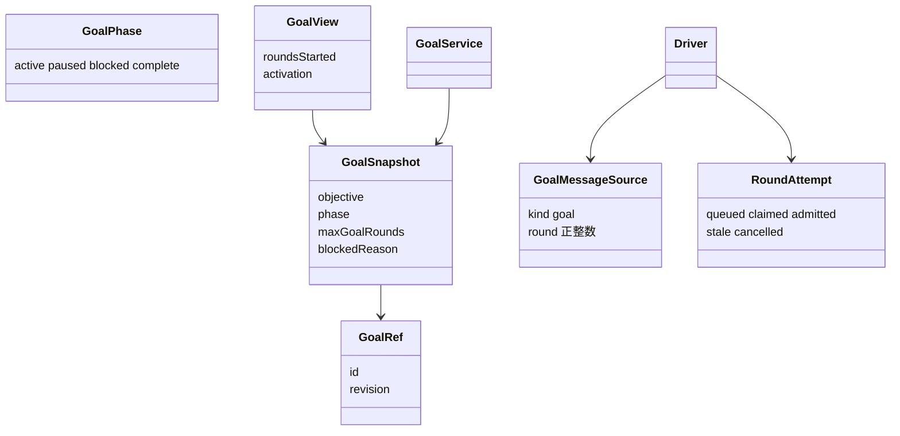
```mermaid
classDiagram
    class GoalRef {
        id
        revision
    }
    class GoalPhase {
        active paused blocked complete
    }
    class GoalSnapshot {
        objective
        phase
        maxGoalRounds
        blockedReason
    }
    class GoalView {
        roundsStarted
        activation
    }
    class GoalMessageSource {
        kind goal
        round 正整数
    }
    class RoundAttempt {
        queued claimed admitted
        stale cancelled
    }
    GoalSnapshot --> GoalRef
    GoalView --> GoalSnapshot
    GoalService --> GoalSnapshot
    Driver --> RoundAttempt
    Driver --> GoalMessageSource
```

### 流程注释

```
① 人类 /goal 或顶层 create_goal（必须人类顶层 Turn）
   GoalService.create：写 goal/change 全量 snapshot，revision=1，默认 armed。
   已有未完成 phase 时不能 create，须 clear 或 resume。

② 模型 get_goal 抄回 id+revision；后续 update 必须 CAS。
   edit/pause/resume 仍要求人类顶层请求。
   complete/blocked 可在自主 round；blocked 默认同一条件连续 3 round。

③ Driver：agent idle 且 activation=armed
   reserve {goalId, revision, round} → queued。
   与人类消息竞争 inbox：competingQueued，禁止两 round 并行扣额度。
   claimed → admitted 进入会话历史后，才 roundsStarted++ 并占用 maxGoalRounds。
   排队失败/取消/stale 不扣额度。

④ goal/changed 时 flush，revision 对不上则 stale。
   整 Agent quiescence 后才清 attempt。

⑤ round 用尽 → durable blocked(code=round-limit) 并 disarm。
   卸载 driver / fork / resume 会话 → 典型 disarm，人再 resume 才自动烧 round。
```

### 端到端流程图

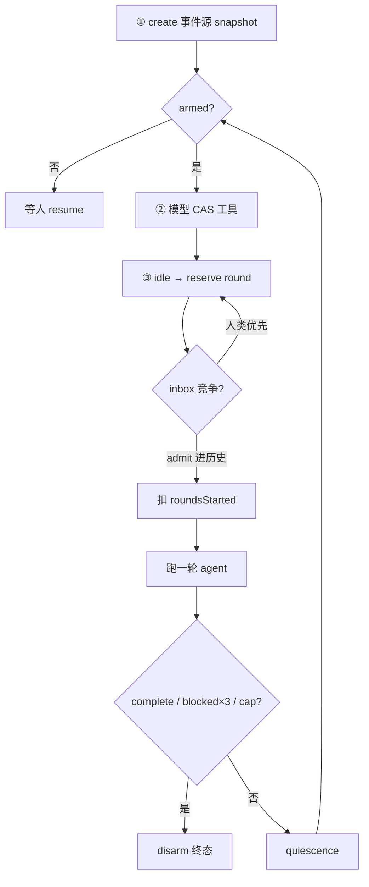
```mermaid
flowchart TD
    A[① create 事件源 snapshot] --> B{armed?}
    B -->|否| W[等人 resume]
    B -->|是| C[② 模型 CAS 工具]
    C --> D[③ idle → reserve round]
    D --> E{inbox 竞争?}
    E -->|人类优先| D
    E -->|admit 进历史| F[扣 roundsStarted]
    F --> G[跑一轮 agent]
    G --> H{complete / blocked×3 / cap?}
    H -->|是| Z[disarm 终态]
    H -->|否| I[quiescence]
    I --> B
```

### 时序图

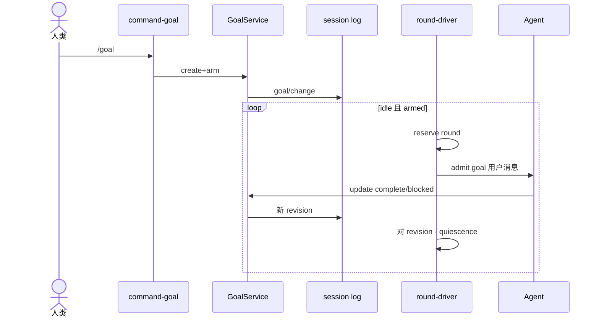
```mermaid
sequenceDiagram
    actor H as 人类
    participant Cmd as command-goal
    participant S as GoalService
    participant Log as session log
    participant Drv as round-driver
    participant Ag as Agent

    H->>Cmd: /goal
    Cmd->>S: create+arm
    S->>Log: goal/change
    loop idle 且 armed
        Drv->>Drv: reserve round
        Drv->>Ag: admit goal 用户消息
        Ag->>S: update complete/blocked
        S->>Log: 新 revision
        Drv->>Drv: 对 revision · quiescence
    end
```

---

## 6. Codex ext/goal

### 模块图

```mermaid
flowchart LR
    UG["core/context/user_goal.rs<br/>仅 host 标注"]
    TUI["tui thread_goal_actions"]
    EXT["ext/goal"]
    SPEC[spec 工具定义]
    RT[runtime idle 续跑]
    ACC[accounting]
    ST[steering 模板]
    DB[codex_state thread_goals]

    TUI --> UG
    TUI --> DB
    EXT --> SPEC
    EXT --> RT
    RT --> ST
    RT --> ACC
    RT --> DB
```

### 架构图

```mermaid
flowchart TB
    subgraph AUTH["权威分离"]
        USER[UserGoalUpdate host-only]
        TOOL[create/update_goal 模型]
    end
    subgraph CORE["未改的 Step 内核"]
        STEP[Turn + needs_follow_up 内环]
    end
    subgraph EXT["扩展运行时"]
        RT[GoalRuntimeHandle]
        IDLE[start_turn_if_idle]
        FRAG[goal steering fragment]
    end
    USER --> DB[(thread_goals)]
    TOOL --> DB
    DB --> RT
    RT --> IDLE
    IDLE --> FRAG --> STEP
```

### 类图

```mermaid
classDiagram
    class UserGoalUpdate {
        Set objective status
        Clear
        禁止从工具构造
    }
    class GoalRuntimeHandle {
        Semaphore 锁
        start_turn_if_idle
        mark_goal_continuation
    }
    class GoalAccountingState {
        tokens
        budget_limited disposition
    }
    class ThreadGoal {
        status Active
        objective
        token_budget
    }
    GoalRuntimeHandle --> ThreadGoal
    GoalRuntimeHandle --> GoalAccountingState
    continuation_steering_item --> ThreadGoal
```

### 流程注释

```
① 仅 saved thread 可设 goal（临时 session 拒绝）。
② 用户改 goal：必须带 content_item_kind=user.goal；过大 objective 整段省略，防截断提权。
③ 模型 create_goal 仅当用户明确要求；未完成 goal 存在则失败。
④ update_goal：pause 仅用户要求；complete 须真做完；blocked 须同一条件连续 ≥3 个 goal turn；预算优先于 pause。
⑤ Thread idle：持 permit 读 goal → 若 deferral 则跳过 → 非 Active 清 accounting。
⑥ continuation 做成 InternalModelContextFragment(source=goal)，turn_trigger="goal"。
⑦ Started 则 mark_goal_continuation(turn_id)，Turn-stop 会计能对上同一把锁。
⑧ NotSubmitted（非空闲）则跳过，不排队爆炸。
⑨ budget_limited：模板要求收口，不要再开实质工作，也不要假装 complete。
⑩ 内环 needs_follow_up 仍可在同一 Turn 转工具；与外环 Goal 独立。
```

### 端到端流程图

```mermaid
flowchart TD
    A[① 用户/工具写入 thread_goals] --> B[② 普通 Turn + 工具]
    B --> C{③ update_goal 终态?}
    C -->|complete/blocked/paused| Z[停续跑]
    C -->|否| D{thread idle?}
    D -->|否| D
    D -->|是| E{deferral?}
    E -->|是| W[推迟]
    E -->|否| F[permit 下读 Active]
    F --> G[steering fragment]
    G --> H[start_turn_if_idle]
    H -->|Started| B
    H -->|NotSubmitted| W
```

### 时序图

```mermaid
sequenceDiagram
    actor U as 用户
    participant TUI as TUI /goal
    participant DB as thread_goals
    participant RT as GoalRuntime
    participant TM as ThreadManager

    U->>TUI: set goal
    TUI->>DB: UserGoalUpdate
    loop Active
        TM->>TM: Turn 跑完变 idle
        RT->>RT: 获取 permit
        RT->>DB: get_thread_goal
        RT->>TM: start_turn_if_idle steering
        TM-->>RT: Started turn_id
        RT->>RT: mark_goal_continuation
    end
```

---

## 7. Grok Build

### 模块图

```mermaid
flowchart TB
    TR[goal_tracker.rs 纯状态机]
    PL[goal_planner.rs]
    EV[goal_evaluator.rs]
    CL[goal_classifier.rs]
    ST[goal_strategist.rs]
    SD[goal_stop_detector.rs]
    SM[goal_summarizer.rs]
    ACP[acp_session_impl/goal.rs]
    SA[SessionActor]

    SA --> ACP
    ACP --> TR
    ACP --> PL
    ACP --> EV
    ACP --> CL
    ACP --> ST
    ACP --> SD
    ACP --> SM
```

### 架构图

```mermaid
flowchart TB
    subgraph L1["L1 Goal 状态机"]
        TR[GoalTracker]
    end
    subgraph L2["L2 计划/验收"]
        PL[Planner 契约]
        VR[Verifier 面板]
        ST[Strategist 只改 HOW]
    end
    subgraph L3["L3 普通 Turn"]
        PT[process_conversation_turn]
    end
    TR --> PL
    PL --> PT
    PT --> VR
    VR -->|NotAchieved| PT
    VR -->|结构卡住| ST
    ST --> PT
```

### 类图

```mermaid
classDiagram
    class GoalPhase {
        Idle Planning Executing
    }
    class GoalStatus {
        Active
        UserPaused BackOffPaused
        NoProgressPaused InfraPaused
        Blocked BudgetLimited Complete
    }
    class GoalPauseReason {
        User BackOff NoProgress
        Verification Infra Planner
    }
    class GoalClassifierVerdict {
        Achieved NotAchieved
    }
    class GoalTracker {
        snapshot()
        pause()
        无 I/O
    }
    GoalTracker --> GoalPhase
    GoalTracker --> GoalStatus
    GoalTracker --> GoalPauseReason
    SessionActor --> GoalTracker
    SessionActor --> GoalClassifierVerdict
```

### 流程注释

```
① /goal：Tracker → Planning。损坏/未知 status 反序列化为 UserPaused，禁止幽灵 Active。
② Planner 写验收契约（goal/plan.md）；失败 closed → InfraPaused(Planner)，不当成用户暂停。
③ 进入 Executing：Implementer = 父会话本体，禁止追问（与 Plan mode 相反）。
④ L3 Turn 结束不把控制权交还用户，进入 evaluate_goal_round。
⑤ Evaluator/Verifier 面板：skeptic 至少 read+grep；缺能力 fail-open 回当前模型。
⑥ Achieved → Complete。NotAchieved → 下一 Implementer Turn。
⑦ 同一 gap 指纹连续 2 次 → NoProgressPaused（不必先撞 cap）。
⑧ 结构问题 → Strategist 只改 HOW；一次性格外 +3 轮 cap，stall 阈值同步放宽。
⑨ 撞 classifier run cap → BackOffPaused。Turn Err → InfraPaused。
⑩ 压缩后 compaction reseed：摘要不得把 Active 自动驾驶弄丢或凭空复活。
```

### 端到端流程图

```mermaid
flowchart TD
    A[① /goal] --> B[② Planner 契约]
    B -->|planner 失败| IP[InfraPaused]
    B --> C[③ Implementer Turn]
    C --> D[④⑤ 评估/Verifier]
    D -->|Achieved| OK[Complete]
    D -->|同 gap×2| NP[NoProgressPaused]
    D -->|NotAchieved| C
    D -->|HOW 卡住| S[Strategist]
    S --> C
    D -->|cap| BO[BackOffPaused]
    C -->|Turn Err| IP
```

### 时序图

```mermaid
sequenceDiagram
    actor U as 用户
    participant SA as SessionActor
    participant TR as GoalTracker
    participant P as Planner
    participant T as L3 Turn
    participant V as Verifier 面板
    participant S as Strategist

    U->>SA: /goal
    SA->>TR: Planning
    SA->>P: 写契约
    P-->>TR: Executing
    loop 直到 Complete/Pause
        SA->>T: Implementer
        T-->>SA: turn 结束
        SA->>V: 对抗验收
        alt Achieved
            V-->>TR: Complete
        else 同 gap stall
            V-->>TR: NoProgressPaused
        else 需改 HOW
            SA->>S: 不改验收标准
        else 继续
            SA->>T: 下一轮
        end
    end
```

---

## 8. OpenHands

### 模块图

```mermaid
flowchart LR
    CTL[controller.py 无 I/O]
    RUN[runner.py run_goal]
    J[judge.py]
    PR[prompts.py]
    SV[agent-server 异步 driver]
    CONV[conversation.run]
    UI[goal-status-content]

    RUN --> CTL
    SV --> CTL
    CTL --> J
    J --> PR
    RUN --> CONV
    SV --> UI
```

### 架构图

```mermaid
flowchart TB
    subgraph OUTER["外环 /goal"]
        C[GoalController]
        J[Judge LLM]
    end
    subgraph INNER["内环 每次 run"]
        A[conversation.run]
        CR[可选 critic]
    end
    C -->|start objective| A
    A -->|events| C
    C --> J
    J -->|missing| A
    CR -.-> A
```

### 类图

```mermaid
classDiagram
    class GoalController {
        objective
        iteration
        max_iterations
        start()
        on_run_finished()
    }
    class GoalVerdict {
        score
        complete
        missing
    }
    class GoalContinue {
        followup
        verdict
    }
    class GoalDone {
        outcome complete 或 capped
    }
    class GoalStatus {
        running complete capped interrupted
    }
    GoalController --> GoalVerdict
    GoalController --> GoalContinue
    GoalController --> GoalDone
    judge_goal --> GoalVerdict
```

### 流程注释

```
① run_goal(conv, objective, judge_llm, max_iterations=10)
   Controller 无表、无 pause；objective 活在实例 + 对话事件。
② start() 的第一条消息就是 objective 原文。
③ conversation.run()：内环可含 critic，管局部质量，不管总目标。
④ on_run_finished：iteration++，judge 只看非 system 的可转换事件。
⑤ 强制 judge 非流式。JSON 解析失败 → complete=False（宁可继续）。
⑥ complete → GoalDone(complete)。否则 iteration≥cap → GoalDone(capped)（两种终态必须区分）。
⑦ 否则 FOLLOWUP 填 missing，send_message 再 run。
⑧ Server 每次生命周期推 ConversationStateUpdateEvent(key=goal) 给 UI chip。
```

### 端到端流程图

```mermaid
flowchart TD
    A[①② 发送 objective] --> B[③ run]
    B --> C[④⑤ judge]
    C -->|complete| OK[Done complete]
    C -->|解析失败| D[当作未完成]
    D --> E{⑥ 达 max_iterations?}
    C -->|未完成| E
    E -->|是| CAP[Done capped]
    E -->|否| F[⑦ followup=missing]
    F --> B
```

### 时序图

```mermaid
sequenceDiagram
    participant D as run_goal
    participant C as GoalController
    participant A as conversation
    participant J as Judge LLM
    participant UI as goal 事件

    D->>C: start
    D->>A: send objective
    D->>UI: running
    loop
        D->>A: run
        D->>C: on_run_finished
        C->>J: judge_goal
        alt complete / capped
            C-->>D: GoalDone
            D->>UI: terminal
        else
            C-->>D: GoalContinue
            D->>A: send missing
            D->>UI: iteration++
        end
    end
```

---

## 9. Penguin

### 模块图

```mermaid
flowchart LR
    S[session.run]
    GL[runGoalLoop]
    GF[GOAL.yaml 读写]
    GP[goal-prompts 每轮块]
    GS[goal-stream goal_finished]
    CE[ContextEngine 单 Task]

    S -->|opts.goal| GL
    S -->|无 goal| CE
    GL --> GF
    GL --> GP
    GL --> CE
    GL --> GS
```

### 架构图

```mermaid
flowchart TB
    subgraph MEM["权威在内存"]
        OBJ[objective]
        BUD[token 计数]
        CAP[maxRounds 默认100]
    end
    subgraph DISK["mailbox 非真源"]
        Y[GOAL.yaml 系统只写一次]
    end
    subgraph ROUND["每 round 普通 Task"]
        IN["yield [goal] 用户消息"]
        T[runTask]
        RD[读 status]
    end
    OBJ --> IN --> T --> RD
    Y -.->|模型可写 complete/blocked| RD
    BUD --> ROUND
```

### 类图

```mermaid
classDiagram
    class GoalFile {
        objective
        status active complete blocked
    }
    class GoalLoopOptions {
        budget
        maxRounds
    }
    class GoalRoundRunner {
        跑一轮普通 Task
    }
    class GoalOutcome {
        complete blocked
        budget_limited aborted
    }
    runGoalLoop --> GoalLoopOptions
    runGoalLoop --> GoalRoundRunner
    runGoalLoop --> GoalFile
    runGoalLoop --> GoalOutcome
```

### 流程注释

```
① session.run(..., {goal}) 分流到 runGoalLoop；系统写一次 GOAL.yaml（objective+active）。
② 之后磁盘 objective 改了也不算：每 round [goal] 块用内存权威重申。
③ yield round 输入（订阅者/Trace 需要）→ 再跑普通 Task。
④ Task 后读 GOAL.yaml：complete/blocked 停；解析失败/缺失 → 当作 blocked 交给人。
⑤ 系统 budget_limited/aborted 只走流上恰好一条 goal_finished，不写回 YAML（恢复点仍是模型最后一笔）。
⑥ 引擎 abort / stop_reason=failed → 不再开火（否则同一 cutoff 死循环）。
⑦ maxRounds 默认 100，-1 关闭；无预算且模型永不写文件时这是保险丝。
⑧ 预算将尽先 wrap-up 消息，不硬杀进行中的一轮。
```

### 端到端流程图

```mermaid
flowchart TD
    A[① 写一次 YAML] --> B[②③ yield 后 runTask]
    B --> C{④ 文件 status}
    C -->|complete/blocked/坏文件| Z[goal_finished]
    C -->|active| D{⑤⑥ abort/failed?}
    D -->|是| Z
    D -->|否| E{⑦ 轮帽/预算?}
    E -->|预算尽| W[wrap-up 再 finished]
    E -->|帽| Z
    E -->|否| B
```

### 时序图

```mermaid
sequenceDiagram
    participant S as Session
    participant L as runGoalLoop
    participant F as GOAL.yaml
    participant T as runTask
    participant Out as 流

    S->>L: opts.goal
    L->>F: 只写一次
    loop
        L->>Out: [goal] round 输入
        L->>T: 普通 Task
        T-->>L: 结束
        L->>F: 读 status
        alt 终态或帽
            L->>Out: 恰好一条 goal_finished
        end
    end
```

---

## 10. nanobot

### 模块图

```mermaid
flowchart LR
    CMD["/goal 命令"]
    ST[goal_state.py metadata]
    TC[turn_continuation.py]
    LP[AgentLoop 只调 helper]
    TL[create/update_goal 工具]

    CMD --> ST
    LP --> TC
    TC --> ST
    TL --> ST
```

### 架构图

```mermaid
flowchart TB
    META["session.metadata goal_state"]
    RC[Runtime Context 行]
    LOOP[AgentLoop]
    POL["continuation 策略<br/>不进 Loop 内核"]
    META --> RC --> LOOP
    LOOP --> POL
    POL -->|内部消息| LOOP
```

### 类图

```mermaid
classDiagram
    class GoalStateBlob {
        status active 才续
        objective
    }
    class ContinuationMeta {
        _internal_continuation
        kind sustained_goal
        rounds 帽 12
    }
    turn_continuation --> GoalStateBlob
    turn_continuation --> ContinuationMeta
```

### 流程注释

```
① /goal 写 metadata.goal_state（兼容旧键 thread_goal），消息标 goal_requested。
② 注入：runtime_lines 进 Runtime Context，不是独立 custom message。
③ Loop 结束问 helper：sustained active 才允许内部 continuation。
④ 排队系统消息 sender=system:continuation，不把用户消息再 persist 一遍。
⑤ 硬帽 12 轮；另有墙钟超时测试。
⑥ 策略可 disable create_goal/update_goal。
```

### 端到端流程图

```mermaid
flowchart TD
    A[① 写 metadata] --> B[② 注入 runtime 行]
    B --> C[③ AgentLoop]
    C --> D{active 且未达 12?}
    D -->|否| W[等用户]
    D -->|是| E[④ 内部 continuation]
    E --> C
```

### 时序图

```mermaid
sequenceDiagram
    actor U as 用户
    participant S as Session
    participant L as AgentLoop
    participant C as turn_continuation

    U->>S: /goal
    S->>S: metadata active
    loop rounds 小于 12
        S->>L: Turn
        L->>C: 是否内部续?
        C->>S: 排队 system:continuation
    end
```

---

## 11. Cursor

闭源。下图是 **产品合同推断**，不是仓库类。

### 模块图（推断）

```mermaid
flowchart LR
    SL["/goal slash"]
    TG[CreateGoal / UpdateGoal]
    RT[Agent 运行时]
    LP["/loop 定时 正交"]
    SL --> RT
    TG --> RT
    LP -.-> RT
```

### 架构图（推断）

```mermaid
flowchart TB
    U[用户 /goal] --> ST[持久 objective]
    M[模型工具] --> ST
    ST --> T[多 Turn Agent]
    T --> G{complete?}
    G -->|否| T
    G -->|是| Z[停]
    U -->|Ctrl+C / pause| P[仅用户可 pause]
```

### 类图（推断）

```mermaid
classDiagram
    class CreateGoal {
        仅用户明确要求
    }
    class UpdateGoal {
        complete 真做完
        pause 仅用户
    }
```

### 流程注释

```
① 用户 /goal 或明确要求 CreateGoal。
② 多 Turn 朝同一 objective；pause 不能由模型擅自做。
③ complete 表示 mandatory 工作已尽。
④ /loop 是重复触发，不是完成门。
⑤ 开源近似：Prime JSONL+complete、Codex idle continuation。
```

### 端到端流程图

```mermaid
flowchart TD
    A[CreateGoal / /goal] --> B[Agent Turn]
    B --> C{UpdateGoal complete?}
    C -->|是| Z[停]
    C -->|用户 pause| P[停等 resume]
    C -->|否| B
```

### 时序图

```mermaid
sequenceDiagram
    actor U as 用户
    participant IDE as Cursor
    participant A as Agent
    U->>IDE: /goal
    loop 直到 complete 或用户 pause
        IDE->>A: Turn
        A-->>IDE: UpdateGoal?
    end
```

---

## 12. Hermes

（图与主文 [§12](./22-goal-mode.md#12-hermes-goalgateway-ralph-loop) 一致。）

### 流程注释

```
① /goal → GoalManager.set → SessionDB goal:session_id
② 首条 goal 文本 enqueue FIFO → run_conversation
③ Turn 交付后 _post_turn_goal_continuation
④ gates → judge_goal → continuation 或 done/pause/wait
⑤ FIFO 注入 user 续跑消息
```

### 模块图 / 架构图 / 类图 / 端到端 / 时序

见主文 §12 五张 mermaid 图。

---

## 13. AgentScope

### 模块图

```mermaid
flowchart LR
    GP[GoalPipeline]
    EX[Executor Agent]
    VR[Verifier Agent]
    MSG[_goal 实例字段]
    GP --> EX
    GP --> VR
    GP --> MSG
```

### 架构图

```mermaid
flowchart TB
    CALL[一次 reply_stream]
    EX[Executor → ExecutionReport]
    VR[Verifier → pass/fail/impossible]
    CALL --> EX --> VR
    VR -->|fail| EX
    VR -->|pass/impossible| END[结束本次调用]
```

### 类图

```mermaid
classDiagram
    class GoalPipeline {
        _goal
        _iters 实例上不因 HITL 重置
        max_iters 10
        max_retries 3
    }
    class ExecutionReport {
        report
    }
    class VerificationResult {
        pass fail impossible
        message
    }
    GoalPipeline --> ExecutionReport
    GoalPipeline --> VerificationResult
```

### 流程注释

```
① 构造 Pipeline(executor, verifier)，goal Msg 存 _goal。
② reply_stream：Executor 结构化报告。
③ Verifier 默认可 reset context；fail 则带路径行号级 message 打回。
④ impossible 停，不再耗 iters。
⑤ HITL 确认回来 _iters 不重置。
⑥ 无 session id、无 Turn 末 admit。跨 Turn 须应用自包。
```

### 端到端流程图

```mermaid
flowchart TD
    A[goal Msg] --> B[Executor]
    B --> C[Verifier]
    C -->|pass| Z[结束调用]
    C -->|impossible| Z
    C -->|fail 且 iters 未满| B
    C -->|iters 满| Z
```

### 时序图

```mermaid
sequenceDiagram
    participant App
    participant P as GoalPipeline
    participant E as Executor
    participant V as Verifier
    App->>P: reply_stream
    loop fail 且未满 iters
        P->>E: 执行
        P->>V: 验收
        V-->>P: fail + message
    end
    V-->>App: pass / impossible / 用尽
```

---

## 14. Strands

### 模块图

```mermaid
flowchart LR
    P[GoalLoop 插件]
    A[Agent.invoke]
    H[AfterInvocationEvent.resume]
    J[内部 Judge Agent 或函数或 shell]
    P --> A
    A --> H
    H --> J
```

### 架构图

```mermaid
flowchart TB
    INV[单次 invoke]
    OUT[输出]
    VAL[goal 校验]
    INV --> OUT --> VAL
    VAL -->|fail| FB[feedback 当 user]
    FB --> INV
    VAL -->|pass/max/timeout| END
```

### 类图

```mermaid
classDiagram
    class GoalLoop {
        goal 字符串或函数或异步
        maxAttempts
        timeout
        lastResult()
    }
    class ValidationOutcome {
        passed
        feedback
    }
    GoalLoop --> ValidationOutcome
```

### 流程注释

```
① Agent 构造时挂插件，goal 可以是 NL / 函数 / npm test。
② invoke 结束 AfterInvocation：校验。
③ 失败则 feedback 当 user，resume 再进 Loop。
④ 停于 satisfied、maxAttempts、timeout。
⑤ 无 thread 真源；每次 invoke 自带 goal。
```

### 端到端流程图

```mermaid
flowchart TD
    A[invoke] --> B[Agent Loop]
    B --> C{校验}
    C -->|pass| Z[返回]
    C -->|fail 未满 attempts| D[feedback]
    D --> B
    C -->|timeout/max| Z
```

### 时序图

```mermaid
sequenceDiagram
    participant U as 调用方
    participant A as Agent
    participant P as GoalLoop
    participant V as validator
    U->>A: invoke
    loop 直到 pass/max/timeout
        A-->>P: AfterInvocation
        P->>V: 校验
        alt fail
            P->>A: resume + feedback
        end
    end
    A-->>U: 结果
```

---

## 15. GenericAgent

### 模块图

```mermaid
flowchart LR
    JSON[goal_state.json]
    GM[reflect/goal_mode.py]
    AM[agentmain 进程]
    HV[Hive SOP]
    BBS[本地 BBS]
    WK[worker 进程]

    JSON --> GM --> AM
    HV --> JSON
    HV --> BBS
    HV --> WK
```

### 架构图

```mermaid
flowchart TB
    OS[OS 进程不退出]
    JSON[文件真源]
    CL[普通 CL 一轮]
    OS --> JSON
    OS --> CL
    CL --> JSON
    subgraph HIVE["Hive"]
        M[Master]
        W[Worker×N]
        B[BBS]
        M --> B --> W
    end
```

### 类图

```mermaid
classDiagram
    class GoalStateJSON {
        objective
        budget_seconds
        max_turns
        turns_used
        status
        done_prompt
    }
    class HiveContract {
        启动前原文校验
        固定收工句
    }
    GoalStateJSON --> HiveContract
```

### 流程注释

```
① 写 JSON：status=running，budget、max_turns。
② 后台 agentmain --reflect goal_mode.py；GOAL_STATE 可多实例。
③ 每轮 CL 后 turns_used++；预算尽收口轮。
④ Hive：启动前逐项核对 objective 与 done_prompt 原文。
⑤ Master 经 BBS 派活，worker≤约 5；收工必须关 worker 并发帖。
⑥ 停：杀进程或预算尽。无 inbox admit。
```

### 端到端流程图

```mermaid
flowchart TD
    A[写 JSON] --> B[拉起进程]
    B --> C[一轮 CL]
    C --> D{预算/max_turns?}
    D -->|否| C
    D -->|是| E[收口]
    E --> Z[进程结束]
```

### 时序图

```mermaid
sequenceDiagram
    actor U as 用户
    participant F as goal_state.json
    participant P as goal_mode 进程
    participant W as Hive worker
    U->>F: 写 objective
    U->>P: 后台启动
    loop turns
        P->>P: CL
        P->>F: turns_used
        opt Hive
            P->>W: BBS 派活
        end
    end
```

---

## 16. LongHorizon

### 模块图

```mermaid
flowchart LR
    M[manager.run MEA]
    AUD[Auditor]
    SUP[Supervisor 证据门]
    AD[AgentAdapter CLI]
    WEB[Web 只投影]
    M --> AUD
    M --> SUP
    M --> AD
    WEB --> M
```

### 架构图

```mermaid
flowchart TB
    subgraph MEA["强制外环"]
        MG[Manager 多轮]
        AU[Auditor]
        EV[clean complete 证据]
    end
    subgraph INNER["外部 CLI Agent"]
        AD[Adapter]
    end
    MG --> AD --> AU --> EV
```

### 类图

```mermaid
classDiagram
    class Manager {
        run MEA
    }
    class Auditor {
        独立验收
    }
    class Supervisor {
        missing_completion_evidence
    }
    Manager --> Auditor
    Supervisor --> Auditor
```

### 流程注释

```
① 无 /goal；任务一开始就进 MEA。
② 每轮 Adapter 跑外部 agent，Auditor 独立看证据。
③ clean complete 三条件 + Supervisor 缺证据则不算完。
④ Web spawn 仍进同一 manager.run，不重做外环。
⑤ 对照 Goal 产品：这是「长程外环+独立验收」，UX 不是 slash。
```

### 端到端流程图

```mermaid
flowchart TD
    A[任务] --> B[Manager round]
    B --> C[CLI Agent]
    C --> D[Auditor]
    D -->|未干净完成| B
    D -->|证据门过| Z[停]
```

### 时序图

```mermaid
sequenceDiagram
    participant S as Supervisor
    participant M as Manager
    participant A as Adapter
    participant U as Auditor
    S->>M: run
    loop 直到 clean complete
        M->>A: 一 round
        A-->>U: 产物/轨迹
        U-->>M: blocked 或通过
    end
```
