# Goal 模式：各 Harness 实现原理

> **怎么读（人话版）**  
> 1. 先看 **[§0](#0-先分清四种goal)**：你要的是不是「聊天里自动接着干」那种 Goal（A 类）。  
> 2. 再看 **[§0.5](#05-怎么读内环外环验收)**：内环 = 一轮对话+工具；外环 = 一轮结束后系统要不要自动再开一轮。  
> 3. 然后按产品跳 **[§2–§12](#2-codewhale)**；对比表看 **[§18](#18-横切对比)**；结论看 **[§19](#19-设计思想与最佳实践)**。  
>  
> **写法**：每大节开头有 **白话导读**；图和函数名保留给对仓库的人；黑话对照 **[§0.6](#06-缩写与行话对照)**。  
> **图集副本**：[22-goal-mode-atlas.md](./22-goal-mode-atlas.md)。**不贴源码**，路径仅作定位。  
> **相关**：[05-plan-mode](./05-plan-mode.md)（Plan = 先对齐方案/审批，不是跨多轮的总目标）

---

## 目录

0. [先分清四种「Goal」](#0-先分清四种goal)
0.5. [怎么读：内环、外环、验收](#05-怎么读内环外环验收)
0.6. [缩写与行话对照](#06-缩写与行话对照)
1. [每节写什么、图怎么配](#1-每节写什么图怎么配)
2. [CodeWhale](#2-codewhale)
3. [Prime（coding-agent）](#3-prime)
4. [Pi 内核与 pi-goal 插件](#4-pi-内核与-pi-goal-插件)
5. [DeepSeek Harness](#5-deepseek-harness)
6. [Codex `ext/goal`](#6-codex-extgoal)
7. [Grok Build](#7-grok-build)
8. [OpenHands SDK `run_goal`](#8-openhands-sdk-run_goal)
9. [Penguin `runGoalLoop`](#9-penguin-rungoalloop)
10. [nanobot](#10-nanobot)
11. [Cursor](#11-cursor)
12. [Hermes `/goal`（gateway Ralph loop）](#12-hermes-goalgateway-ralph-loop)
13. [AgentScope GoalPipeline](#13-agentscope-goalpipeline)
14. [Strands GoalLoop](#14-strands-goalloop)
15. [GenericAgent Goal Mode / Hive](#15-genericagent)
16. [LongHorizon：MEA + Auditor](#16-longhorizon)
17. [补节：OpenHarness / MAG + 假 Goal 表](#17-补节openharness--mag--假-goal-表)
18. [横切对比：续跑、验收、竞态](#18-横切对比)
19. [设计思想与最佳实践](#19-设计思想与最佳实践)

---

## 0. 先分清四种「Goal」

仓库里大量文件名叫 goal，产品语义只有四类。混谈就会把 AgentScope 的一次 `reply_stream` 当成 Cursor `/goal`。

| 类型 | 本质 | 跨用户 Turn 自动再开一轮？ | 代表 |
|------|------|---------------------------|------|
| **A. 会话外环** | 持久 objective + Turn 结束后的续跑裁决 + 完成门 | **是**（或 armed 后才是） | CodeWhale、Prime、DSH、Codex `ext/goal`、Grok、Penguin、OpenHands `run_goal`、nanobot、pi-goal、Cursor、**Hermes `/goal`** |
| **B. 调用内质量环** | 一次 API/`invoke` 里 Executor↔Verifier 或 Judge 重试 | **否** | AgentScope `GoalPipeline`、Strands `GoalLoop` |
| **C. 文件协议外环** | 进程外 JSON + SOP，由脚本/多 worker 自驱 | 是，但是 **操作系统进程** 在转，不是 harness inbox | GenericAgent `goal_mode` / Goal Hive |
| **D. 字面 goal** | 人设槽、工具 metadata、教学画像 | 否 | OpenHarness `task_focus_state`、crewAI `Agent.goal`、DeepTutor `learning_goals` |

**A 才是本章的主线。** B/C/D 写清楚，是为了对照时不被名字骗。

#### A / B / C / D 用人话说

| 类 | 一句话 |
|----|--------|
| **A 会话外环** | 总目标记在会话里；**每一轮聊完**，系统还能**自动再开下一轮**，直到做完、你暂停或轮次用尽。CodeWhale、Codex、OpenHands、Hermes、Cursor 等都在这一档。 |
| **B 一次请求里的重试** | 你只点了**一次**「发送」，在**这一次还没结束**时，里面「干活 → 检查没过 → 再干」。**不会**跨到你下一条聊天消息。AgentScope、Strands。 |
| **C 脚本进程在转** | 不靠聊天 inbox 续跑，靠 **后台脚本/多进程** 读文件、反复调 agent。GenericAgent Hive。 |
| **D 只是名字叫 goal** | 角色人设、教学画像、工具里一个字段——**没有**跨轮自动续跑。crewAI、OpenHarness 的 task_focus 等。 |

**不要混用**：用 B（一次 API 内重试）或 C（shell 循环）去仿 A（IDE 里 thread 自动续跑），容易缺真源、缺暂停、或把状态机塞进一次 `invoke` 里撑爆。

普通 Agent Turn 的合同是：**这一轮模型停工具了，控制权交还用户。**  
Goal 改的是这条合同：**这一轮停 ≠ 总目标完成；系统可以再塞一条「继续干总目标」的输入，直到验收通过、卡住、或触达上限。**

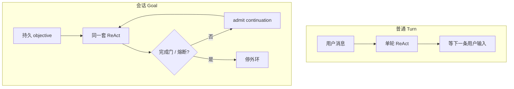
```mermaid
flowchart TB
    subgraph NORMAL["普通 Turn"]
        U1[用户消息] --> L1[单轮 ReAct]
        L1 --> W1[等下一条用户输入]
    end
    subgraph GOAL["会话 Goal"]
        OBJ[持久 objective] --> L2[同一套 ReAct]
        L2 --> J{完成门 / 熔断?}
        J -->|否| ADM[admit continuation]
        ADM --> L2
        J -->|是| W2[停外环]
    end
```

内核 Loop（Codex Step、Pi `runLoop`、CodeWhale `run_turn`）**不必改**。改的是 Loop **外面**：状态真源、注入块、Turn 末 dispatcher。

---

## 0.5 怎么读：内环、外环、验收

读各仓专节时反复出现三个词，对应 **源码里三条不同的控制流**（不是同一件事）。

| 词 | 在源码里通常叫什么 | 发生什么 | 谁决定停 |
|----|-------------------|----------|----------|
| **内环 Loop**（一次 **Turn**） | `run_turn`、`conversation.run()`、`Step`、Pi `runLoop` 一轮 | 模型 ↔ 工具，直到**这一轮**模型不再调工具（或 step 上限） | **内环自己的** stop 条件（无 tool call、max_steps、错误） |
| **外环 / Goal 循环** | continuation、idle 续跑、`run_goal` 再 `run()`、post-turn hook | 内环 **已经停过一轮**，但总 objective **还没关门** → 系统 **再 admit 一条输入**，**再开一轮内环** | 外环 dispatcher（`decide_continuation`、`start_turn_if_idle`、`evaluate_after_turn`…） |
| **验收 / 完成门** | complete、`judge_goal`、Verifier、gap 指纹、gate | 问：**总目标算不算做完？** 可能在 **Turn 内**（工具 `update_goal`）、**Turn 末**（Judge）、或 **独立角色**（Grok Verifier） | 完成门规则（自报 / 独立 LLM / 机械 stall） |

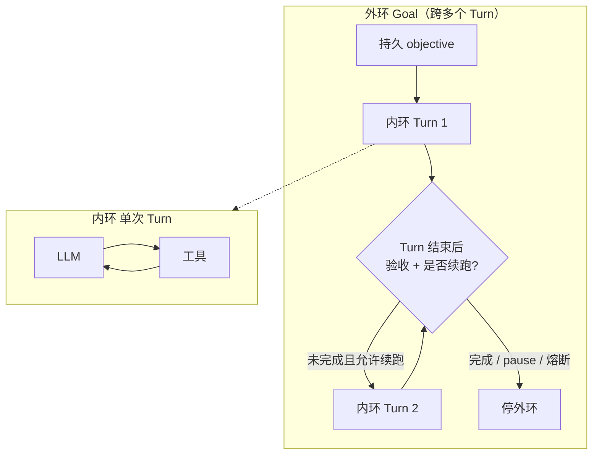
```mermaid
flowchart TB
    subgraph OUTER["外环 Goal（跨多个 Turn）"]
        OBJ[持久 objective]
        ADM{Turn 结束后<br/>验收 + 是否续跑?}
        OBJ --> T1
        T1[内环 Turn 1] --> ADM
        ADM -->|未完成且允许续跑| T2[内环 Turn 2]
        ADM -->|完成 / pause / 熔断| STOP[停外环]
        T2 --> ADM
    end
    subgraph INNER["内环 单次 Turn"]
        M[LLM] --> TOOL[工具]
        TOOL --> M
    end
    T1 -.-> INNER
```

**和普通聊天的差别**：普通模式内环停 → **控制权还给人**（等下一条用户消息）。Goal 模式内环停 → 外环可能 **不等人**，自动 admit「继续干 objective」的输入 → **再跑内环**。

**续跑相关词（只作用在外环；§1 第 5 问）**

| 术语 | 人话 | 技术含义 |
|------|------|----------|
| **admit / 放行续跑** | 这一轮已经聊完了，系统**准许**再塞一条「继续干」并**再开一轮**内环 | Turn 空闲后的注入许可 |
| **armed / 允许自动续跑** | 磁盘里虽有目标，但**开关没打开**就不会自己接着烧；恢复会话后常要人再开 | 与「有 goal 记录」分离的产品开关 |
| **deferral / 暂缓一拍** | 本来该续跑，但这一瞬间**先别开**（例如 thread 正忙、会计还没结清） | 推迟到下一拍再决策 |
| **quiet period / 安静几秒** | 已经决定续跑，但**故意等几秒**再开，方便你按 Esc 取消或改目标 | 延迟 admit |
| **双 dispatcher / 两条续跑入口** | **同一轮结束**有两个地方都能触发续跑（例如 Turn 内立刻再跑 vs 宿主跨 Turn 再跑），实现上要**别数两次** | CodeWhale 最明显；Codex 用 permit 串会计 |

**怎么读每一节（推荐顺序）**

1. 先看 **「端到端流程」**：编号步骤 + 紧挨着的流程图（编号与图节点一致）。  
2. 再看 **时序图**：通常画 **外环的一圈**（一次内环结束 → 验收/续跑 → 可能再内环）。  
3. **模块/架构/类图**只帮你 **在仓库里找文件**，不代替流程。  
4. 文末 **原理小节**补优先级、边界情况。

**排版状态**：**§2 CodeWhale、§12 Hermes** 流程与图同节；§3–§11 多为「白话步骤块 + 图」；读不懂术语先翻 [§0.6](#06-缩写与行话对照)。

---

## 0.6 缩写与行话对照

| 缩写或行话 | 指什么 |
|------------|--------|
| **Turn / 一轮** | 用户侧可见的一轮：模型与工具来回，直到这一轮模型不再调工具（或到步数上限） |
| **内环** | 这一轮里的 ReAct / `run_turn` / `conversation.run()` |
| **外环** | 多轮 Turn 组成的「总目标」循环 |
| **objective / 总目标** | 用户用 `/goal` 等设的那段要完成的事 |
| **真源** | 官方认定「目标是什么、状态是什么」的存储（DB、JSONL、事件日志等） |
| **完成门 / 验收** | 谁有权认定「总目标做完了」 |
| **续跑 / continuation** | 外环再开一轮内环时注入的那段「继续干」文案或内部消息 |
| **cap / 轮次上限** | 外环最多自动再开几轮（如 OpenHands 默认约 10 次 `run()`） |
| **熔断** | 没做完但系统强制停（轮次用尽、token、同一卡点重复多次等） |
| **gap / 卡点指纹** | 验收说「还差 X」时，把 X 归一化；若连续多轮仍是同一个 X，视为空转 |
| **blocked** | 模型声明「在当前条件下做不了」，等人改目标或介入 |
| **CAS / revision** | 改目标要带版本号，防止旧消息覆盖新状态（DeepSeek Harness、Codex 等） |
| **DSH** | DeepSeek Harness |
| **LHH** | LongHorizon Harness（评测外环 + Auditor） |
| **OH** | OpenHands SDK `run_goal` |
| **Ralph loop** | Hermes 里 Turn 结束后 judge 再决定是否续跑的网关模式（名来自社区说法） |

---

## 1. 每节写什么、图怎么配

读任意一节，建议能回答下面 **八个问题**（不必背术语，对照该节表格即可）：

1. **平时聊完一轮会怎样？** 是等人发下一条，还是系统可能自动再开一轮？  
2. **Goal 改的是哪一层？** 只改一轮里的工具，还是跨多轮的外环？  
3. **目标写在哪？** 重启后还能不能找到同一条 objective？  
4. **每轮模型多看到什么？** 总目标块、续跑说明、预算提示等。  
5. **谁决定自动续跑？** 要不要人点恢复、要不要等几秒、有没有两条入口别重复计数（见 §0.5）。  
6. **怎样才算做完？** 模型自己点完成、专用工具、还是另一次模型来判？  
7. **怎样会被强制停下？** 轮次上限、钱/ token、同一问题重复多轮没进展等。  
8. **和 Plan 什么关系？** 能不能同时开、会不会一个要追问一个禁止追问。

**推荐小节顺序（与源码调用顺序对齐，流程与图同节）**

| 顺序 | 小节 | 内容 |
|------|------|------|
| 1 | **端到端流程** | ①②③… 注释（函数/模块名，不贴代码）+ **同编号**的 flowchart |
| 2 | **时序** | sequenceDiagram + 「本图对应哪几步」 |
| 3 | **结构图** | 模块 / 架构 / 类（定位仓库） |
| 4 | **原理** | 优先级、dispatcher、与 Plan 关系 |

---

## 2. CodeWhale

> **白话导读**：TUI 里 `/goal` 设总目标后，**默认可以一直自动续跑**（没有硬性的「最多 N 轮」），真正停下来靠「模型点完成/卡住」或 **同一卡点连续 3 次没过审查**。续跑前常有 **几秒安静期** 可 Esc 取消。特别之处：一轮结束时有 **两条** 续跑路径（Turn 内立刻再跑 vs 宿主跨 Turn 再跑），实现上禁止 **重复计数**。

### 端到端流程（源码顺序：`goal.rs` → `run_turn` → `goal_loop` / `turn_loop` / `runtime_threads`）

下面编号与流程图节点 **①–⑤** 一致；对照仓库时从 `crates/tui/src/commands/groups/project/goal.rs` 进入。

| 步 | 源码锚点（打开核对） | 做什么 |
|----|---------------------|--------|
| ① | `goal.rs` 命令 | `/goal` 写 durable `ThreadGoal=Active`，sync `SharedGoalState`；**不跑模型** |
| ② | `turn_loop.rs` `run_turn` | 普通内环；无 `update_goal` 工具则 **外环永不续跑**；Goal 时 max_steps≈1000 |
| ③ | `tools/goal.rs` | Turn 内：`update_goal`、Critical/Advisory review；同 gap 连续 3 pass → `Pause(NoProgress)` |
| ④a | `turn_loop` + `goal_loop.rs` `decide_continuation` | Turn 末 **Turn 内**续跑：Stop 或 Continue+quiet+continuation 文案 **同一 Turn 再 run_turn** |
| ④b | `runtime_threads.rs` settle/spawn | Turn **Completed** 后 **跨 Turn** re-arm；cap/无工具则 park |
| ⑤ | 两处 dispatcher | **禁止对同一次续跑双计**；quiet 上限 24h |

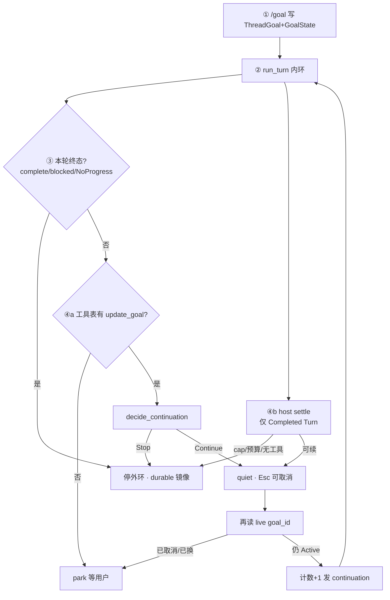
```mermaid
flowchart TD
    A["① /goal 写 ThreadGoal+GoalState"] --> B["② run_turn 内环"]
    B --> C{"③ 本轮终态?<br/>complete/blocked/NoProgress"}
    C -->|是| Z[停外环 · durable 镜像]
    C -->|否| D{"④a 工具表有 update_goal?"}
    D -->|否| P[park 等用户]
    D -->|是| E[decide_continuation]
    E -->|Stop| Z
    E -->|Continue| F[quiet · Esc 可取消]
    F --> G[再读 live goal_id]
    G -->|已取消/已换| P
    G -->|仍 Active| H["计数+1 发 continuation"]
    H --> B
    B --> I["④b host settle<br/>仅 Completed Turn"]
    I -->|cap/预算/无工具| Z
    I -->|可续| F
```

### 时序（外环一圈：一次内环结束 → 续跑决策）

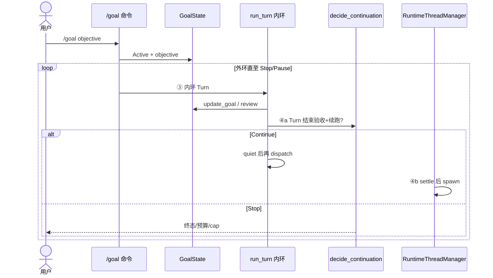
```mermaid
sequenceDiagram
    actor U as 用户
    participant Cmd as /goal 命令
    participant GS as GoalState
    participant E as run_turn 内环
    participant D as decide_continuation
    participant H as RuntimeThreadManager

    U->>Cmd: /goal objective
    Cmd->>GS: Active + objective
    loop 外环直至 Stop/Pause
        Cmd->>E: ③ 内环 Turn
        E->>GS: update_goal / review
        E->>D: ④a Turn 结束验收+续跑?
        alt Continue
            E->>E: quiet 后再 dispatch
            H->>H: ④b settle 后 spawn
        else Stop
            D-->>U: 终态/预算/cap
        end
    end
```

- **内环**：`E` 里的一次 `run_turn`（③）。  
- **验收**：③ 里 `update_goal(complete|blocked)` + Critical gap；④ `decide_continuation` 看 status/预算。  
- **外环循环**：`loop` 框；Continue 时 ④a/④b 再喂内环，**不是**用户在聊天里打字。

### 结构图（定位用）

### 模块图

命令、纯决策、会话状态、Turn 接缝、跨 Turn 宿主、落盘记账六块；决策 crate **禁止**做 I/O。

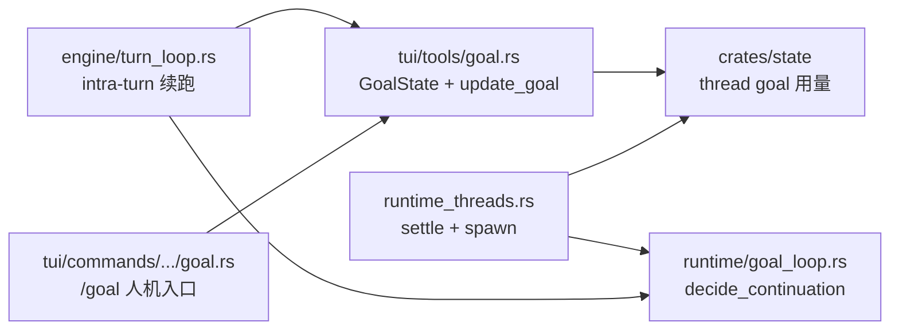
```mermaid
flowchart LR
    CMD["tui/commands/.../goal.rs<br/>/goal 人机入口"]
    TOOL["tui/tools/goal.rs<br/>GoalState + update_goal"]
    DEC["runtime/goal_loop.rs<br/>decide_continuation"]
    ENG["engine/turn_loop.rs<br/>intra-turn 续跑"]
    HOST["runtime_threads.rs<br/>settle + spawn"]
    ST["crates/state<br/>thread goal 用量"]

    CMD --> TOOL
    ENG --> DEC
    ENG --> TOOL
    HOST --> DEC
    HOST --> ST
    TOOL --> ST
```

### 架构图

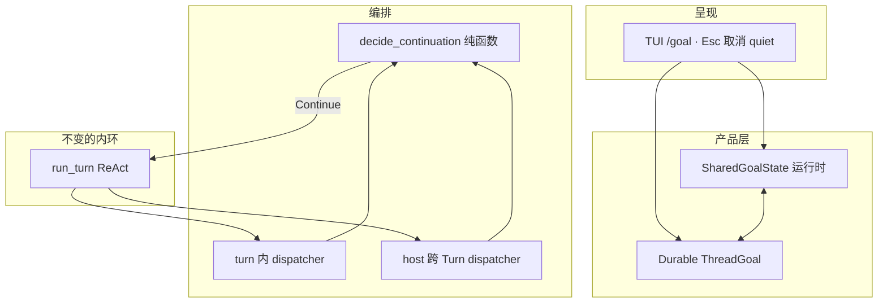
```mermaid
flowchart TB
    subgraph UI["呈现"]
        TUI[TUI /goal · Esc 取消 quiet]
    end
    subgraph PROD["产品层"]
        GS[SharedGoalState 运行时]
        TG[Durable ThreadGoal]
    end
    subgraph ORCH["编排"]
        D[decide_continuation 纯函数]
        IN[turn 内 dispatcher]
        HO[host 跨 Turn dispatcher]
    end
    subgraph L1["不变的内环"]
        RT[run_turn ReAct]
    end
    TUI --> GS
    TUI --> TG
    RT --> IN
    IN --> D
    RT --> HO
    HO --> D
    D -->|Continue| RT
    GS <--> TG
```

### 类图

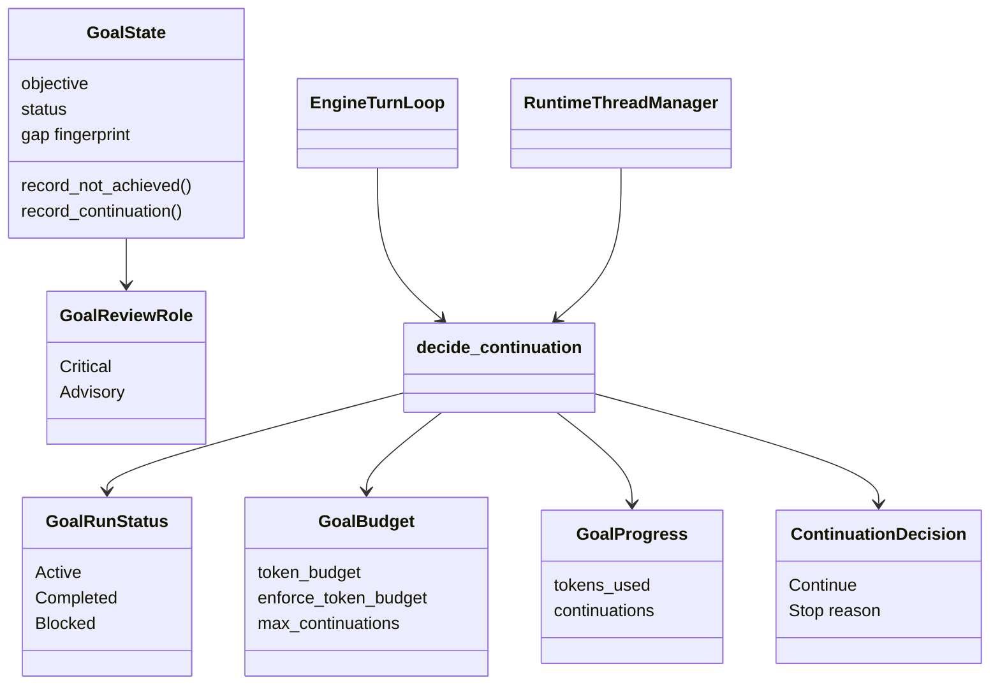
```mermaid
classDiagram
    class GoalRunStatus {
        Active
        Completed
        Blocked
    }
    class GoalBudget {
        token_budget
        enforce_token_budget
        max_continuations
    }
    class GoalProgress {
        tokens_used
        continuations
    }
    class ContinuationDecision {
        Continue
        Stop reason
    }
    class GoalState {
        objective
        status
        gap fingerprint
        record_not_achieved()
        record_continuation()
    }
    class GoalReviewRole {
        Critical
        Advisory
    }
    decide_continuation --> GoalRunStatus
    decide_continuation --> GoalBudget
    decide_continuation --> GoalProgress
    decide_continuation --> ContinuationDecision
    GoalState --> GoalReviewRole
    EngineTurnLoop --> decide_continuation
    RuntimeThreadManager --> decide_continuation
```

---

**问题**：TUI 里 `/goal` 之后，用户不能每轮打「继续」。要把一次性 objective 变成 **跨 Turn 工作环**，同时 **完成信号必须可验证**，不能只靠模型口嗨。

设计上故意切成三块，避免决策逻辑和 I/O 缠在一起：

| 块 | 路径 | 只做什么 |
|----|------|----------|
| 纯决策 | `Codewhale/crates/runtime/src/goal_loop.rs` | `decide_continuation`：status + 用量 + 预算 → Continue / Stop |
| 模型可见状态 | `crates/tui/src/tools/goal.rs` | `GoalState`、`update_goal`、Critical/Advisory review、gap 指纹 |
| Turn 接缝 | `crates/tui/src/core/engine/turn_loop.rs` | `goal_continuation_message_if_needed` |
| 跨 Turn 宿主 | `crates/tui/src/runtime_threads.rs` | `settle_thread_goal_after_turn` → `spawn_goal_continuation` |

用量记账在 `crates/state` 的 `record_thread_goal_usage`，重启后仍是权威。引擎内存里的 snapshot 只是本 Turn 投影。

### 2.1 普通 Turn vs Goal

普通 Agent Turn：`run_turn` 结束 → 等用户。没有 active goal，`goal_continuation_message_if_needed` 直接空返回。

Goal 活跃时：同一套 `run_turn`，但

- 工具表必须有 **`update_goal`**（没有则 **禁止续跑**——否则模型永远报不了 complete/blocked，会空烧 provider）；  
- 每 Turn 步数上限抬到 `DEFAULT_GOAL_MAX_STEPS = 1000`（普通交互约 200 的五倍），**续跑次数**另算；  
- Turn 干净结束后走续跑管道。

Plan 模式仍是权限收缩（禁写），与 Goal 正交。Fleet 另有 **GoalGate**：多 Worker 时汇总 **critical Verifier**，不是 session `/goal` 的第二条产品线，而是同一完成门在多 worker 上的投影。见 [codewhale-architecture](../../codewhale-architecture/ARCHITECTURE.md)、`Codewhale/docs/design/WORKFLOWS_GOAL_PARITY.md`。

### 2.2 `decide_continuation` 的合同

优先级（高 → 低）：

1. **终态**：`Completed` / `Blocked` → 立刻 Stop。这是模型（或 critical review）已经关掉工作环。  
2. **Token 预算**：默认 **只记账、不硬停**。`[goal] enforce_token_budget=true` 且 `tokens_used >= token_budget` → `Stop(BudgetLimit)`。时间预算只有 telemetry，goal 记录里没有可执行的 time 上限。  
3. **续跑次数**：`max_continuations > 0` 且已达上限 → `Stop(ContinuationLimit)`。**默认 0 = 不限次数。**  
4. 否则 Continue。

**设计选择**：默认不靠「跑满 N 轮就停」。无限续跑的真正刹车是 **完成门 + 无进展 pause**。无进展 **不在** `decide_continuation` 里：critical Verifier 对 **同一套归一化 gap** 连续报 `not_achieved` **3 次**（`MAX_REPEATED_GAP_PASSES`）时，`GoalState::record_not_achieved` 把 goal **Pause(`NoProgress`)**。两个 dispatcher 都拒绝给非 Active 的 goal 再 dispatch；host 把 pause 镜像进 durable `ThreadGoalStatus`，重启仍停，必须显式 resume。

计数规则：同一 Turn 内 verifier 多次报同一 gap **不算**多 pass；`last_gap_pass` 绑在 continuation pass 上，避免一轮里刷三次就误 pause。

### 2.3 两套 dispatcher（不是两套产品）

注释写死：**恰好两条**，按范围拆，禁止双计。

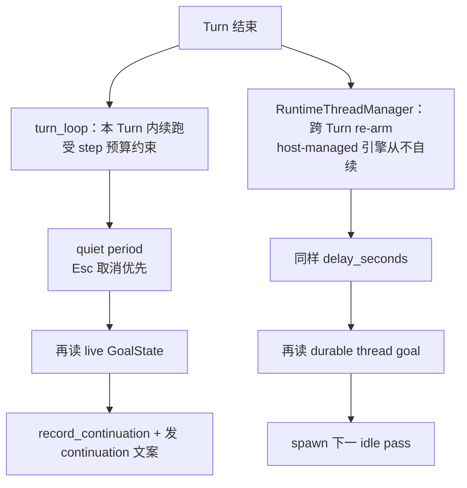
```mermaid
flowchart TD
    T[Turn 结束] --> INTRA["turn_loop：本 Turn 内续跑<br/>受 step 预算约束"]
    T --> HOST["RuntimeThreadManager：跨 Turn re-arm<br/>host-managed 引擎从不自续"]
    INTRA --> Q[quiet period<br/>Esc 取消优先]
    HOST --> Q2[同样 delay_seconds]
    Q --> R[再读 live GoalState]
    Q2 --> R2[再读 durable thread goal]
    R --> D[record_continuation + 发 continuation 文案]
    R2 --> D2[spawn 下一 idle pass]
```

`goal_continuation_message_if_needed` 要点：

- 先 `decide_continuation`，**终态不进 quiet period**；  
- delay 上限一天（`MAX_GOAL_CONTINUATION_DELAY_SECONDS`），防止巨大整数变成「看起来取消不了」的日程；  
- wait 期间 `/goal pause|clear` 或终态 `update_goal` → wait 后再判定，**不 dispatch、不计数**；  
- lock 后再比对 `goal_id`，防替换目标后的 stale pass。

Host 侧 `settle_thread_goal_after_turn` 镜像同一套门：Turn 必须 `Completed`；引擎已撞 cap / 强制 token 停则 **durable Paused**；catalog 没有 `update_goal` 则 **park、不 re-arm**。失败/打断的 Turn 保持 Active，等人 resume，避免失败循环。

### 2.4 验收角色

`GoalReviewRole::Critical`：可以满足完成门、推进 gap 计数、导致 pause。  
`Advisory`：**只追加笔记**；格式坏了或给差评也 **不得** pause/complete/block。

进度百分比是模型自报，**不是**已验证工作量。runtime 失败导致的 Blocked 标 `runtime_blocked`，用户下一条消息可 resume——这不是对工作本身的判决。

入口：`crates/tui/src/commands/groups/project/goal.rs`。

---

## 3. Prime

> **白话导读**：Pi 内核**不知道** Goal；Prime 在 harness 层加 `/goal`、把目标写进 **JSONL 会话文件**，每轮给模型一块 **XML 包起来的总目标**（防注入）。做完必须走 **`goal.complete()` 工具**，嘴上说做完不算。Turn 结束后若仍开着自动模式，会 **再注入一条续跑消息**；token 超预算会标「预算用尽」，**不会假装已完成**。`/refine` 改能力，不改总目标。

**端到端流程（编号与图一致）**

| 步 | 人话 | 源码锚点 |
|----|------|----------|
| ① | 用户 `/goal [预算] 目标文字`；校验长度；写入活跃目标并落盘 JSONL，可断点恢复 | `goals.ts`、session custom state |
| ② | 每轮组装上下文时插入 goal 块：标明是用户数据、**本轮结束 ≠ 总任务结束** | `buildSessionContext` |
| ③ | 内环照常跑；收工必须调 host 的 **complete**；须对照 objective 自检 | `runLoop`、`handleGoalHostRequest` |
| ④ | Turn 结束：若仍自动且目标活跃，等子 agent 安静后 **放行续跑**；超 token 预算则标 budget_limited | `_admitSessionInput` |
| ⑤ | pause / resume / clear / status 都走同一 GoalState；与 `/refine`、Plan 分开 | goal 命令组 |

### 图：模块 / 架构 / 类 / 端到端流程 / 时序

### 模块图

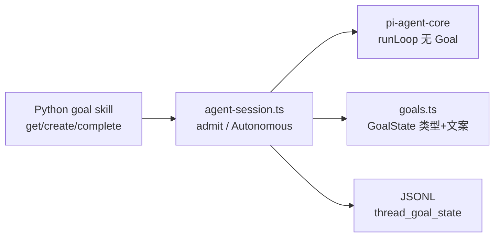
```mermaid
flowchart LR
    CORE["pi-agent-core<br/>runLoop 无 Goal"]
    GS["goals.ts<br/>GoalState 类型+文案"]
    AS["agent-session.ts<br/>admit / Autonomous"]
    SK["Python goal skill<br/>get/create/complete"]
    JL["JSONL<br/>thread_goal_state"]

    AS --> CORE
    AS --> GS
    AS --> JL
    SK --> AS
```

### 架构图

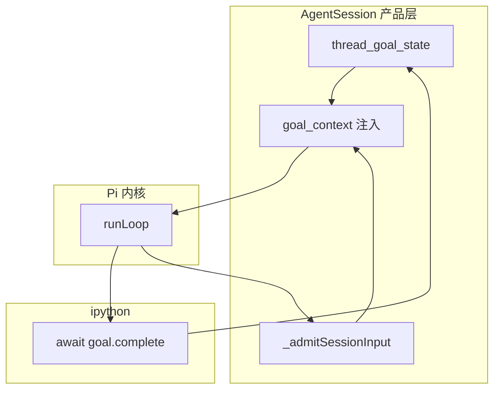
```mermaid
flowchart TB
    subgraph SESSION["AgentSession 产品层"]
        ST[thread_goal_state]
        CX[goal_context 注入]
        AD[_admitSessionInput]
    end
    subgraph LOOP["Pi 内核"]
        RL[runLoop]
    end
    subgraph PY["ipython"]
        GC[await goal.complete]
    end
    ST --> CX --> RL
    RL --> GC
    GC --> ST
    RL --> AD
    AD --> CX
```

### 类图

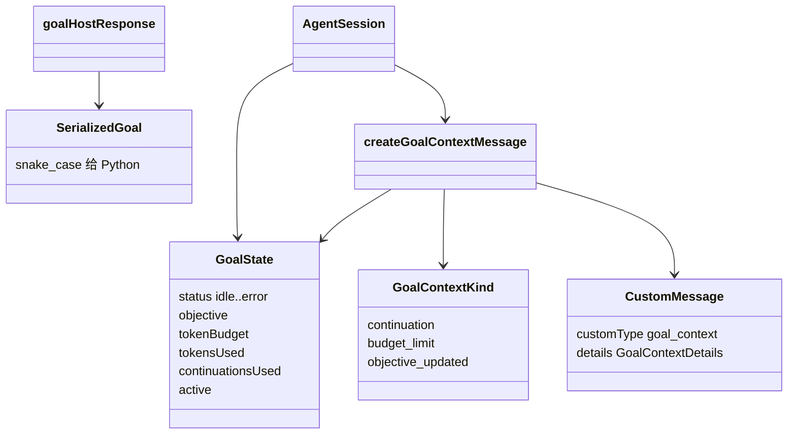
```mermaid
classDiagram
    class GoalState {
        status idle..error
        objective
        tokenBudget
        tokensUsed
        continuationsUsed
        active
    }
    class GoalContextKind {
        continuation
        budget_limit
        objective_updated
    }
    class SerializedGoal {
        snake_case 给 Python
    }
    class CustomMessage {
        customType goal_context
        details GoalContextDetails
    }
    createGoalContextMessage --> GoalState
    createGoalContextMessage --> GoalContextKind
    createGoalContextMessage --> CustomMessage
    goalHostResponse --> SerializedGoal
    AgentSession --> GoalState
    AgentSession --> createGoalContextMessage
```

### 端到端流程图

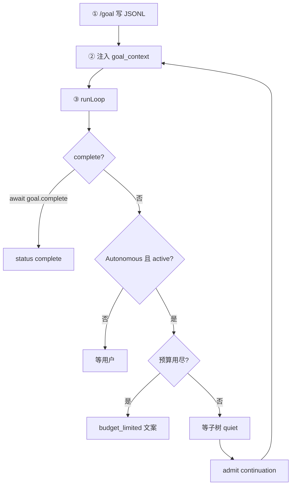
```mermaid
flowchart TD
    A[① /goal 写 JSONL] --> B[② 注入 goal_context]
    B --> C[③ runLoop]
    C --> D{complete?}
    D -->|await goal.complete| Z[status complete]
    D -->|否| E{Autonomous 且 active?}
    E -->|否| W[等用户]
    E -->|是| F{预算用尽?}
    F -->|是| BL[budget_limited 文案]
    F -->|否| G[等子树 quiet]
    G --> H[admit continuation]
    H --> B
```

### 时序图

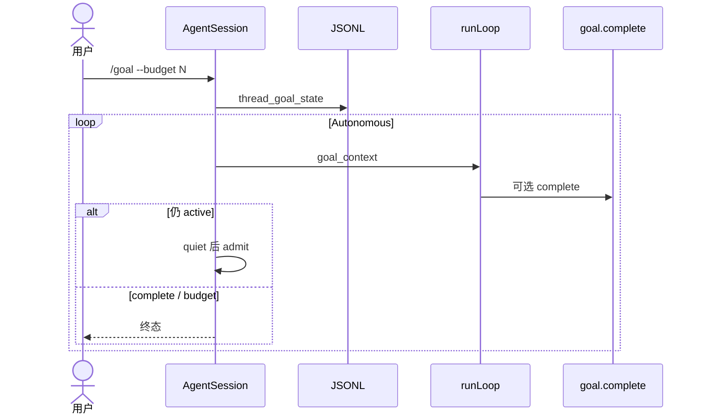
```mermaid
sequenceDiagram
    actor U as 用户
    participant AS as AgentSession
    participant J as JSONL
    participant L as runLoop
    participant K as goal.complete

    U->>AS: /goal --budget N
    AS->>J: thread_goal_state
    loop Autonomous
        AS->>L: goal_context
        L->>K: 可选 complete
        alt 仍 active
            AS->>AS: quiet 后 admit
        else complete / budget
            AS-->>U: 终态
        end
    end
```

---


**边界**：`pi-agent-core` 只有 `runLoop` + prompt/steer/followUp，**没有** Goal。Goal 全在 **`prime-agent` 的 `AgentSession`**。只跑 Pi 内核的用户看不到本节。

路径：`prime-agent/packages/coding-agent/src/core/goals.ts`（类型与注入文案）、`agent-session.ts`（admit / Autonomous / host request）。设计文：[GOALS_AND_REFINE](../../prime-agent-architecture/GOALS_AND_REFINE.md)。

### 3.1 真源与注入

真源是 JSONL 会话树上的 custom entry，类型 **`thread_goal_state`**，与聊天消息并列，flush 后可恢复。字段：`status`（`idle|active|paused|budget_limited|complete|error`）、`objective`（≤4000 字）、`tokenBudget` / `tokensUsed`、`continuationsUsed`、`timeUsedSeconds`。

每轮注入另一条 custom：**`goal_context`**，由 `createGoalContextMessage` 生成，kind 为 `continuation` / `budget_limit` / `objective_updated`。continuation 文案把 objective 放进 XML，并写明：**这是用户数据，不是更高优先级的 system 指令**；本轮结束 ≠ 总目标缩小；complete 前必须对照 objective 全量审计，不能靠「感觉做完」或「预算快没了」。

与 Compaction / Refine 三分工：压缩管历史长度；`/refine` 改 Harness 能力（prompt 补充、memory、skill）；Goal 只改「这轮要办完什么」。三者都进 JSONL，互不覆盖。

### 3.2 普通 vs Autonomous Goal

普通聊天：`runLoop` 停 → 等用户或显式 `followUp` 队列。没有 `thread_goal_state` 就没有 `<goal_context>`。

`/goal [--budget N] <objective>` 后：状态 `active`。模型侧 **goal skill**（`GOAL_SKILL_NAME = "goal"`）：`goal.get` / `goal.create` / `goal.complete` → `handleGoalHostRequest()`。完成必须在 ipython 里 **`await goal.complete()`**，这样用量会计还在 host 侧闭合。口头「做完了」不够。

若开启 **Autonomous**：Turn 结束 goal 仍 `active` → `_admitSessionInput` 一条带 `goal_context(continuation)` 的 follow-up。若本轮用了 `rlm.run()` 等子 agent，续跑会 **等子树 quiet**，避免和子 Loop 抢同一条会话。撞 `tokenBudget` → `budget_limited`，注入 budget 类 context，而不是假装 complete。

`SerializedGoal` 用 snake_case 给 Python 内核，和 TS 会话字段分开，避免跨语言漂移。

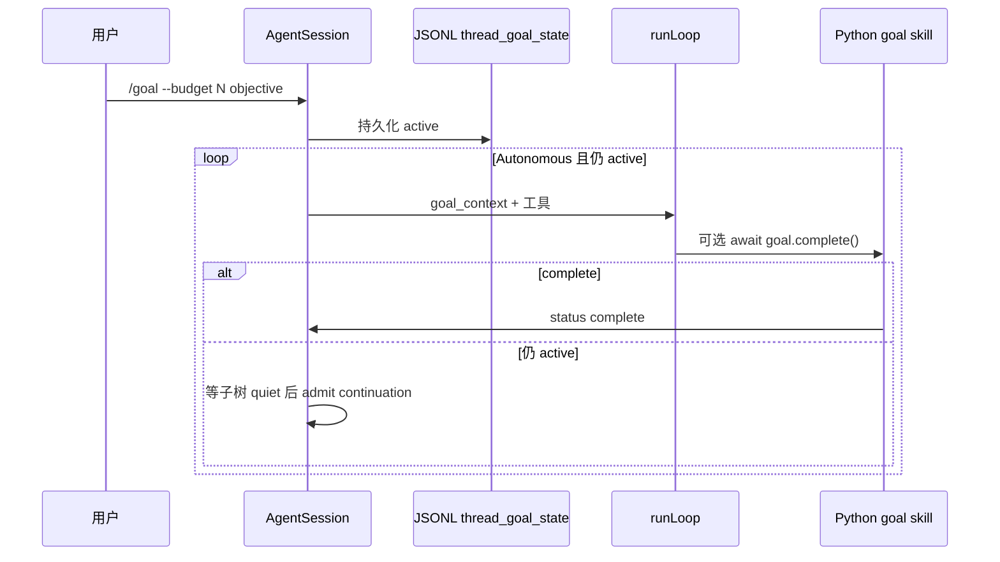
```mermaid
sequenceDiagram
    participant U as 用户
    participant AS as AgentSession
    participant J as JSONL thread_goal_state
    participant L as runLoop
    participant K as Python goal skill

    U->>AS: /goal --budget N objective
    AS->>J: 持久化 active
    loop Autonomous 且仍 active
        AS->>L: goal_context + 工具
        L->>K: 可选 await goal.complete()
        alt complete
            K->>AS: status complete
        else 仍 active
            AS->>AS: 等子树 quiet 后 admit continuation
        end
    end
```

---

## 4. Pi 内核与 pi-goal 插件

> **白话导读**：**不改 Pi 内核**，用插件挂 `/goal`。模型只能 **complete**，不能自己 pause（人要 Esc 或 `/goal pause`）。Turn 结束若目标仍活跃且本轮 **用过工具**，才自动续跑；**整轮没碰工具**视为闲聊，不续。排队中的续跑若你中途改了目标，**旧续跑作废**。命令行 `--goal` 模式在结束时用 **evaluator** 再判一轮 Met / 不可能 / 还没完。

**端到端流程**

| 步 | 人话 | 要点 |
|----|------|------|
| ① | `/goal` 写入活跃目标（无主会话则写到扩展目录） | store |
| ② | 完成只能 `update_goal(complete)`；暂停归用户 | 防模型自停 |
| ③ | 仅正常结束且仍 active 才考虑续跑 | `stopReason` |
| ④ | 本轮 0 次工具 → 不续跑 | 防空转 |
| ⑤ | 续跑文案 XML 转义注入 | 防注入 |
| ⑥⑦ | 改目标/暂停时取消已排队续跑；同一代续跑调度 | generation |
| ⑧ | 非交互：结束时 evaluator 读全量消息再决定 | `--goal` |

### 图：模块 / 架构 / 类 / 端到端流程 / 时序

### 模块图

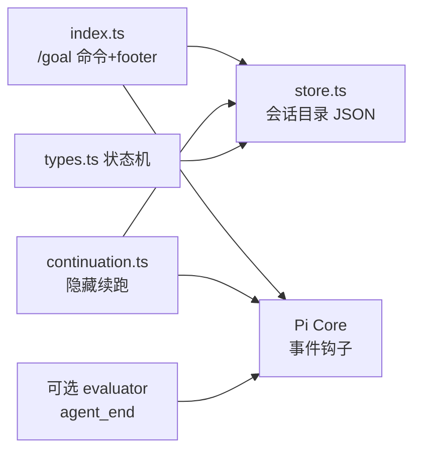
```mermaid
flowchart LR
    IDX["index.ts<br/>/goal 命令+footer"]
    ST["store.ts<br/>会话目录 JSON"]
    CT["continuation.ts<br/>隐藏续跑"]
    TY["types.ts 状态机"]
    EV["可选 evaluator<br/>agent_end"]
    PI["Pi Core<br/>事件钩子"]

    IDX --> ST
    IDX --> PI
    CT --> PI
    CT --> ST
    EV --> PI
    TY --> ST
```

### 架构图

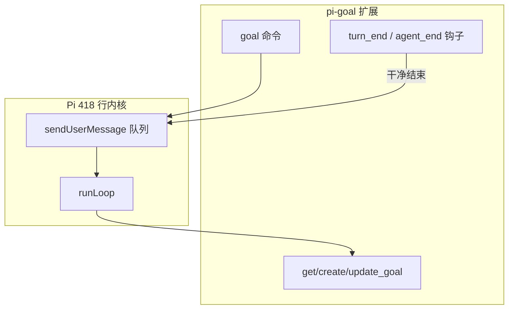
```mermaid
flowchart TB
    subgraph PLUGIN["pi-goal 扩展"]
        C[goal 命令]
        T[get/create/update_goal]
        H[turn_end / agent_end 钩子]
    end
    subgraph CORE["Pi 418 行内核"]
        Q[sendUserMessage 队列]
        L[runLoop]
    end
    C --> Q
    H -->|干净结束| Q
    Q --> L
    L --> T
```

### 类图

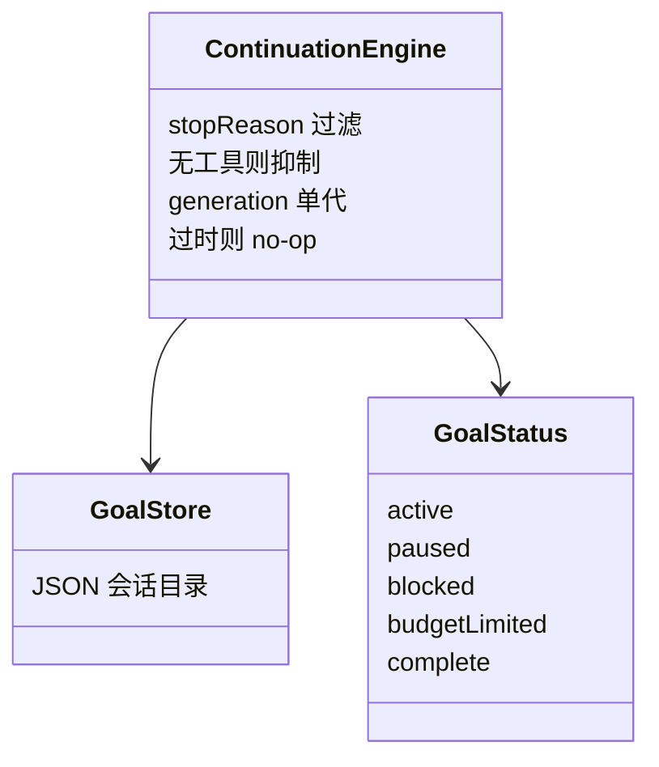
```mermaid
classDiagram
    class GoalStatus {
        active
        paused
        blocked
        budgetLimited
        complete
    }
    class ContinuationEngine {
        stopReason 过滤
        无工具则抑制
        generation 单代
        过时则 no-op
    }
    class GoalStore {
        JSON 会话目录
    }
    ContinuationEngine --> GoalStore
    ContinuationEngine --> GoalStatus
```

### 端到端流程图

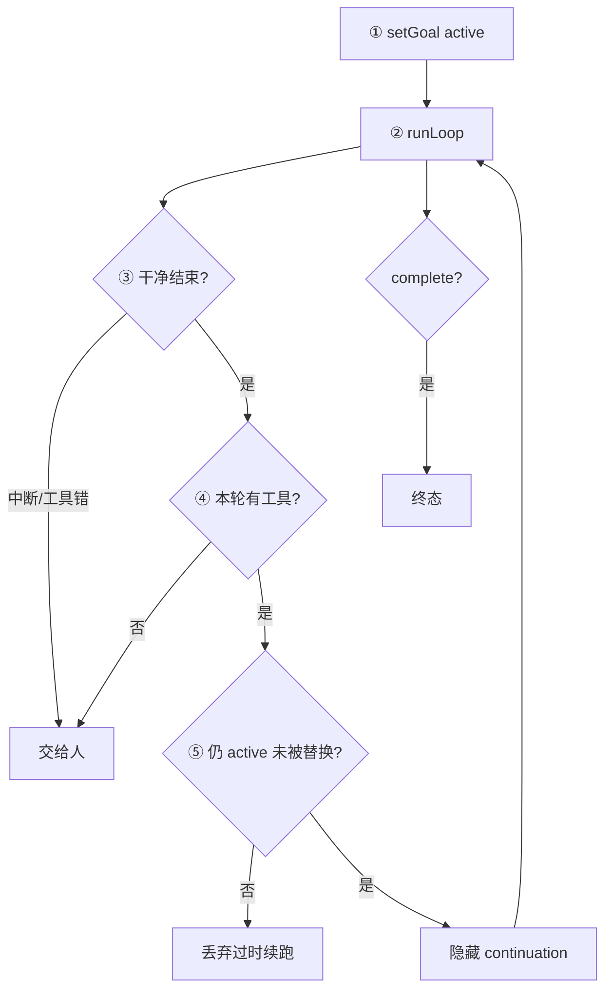
```mermaid
flowchart TD
    A[① setGoal active] --> B[② runLoop]
    B --> C{③ 干净结束?}
    C -->|中断/工具错| W[交给人]
    C -->|是| D{④ 本轮有工具?}
    D -->|否| W
    D -->|是| E{⑤ 仍 active 未被替换?}
    E -->|否| N[丢弃过时续跑]
    E -->|是| F[隐藏 continuation]
    F --> B
    B --> G{complete?}
    G -->|是| Z[终态]
```

### 时序图

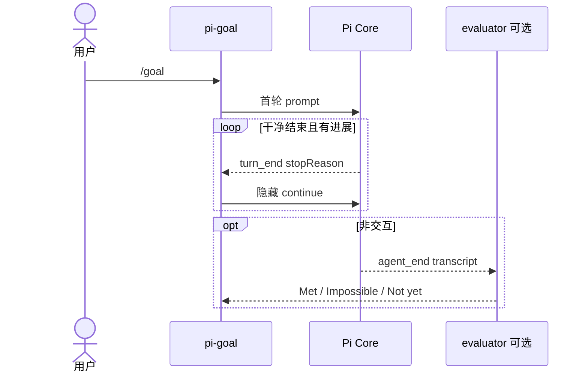
```mermaid
sequenceDiagram
    actor U as 用户
    participant P as pi-goal
    participant C as Pi Core
    participant E as evaluator 可选

    U->>P: /goal
    P->>C: 首轮 prompt
    loop 干净结束且有进展
        C-->>P: turn_end stopReason
        P->>C: 隐藏 continue
    end
    opt 非交互
        C-->>E: agent_end transcript
        E-->>P: Met / Impossible / Not yet
    end
```

---


Pi **核心不实现 Goal**。扩展用命令 + 工具 + hook 在不改 内核 Loop 的前提下加上外环。对照：[pi-plugins-design §5](../../pi-agent/pi-plugins-design.md)。

| | Pi 内核 | pi-goal 插件 | Prime 产品 |
|--|---------|--------------|------------|
| 真源 | 无 | 会话目录 JSON（无持久会话则退到扩展目录） | JSONL `thread_goal_state` |
| 续跑 | 无 | turn 干净结束时注入 **隐藏** continuation | Autonomous `_admitSessionInput` |
| 完成 | — | `update_goal` **只允许** `{status:"complete"}`（模型不能自己 pause） | `goal.complete()` |
| 额外 | — | 无工具调用则 **不续跑**（无进展抑制）；clear/pause/replace 使已排队续跑作废 | 子树 quiescence |
| fork | — | 有独立 evaluator 模型在 `agent_end` 判 Met / Impossible / Not yet | 文档要求 complete 前审计，默认不是第二 LLM |

续跑五步：盯 `stopReason` → 仅 `stop`/`toolUse`/`length` 且 active 才注入 → XML 转义 objective → 过时保护 → generation 调度（同一时刻只一代续跑）。

非交互 `pi -p --goal`：在 `agent_end` 用 evaluator 读完整 `event.messages`，不必自己缓冲。与 `/plan` 推荐组合：Plan 出方案 → 退出规划 → Goal 闭环执行。`pi-hermes-memory` 是记忆，不是 Goal。

---

## 5. DeepSeek Harness

> **白话导读**：插件化 Goal；**事件日志是真源**（带 **版本号 revision**），改目标要对版本，防旧消息覆盖。人才能在顶层 **创建/改/暂停/恢复** 目标；模型可读、可 complete/blocked。Agent **空闲**且 **允许自动续跑（armed）** 时，驱动器在 inbox 里 **排队** 开下一轮，和人类消息 **抢队列、不并行两轮**。外环轮次受配置 **`maxGoalRounds`** 限制。从 fork/恢复回来默认常 **disarm**（有目标但不自动烧）。

**端到端流程**

```
① 人类 /goal 或顶层 create_goal（必须人类顶层 Turn）
   写入全量 snapshot，revision=1，默认允许自动续跑（armed）。
   已有未完成阶段时不能新建，须 clear 或 resume。

② 模型 get_goal 抄回 id+revision；后续 update 必须带版本 CAS。
   edit/pause/resume 仍要求人类顶层请求。
   complete/blocked 可在自主 round；blocked 默认同一条件连续 3 round。

③ 驱动：agent 空闲 且 允许自动续跑
   在 inbox 排队 reserve → queued；与人类消息竞争，禁止两 round 并行扣额度。
   进入历史 admitted 后，才 roundsStarted++ 并占用 maxGoalRounds 上限。
   排队失败/取消/版本过期不扣额度。

④ goal 变更时 flush，revision 对不上则整条续跑作废（stale）。
   整 Agent quiescence 后才清 attempt。

⑤ round 用尽 → durable blocked(code=round-limit) 并 disarm。
   卸载 driver / fork / resume 会话 → 典型 disarm，人再 resume 才自动烧 round。
```

### 图：模块 / 架构 / 类 / 端到端流程 / 时序

### 模块图

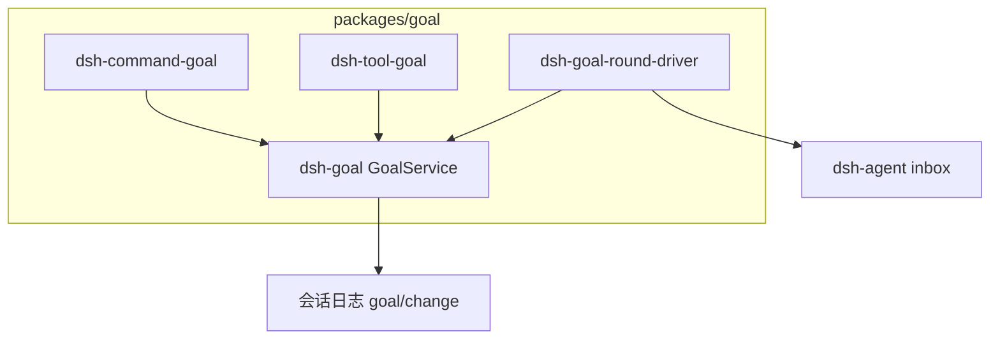
```mermaid
flowchart TB
    subgraph PACK["packages/goal"]
        SVC[dsh-goal GoalService]
        TOOL[dsh-tool-goal]
        CMD[dsh-command-goal]
        DRV[dsh-goal-round-driver]
    end
    LOG[会话日志 goal/change]
    AG[dsh-agent inbox]
    SVC --> LOG
    CMD --> SVC
    TOOL --> SVC
    DRV --> SVC
    DRV --> AG
```

### 架构图

```mermaid
flowchart TB
    subgraph DURABLE["落盘"]
        EV[goal/change 事件]
        FOLD[严格 fold 投影]
        SNAP[GoalSnapshot + revision]
    end
    subgraph LIVE["进程内"]
        ACT[activation armed?]
        ATT[恰好一个 RoundAttempt]
    end
    EV --> FOLD --> SNAP
    SNAP --> ACT
    ACT -->|armed 且 idle| ATT
    ATT -->|admitted 进历史| EV
```

### 类图

```mermaid
classDiagram
    class GoalRef {
        id
        revision
    }
    class GoalPhase {
        active paused blocked complete
    }
    class GoalSnapshot {
        objective
        phase
        maxGoalRounds
        blockedReason
    }
    class GoalView {
        roundsStarted
        activation
    }
    class GoalMessageSource {
        kind goal
        round 正整数
    }
    class RoundAttempt {
        queued claimed admitted
        stale cancelled
    }
    GoalSnapshot --> GoalRef
    GoalView --> GoalSnapshot
    GoalService --> GoalSnapshot
    Driver --> RoundAttempt
    Driver --> GoalMessageSource
```

### 端到端流程图

```mermaid
flowchart TD
    A[① create 事件源 snapshot] --> B{armed?}
    B -->|否| W[等人 resume]
    B -->|是| C[② 模型 CAS 工具]
    C --> D[③ idle → reserve round]
    D --> E{inbox 竞争?}
    E -->|人类优先| D
    E -->|admit 进历史| F[扣 roundsStarted]
    F --> G[跑一轮 agent]
    G --> H{complete / blocked×3 / cap?}
    H -->|是| Z[disarm 终态]
    H -->|否| I[quiescence]
    I --> B
```

### 时序图

```mermaid
sequenceDiagram
    actor H as 人类
    participant Cmd as command-goal
    participant S as GoalService
    participant Log as session log
    participant Drv as round-driver
    participant Ag as Agent

    H->>Cmd: /goal
    Cmd->>S: create+arm
    S->>Log: goal/change
    loop idle 且 armed
        Drv->>Drv: reserve round
        Drv->>Ag: admit goal 用户消息
        Ag->>S: update complete/blocked
        S->>Log: 新 revision
        Drv->>Drv: 对 revision · quiescence
    end
```

---


Goal 是 **Cordis 插件组**，可整组不挂。服务真源是 **会话日志里的 `goal/change` 事件**，严格 fold 成投影；inbox 消息 **不**改 goal 状态。文档：`deepseek-harness/docs/subsystems/goal.md`，类型在 `packages/goal/goal/src/types.ts`。

### 5.1 两层生命周期

**Durable phase**：`active | paused | blocked | complete`（blocked 带 `GoalBlockReason.code` + message）。  
**Activation（进程内、不落盘）**：现在能不能自动开下一 round。`disarm` 只摘续跑权，不改 phase/revision。resume/fork/卸载 driver 后典型是 **disarmed**，人类再 `resume` 才 armed。这样「日志里 goal 还在」≠「进程一起来就自己烧 round」。

`GoalRef = { id, revision }`：每次 durable 变更 revision+1。模型 `update_goal` 必须抄 **恰好当前** 的 id+revision（CAS），防过期写。

`GoalSnapshot`：`objective`、`phase`、`maxGoalRounds`。`GoalView` 再加 `roundsStarted`（从日志推导）和 `activation`。

### 5.2 插件切分

| 插件 | 角色 |
|------|------|
| `dsh-goal` | `ctx.goals`：create/edit/pause/resume/complete/block/clear/disarm |
| `dsh-tool-goal` | 模型 `get_goal` / `create_goal` / `update_goal` |
| `dsh-command-goal` | 人类 `/goal`，不占模型轮 |
| `dsh-goal-round-driver` | idle 且 armed 时排队 goal round 用户消息 |

权限（tool-goal README）：**创建/编辑/暂停/恢复** 必须来自人类顶层 Turn 的直接请求；**complete / blocked** 也可以在自主 goal round 里做。自主 **blocked** 默认要 **同一条件连续 3 round**（可配），防一轮情绪化卡死。`resume` 后 blocked 审计清零。

### 5.3 round-driver 的竞态

路径：`packages/goal/goal-round-driver/src/index.ts`。

自动续跑不是「往 inbox 塞字符串」那么简单，因为人类消息、旧 round、goal 被 edit 会打架。Driver 为每个 live Agent 维护 **恰好一个** `RoundAttempt`：`queued → claimed → admitted`。

1. **Reserve 身份** `{goalId, revision, round}`，再 admit。人类消息与自动 round 抢 inbox 时，用 `competingQueued` 等旗标，而不是两个 round 并行扣额度。  
2. **`GoalMessageSource`**：只有 **已经进入会话历史** 的 goal 用户消息才增加 `roundsStarted` 并扣 `maxGoalRounds`。排队失败、取消、stale **不扣**。Replay 拒绝非正 round、缺口、过期 revision、已停 phase、超 cap。  
3. `goal/changed` 后 **flush**，再对 revision；陈旧 attempt 标 `stale`/`cancelled`。  
4. 整 Agent quiescence 之后才清 attempt，避免半截 step 时再开一轮。

Prompt：`renderGoalRoundPrompt`，带 round / cap，模型看得见预算。

撞 cap → durable `blocked`，code 如 `round-limit`。这是 **轮次硬顶**，和 CodeWhale「默认不限续跑、靠 gap stall」相反。

```mermaid
stateDiagram-v2
    [*] --> noGoal
    noGoal --> activeArmed: create
    activeArmed --> activeDisarmed: disarm / 卸载
    activeDisarmed --> activeArmed: resume
    activeArmed --> paused: pause
    paused --> activeArmed: 人类 resume
    activeArmed --> complete: complete
    activeArmed --> blocked: blocked / round-limit
    blocked --> activeArmed: resume 且仍有 round
    complete --> activeArmed: 允许替换新 goal
```

对照：[05-对照-Pi-与-DSH](../../deepseek-harness/05-对照-Pi-与-DSH.md)。

---

## 6. Codex `ext/goal`

> **白话导读**：Codex 现在有独立 **会话级 Goal**（存 `thread_goals`），和「同一 Turn 里工具还没跑完就继续」的 **needs_follow_up** 是两层。只有 **已保存的 thread** 能设目标。Thread **空闲**时若目标仍活跃，用 **steering 片段** 自动开一轮，`turn_trigger=goal`。完成靠 **update_goal** 工具；同一「做不了」条件要连续 **≥3 个 goal 轮** 才认 blocked。预算用尽会 **收口**，不伪装完成。

**端到端流程**

| 步 | 人话 |
|----|------|
| ① | 临时会话不能设 goal；须已保存 thread |
| ② | 用户改 goal 须带正确类型；目标过长 **整段省略**（不截断） |
| ③④ | 模型建 goal 须用户明确要求；pause 主要归用户；complete 要真做完；blocked 三连 |
| ⑤–⑧ | 空闲 + 持锁读 goal；暂缓则跳过；续跑记 turn_id 与会计对齐；忙则不入队 |
| ⑨⑩ | budget_limited 只收尾；Step 内 needs_follow_up 与外环 Goal **独立** |

### 图：模块 / 架构 / 类 / 端到端流程 / 时序

### 模块图

```mermaid
flowchart LR
    UG["core/context/user_goal.rs<br/>仅 host 标注"]
    TUI["tui thread_goal_actions"]
    EXT["ext/goal"]
    SPEC[spec 工具定义]
    RT[runtime idle 续跑]
    ACC[accounting]
    ST[steering 模板]
    DB[codex_state thread_goals]

    TUI --> UG
    TUI --> DB
    EXT --> SPEC
    EXT --> RT
    RT --> ST
    RT --> ACC
    RT --> DB
```

### 架构图

```mermaid
flowchart TB
    subgraph AUTH["权威分离"]
        USER[UserGoalUpdate host-only]
        TOOL[create/update_goal 模型]
    end
    subgraph CORE["未改的 Step 内核"]
        STEP[Turn + needs_follow_up 内环]
    end
    subgraph EXT["扩展运行时"]
        RT[GoalRuntimeHandle]
        IDLE[start_turn_if_idle]
        FRAG[goal steering fragment]
    end
    USER --> DB[(thread_goals)]
    TOOL --> DB
    DB --> RT
    RT --> IDLE
    IDLE --> FRAG --> STEP
```

### 类图

```mermaid
classDiagram
    class UserGoalUpdate {
        Set objective status
        Clear
        禁止从工具构造
    }
    class GoalRuntimeHandle {
        Semaphore 锁
        start_turn_if_idle
        mark_goal_continuation
    }
    class GoalAccountingState {
        tokens
        budget_limited disposition
    }
    class ThreadGoal {
        status Active
        objective
        token_budget
    }
    GoalRuntimeHandle --> ThreadGoal
    GoalRuntimeHandle --> GoalAccountingState
    continuation_steering_item --> ThreadGoal
```

### 端到端流程图

```mermaid
flowchart TD
    A[① 用户/工具写入 thread_goals] --> B[② 普通 Turn + 工具]
    B --> C{③ update_goal 终态?}
    C -->|complete/blocked/paused| Z[停续跑]
    C -->|否| D{thread idle?}
    D -->|否| D
    D -->|是| E{deferral?}
    E -->|是| W[推迟]
    E -->|否| F[permit 下读 Active]
    F --> G[steering fragment]
    G --> H[start_turn_if_idle]
    H -->|Started| B
    H -->|NotSubmitted| W
```

### 时序图

```mermaid
sequenceDiagram
    actor U as 用户
    participant TUI as TUI /goal
    participant DB as thread_goals
    participant RT as GoalRuntime
    participant TM as ThreadManager

    U->>TUI: set goal
    TUI->>DB: UserGoalUpdate
    loop Active
        TM->>TM: Turn 跑完变 idle
        RT->>RT: 获取 permit
        RT->>DB: get_thread_goal
        RT->>TM: start_turn_if_idle steering
        TM-->>RT: Started turn_id
        RT->>RT: mark_goal_continuation
    end
```

---


旧结论「Codex 只有 Step 内 `needs_follow_up`、没有会话 Goal」**已经过时**。现在有独立 crate：`codex/codex-rs/ext/goal/`。`needs_follow_up` 仍是 **单 Turn 工具链未清** 的内环；Goal 是 **thread 级外环**。两者会同时存在，不要互相解释。

### 6.1 两套「改 goal」的入口

**用户权威**：`core/src/context/user_goal.rs` 的 `UserGoalUpdate`。只接受 **host 标注** 的 user 消息（`user.goal`），禁止从工具输出或自动 continuation 构造。超大 objective（JSON 后 >700 字节）整段省略（kind `user.goal.omitted`），避免截断把限制句裁成授权句。注入用 `<codex_internal_context source="user_goal">`。TUI：`tui/src/app/thread_goal_actions.rs`、`goal_files.rs`；临时 session 不能设 goal，必须 saved thread。

**模型工具**（`ext/goal/src/spec.rs`）：`get_goal` / `create_goal` / `update_goal`。`create_goal` 仅当用户或 developer 指令 **明确要求**，禁止从普通任务推断；未完成 goal 存在时 create 失败。`update_goal`：`complete` 仅当 objective 真做完；`paused` **只能用户明确要求**；`blocked` 仅当同一阻塞 **连续至少 3 个 goal turn**（含用户触发轮 + 自动续跑）。预算用尽优先于 pause。Resume 后 blocked 审计重新计。

### 6.2 续跑

`GoalRuntimeHandle`（`runtime.rs`）在 thread idle 时：

- 信号量锁住 read/start 窗口，防止 set/clear 插在「读到 Active」和「开 Turn」之间；  
- 尊重 `has_thread_goal_continuation_deferral`（推迟续跑）；  
- 非 Active 则清 accounting；  
- 用 `continuation_steering_item` 做成 **internal context fragment**（source `"goal"`），`start_turn_if_idle`，`turn_trigger = "goal"`；  
- 成功则 `mark_goal_continuation(turn_id)`，让 Turn-stop 会计认得出这是 host 续跑。

模板：`templates/goals/continuation.md`、`budget_limit.md`、`objective_updated.md`。budget_limited 要求 **收口、不要再开实质工作**；未真正 complete 且用户未要求 pause 时 **不要** `update_goal`。

Accounting（`accounting.rs`）把 token 累到 thread goal；usage limit 与 budget_limited 的 disposition 决定是否清 active。这是 **产品层 Goal**，不是 Step 内核改写。

对照：Codex 的完成门仍是 **模型自报 + 工具契约**（3-turn blocked 阈值），**没有** OpenHands 那种独立 Judge LLM，也没有 CodeWhale 的 critical Verifier gap 指纹。更接近 Prime/DSH 工具面，持久化走 `codex_state` thread_goals，而不是 JSONL custom type。

---

## 7. Grok Build

> **白话导读**：验收 **最重** 的一档：除总目标外还有 **Planner 写验收契约**，执行阶段 **禁止像 Plan 那样追问**。每一轮干完 **不立刻还给人**，先走 **Evaluator/Verifier 面板**（多角色读代码、挑刺）。过了才算 Achieved；不过再开 Implementer 轮。同一 **卡点** 连续 2 次 → 无进展暂停。与 **Plan 模式用法互斥**（一个要人批+可问，一个要闭环执行）。

**端到端流程**

| 步 | 人话 |
|----|------|
| ① | `/goal` 进规划；坏状态当用户暂停，不复活幽灵 Active |
| ② | Planner 写 `goal/plan.md` 验收标准；基础设施失败 ≠ 用户暂停 |
| ③④ | 执行阶段：本体实现者、少追问；Turn 末进评估，不直接交还用户 |
| ⑤⑥ | 独立 Verifier 面板；达成 → Complete，否则再干一轮 |
| ⑦–⑨ | 卡点重复、结构问题找 Strategist、轮次用尽 → 各类暂停 |
| ⑩ | 对话压缩后须 **接回** Goal 状态，不能丢或假复活 |

### 图：模块 / 架构 / 类 / 端到端流程 / 时序

### 模块图

```mermaid
flowchart TB
    TR[goal_tracker.rs 纯状态机]
    PL[goal_planner.rs]
    EV[goal_evaluator.rs]
    CL[goal_classifier.rs]
    ST[goal_strategist.rs]
    SD[goal_stop_detector.rs]
    SM[goal_summarizer.rs]
    ACP[acp_session_impl/goal.rs]
    SA[SessionActor]

    SA --> ACP
    ACP --> TR
    ACP --> PL
    ACP --> EV
    ACP --> CL
    ACP --> ST
    ACP --> SD
    ACP --> SM
```

### 架构图

```mermaid
flowchart TB
    subgraph L1["L1 Goal 状态机"]
        TR[GoalTracker]
    end
    subgraph L2["L2 计划/验收"]
        PL[Planner 契约]
        VR[Verifier 面板]
        ST[Strategist 只改 HOW]
    end
    subgraph L3["L3 普通 Turn"]
        PT[process_conversation_turn]
    end
    TR --> PL
    PL --> PT
    PT --> VR
    VR -->|NotAchieved| PT
    VR -->|结构卡住| ST
    ST --> PT
```

### 类图

```mermaid
classDiagram
    class GoalPhase {
        Idle Planning Executing
    }
    class GoalStatus {
        Active
        UserPaused BackOffPaused
        NoProgressPaused InfraPaused
        Blocked BudgetLimited Complete
    }
    class GoalPauseReason {
        User BackOff NoProgress
        Verification Infra Planner
    }
    class GoalClassifierVerdict {
        Achieved NotAchieved
    }
    class GoalTracker {
        snapshot()
        pause()
        无 I/O
    }
    GoalTracker --> GoalPhase
    GoalTracker --> GoalStatus
    GoalTracker --> GoalPauseReason
    SessionActor --> GoalTracker
    SessionActor --> GoalClassifierVerdict
```

### 端到端流程图

```mermaid
flowchart TD
    A[① /goal] --> B[② Planner 契约]
    B -->|planner 失败| IP[InfraPaused]
    B --> C[③ Implementer Turn]
    C --> D[④⑤ 评估/Verifier]
    D -->|Achieved| OK[Complete]
    D -->|同 gap×2| NP[NoProgressPaused]
    D -->|NotAchieved| C
    D -->|HOW 卡住| S[Strategist]
    S --> C
    D -->|cap| BO[BackOffPaused]
    C -->|Turn Err| IP
```

### 时序图

```mermaid
sequenceDiagram
    actor U as 用户
    participant SA as SessionActor
    participant TR as GoalTracker
    participant P as Planner
    participant T as L3 Turn
    participant V as Verifier 面板
    participant S as Strategist

    U->>SA: /goal
    SA->>TR: Planning
    SA->>P: 写契约
    P-->>TR: Executing
    loop 直到 Complete/Pause
        SA->>T: Implementer
        T-->>SA: turn 结束
        SA->>V: 对抗验收
        alt Achieved
            V-->>TR: Complete
        else 同 gap stall
            V-->>TR: NoProgressPaused
        else 需改 HOW
            SA->>S: 不改验收标准
        else 继续
            SA->>T: 下一轮
        end
    end
```

---


Grok 把 Goal 做成 **Harness 一等公民**，比「Turn 末再塞一条消息」重：外环有 Planner / Implementer / Verifier 面板 / Strategist，和 **Plan mode（人批、可追问）正交**。

路径：`grok-build/crates/codegen/xai-grok-shell/src/session/goal_tracker.rs`（纯状态机，无 I/O）、`goal_planner.rs`、`goal_evaluator.rs`、`goal_stop_detector.rs`、`goal_classifier.rs`、`goal_strategist.rs`、`goal_summarizer.rs`、`goal_role_tools.rs`、`acp_session_impl/goal.rs`。文档：[ARCHITECTURE 轨 B](../../grok-build-architecture/grok-build/ARCHITECTURE.md)。

### 7.1 与普通聊天、与 Plan

普通：`process_conversation_turn` 结束 → 等用户。  
Plan：人审批方案，**依赖 ask**。  
Goal：**禁止追问**；做到 Verifier 过或 pause。选型表在架构文档里写死——方案不清走人批 Plan；「一直做到完」走 Goal。

`GoalTracker` 挂在 `SessionActor` 的 Mutex 上，调用点由编排器决定，状态机本身可单测。未知/损坏的持久 status **反序列化为 `UserPaused`**，永远不能复活成 Active 自动驾驶（含历史 `doom_loop_paused`）。

### 7.2 状态与角色

`GoalPhase`：`Idle | Planning | Executing`。  
`GoalStatus`：`Active`、多种 pause（`UserPaused`、`BackOffPaused` 撞 classifier cap、`NoProgressPaused` 同 gap、`InfraPaused` Turn 错误、`Blocked` 验收失败）、`BudgetLimited`、`Complete`。

启动：Planner 写验收契约（`goal/plan.md` 一类），用户几乎不看。Implementer 是 **父会话本体**。每轮 L3 Turn 完进入评估：Evaluator / Classifier（wire 上仍叫 Classifier）出 `Achieved | NotAchieved`。未达成则 Verifier 面板（skeptic，至少要能 read+grep）对抗验收。卡住则 Strategist **只改 HOW，不改 WHAT/验收标准**；strategist 触发时一次性格外多给 3 轮 cap（`GOAL_STRATEGIST_CAP_BONUS`），stall 阈值也放宽同一幅度，避免刚改方案就被 stall 掐死。

Stall：连续相同 gap 指纹 **2 次**（`GOAL_CLASSIFIER_STALL_THRESHOLD`，比 CodeWhale 的 3 更急）→ `NoProgressPaused`，不必先撞 run cap。历史事件最多 64 条。压缩后有 **compaction reseed** 测试（`goal_compaction_reseed_tests.rs`）：摘要不能把 goal 自动驾驶状态弄丢或弄成 Active 幽灵。

Role 工具门：Verifier/Strategist 的 `agent_type` 缺能力则 **fail open 回当前模型**，避免拉起不能读代码的 skeptic。

```mermaid
flowchart TD
    G["/goal"] --> P[Planner 写验收契约]
    P --> I[Implementer 父会话 Turn]
    I --> E[Evaluator / Verifier 面板]
    E -->|Achieved| C[Complete]
    E -->|同 gap stall| NP[NoProgressPaused]
    E -->|NotAchieved| I
    E -->|结构问题| S[Strategist 只改 HOW]
    S --> I
```

这是本章里 **验收最重** 的会话 Goal：独立角色 + 对抗面板，而不只是 `update_goal(complete)`。

---

## 8. OpenHands SDK `run_goal`

> **白话导读**：库作者在外层写 `run_goal`：**默认最多约 10 次** `conversation.run()`（外环 cap）。每轮跑完由 **独立 Judge 模型** 看对话，JSON 说做完才停；**解析失败当作没做完**（宁可多跑）。没做完就塞 **FOLLOWUP**（缺什么补什么）再 `run()`。**capped（轮次用尽）和 complete（真做完） UI 必须分开**。产品层 agent-server 的 `/goal` 共用同一套 Controller。

**端到端流程**

| 步 | 人话 |
|----|------|
| ① | `run_goal(..., max_iterations≈10)`；目标在实例+事件里，Controller 无 DB |
| ② | 第一条用户消息就是 objective 原文 |
| ③ | 每轮 `run()`；内环 critic 只管局部，不管总目标 |
| ④⑤ | 轮末 Judge 读对话；非流式；JSON 坏了 → 继续干 |
| ⑥⑦ | 做完 → complete；否则到上限 → **capped**；否则 FOLLOWUP 再 run |
| ⑧ | Server 推 goal 状态给 UI |

### 图：模块 / 架构 / 类 / 端到端流程 / 时序

### 模块图

```mermaid
flowchart LR
    CTL[controller.py 无 I/O]
    RUN[runner.py run_goal]
    J[judge.py]
    PR[prompts.py]
    SV[agent-server 异步 driver]
    CONV[conversation.run]
    UI[goal-status-content]

    RUN --> CTL
    SV --> CTL
    CTL --> J
    J --> PR
    RUN --> CONV
    SV --> UI
```

### 架构图

```mermaid
flowchart TB
    subgraph OUTER["外环 /goal"]
        C[GoalController]
        J[Judge LLM]
    end
    subgraph INNER["内环 每次 run"]
        A[conversation.run]
        CR[可选 critic]
    end
    C -->|start objective| A
    A -->|events| C
    C --> J
    J -->|missing| A
    CR -.-> A
```

### 类图

```mermaid
classDiagram
    class GoalController {
        objective
        iteration
        max_iterations
        start()
        on_run_finished()
    }
    class GoalVerdict {
        score
        complete
        missing
    }
    class GoalContinue {
        followup
        verdict
    }
    class GoalDone {
        outcome complete 或 capped
    }
    class GoalStatus {
        running complete capped interrupted
    }
    GoalController --> GoalVerdict
    GoalController --> GoalContinue
    GoalController --> GoalDone
    judge_goal --> GoalVerdict
```

### 端到端流程图

```mermaid
flowchart TD
    A[①② 发送 objective] --> B[③ run]
    B --> C[④⑤ judge]
    C -->|complete| OK[Done complete]
    C -->|解析失败| D[当作未完成]
    D --> E{⑥ 达 max_iterations?}
    C -->|未完成| E
    E -->|是| CAP[Done capped]
    E -->|否| F[⑦ followup=missing]
    F --> B
```

### 时序图

```mermaid
sequenceDiagram
    participant D as run_goal
    participant C as GoalController
    participant A as conversation
    participant J as Judge LLM
    participant UI as goal 事件

    D->>C: start
    D->>A: send objective
    D->>UI: running
    loop
        D->>A: run
        D->>C: on_run_finished
        C->>J: judge_goal
        alt complete / capped
            C-->>D: GoalDone
            D->>UI: terminal
        else
            C-->>D: GoalContinue
            D->>A: send missing
            D->>UI: iteration++
        end
    end
```

---


OpenHands 产品与 `software-agent-sdk` 共用同一套内核。普通路径：`conversation.send_message` + **`conversation.run()`** —— 一次 run 做到 agent 自己停（可含 critic **在 run 内部**）。

Goal 路径：**外环驱动多次 `run()`**。拆成无 I/O 的 **`GoalController`** 和有 I/O 的 **`run_goal` / agent-server 异步任务**，决策逻辑共享。

路径：`software-agent-sdk/openhands-sdk/openhands/sdk/conversation/goal/controller.py`、`runner.py`、`judge.py`、`prompts.py`。文档：[openhands-sdk ARCHITECTURE_PART1 Goal](../../openhands-sdk/ARCHITECTURE_PART1.md)。UI：`OpenHands/src/components/features/chat/goal-status-content.tsx`；server 用 `ConversationStateUpdateEvent` key=`goal` 推 `GoalStatus`。

### 8.1 原理

`GoalController.start()` 返回 **第一条消息就是 objective 原文**（没有单独的持久 Goal 表；objective 活在 controller 实例 + 对话事件里）。每次 `run()` 结束：`iteration += 1`，**第二个 LLM** `judge_goal(objective, events)`。

Judge：

- 只看可转成 LLM 消息的事件，**丢掉 system**（太大且无完成证据）；  
- 强制非流式，避免拿 agent 的 streaming LLM 当 judge 时缺 callback；  
- 解析失败 → `score=0, complete=False`（**保守，宁可继续干，不可误报完成**）；  
- `complete` 为真 → `GoalDone(status=complete)`；  
- 否则若 `iteration >= max_iterations`（默认 **10**）→ `GoalDone(status=capped)`——驱动者能区分「做成了」和「轮次用尽」；  
- 否则用 `FOLLOWUP_PROMPT` 把 `missing` 塞回，再 `send_message` + `run()`。

```mermaid
sequenceDiagram
    participant D as run_goal driver
    participant C as GoalController
    participant A as conversation.run
    participant J as judge LLM

    D->>C: start()
    D->>A: send objective
    loop 直到 Done
        D->>A: run()
        A-->>D: events
        D->>C: on_run_finished(events)
        C->>J: judge_goal
        alt complete 或 capped
            C-->>D: GoalDone
        else
            C-->>D: GoalContinue + missing
            D->>A: send followup
        end
    end
```

**和 Grok/CodeWhale 的差别**：没有 thread 级 GoalState 工具，没有 pause/resume 状态机；会话关了 controller 就没了（除非事件流可恢复且 driver 重挂）。**完成权在 Judge，不在工作模型的 complete 工具。** Inner critic 仍管每一圈 `run()` 的局部质量，外环管总目标——文档明确两者叠加。

### 8.2 OpenHands 产品层（agent-server）

SDK 的 `run_goal` 是同步驱动；**OpenHands 应用**走 HTTP + 后台任务，语义与 SDK 共用 `GoalController`，但多了并发与 UI 契约：

| 能力 | 路径 / 行为 |
|------|-------------|
| 启动 | `POST …/conversations/{id}/goal` → `event_service.start_goal_loop` |
| 停止 | `POST …/goal/stop` |
| 恢复 | `POST …/goal/resume`（`RESUME_PROMPT` 而非首条 objective） |
| 互斥 | `_run_lock`：已有 `run` 或另一 `/goal` → **409**；避免 Judge 审计到无关 transcript |
| UI | `ConversationStateUpdateEvent` `key="goal"` → `goal-status-content.tsx` |
| 抢占 | 普通用户消息会 **supersede** 活跃 `/goal` 环（见 `event_service` 注释） |

**八问速查**：真源 = controller + 事件流里的 `GoalStatus` 快照；续跑 = driver 循环 `send_message(missing)` + `run()`；完成门 = **外置 Judge**（§8.1）；与 Plan 正交（Plan 管写权限，Goal 管多轮验收）。

---

## 9. Penguin `runGoalLoop`

> **白话导读**：**内环完全不知道 Goal**；外面包 `runGoalLoop`，每轮先塞一块 `[goal]` 再跑普通 Task。官方目标在 **内存**；磁盘 `GOAL.yaml` 只是模型写状态的 **信箱**，**不能**用改磁盘来改官方 objective。做完/卡住看 YAML；读坏了就当 **blocked** 交给人。外环默认 **最多约 100 轮**（可关）。失败的一轮 **不会** 立刻再自动开（防死循环）。

**端到端流程**

| 步 | 人话 |
|----|------|
| ① | 带 `goal` 选项 → 进外环；系统写一次 YAML（active） |
| ② | 每轮用 **内存里的** objective 注入，不信磁盘改字 |
| ③ | 跑普通 Task（内环） |
| ④ | Task 后读 YAML：complete/blocked 停；解析失败 → 人介入 |
| ⑤–⑧ | 预算/abort/失败处理；默认 100 轮保险丝；预算将尽先收尾话术 |

### 图：模块 / 架构 / 类 / 端到端流程 / 时序

### 模块图

```mermaid
flowchart LR
    S[session.run]
    GL[runGoalLoop]
    GF[GOAL.yaml 读写]
    GP[goal-prompts 每轮块]
    GS[goal-stream goal_finished]
    CE[ContextEngine 单 Task]

    S -->|opts.goal| GL
    S -->|无 goal| CE
    GL --> GF
    GL --> GP
    GL --> CE
    GL --> GS
```

### 架构图

```mermaid
flowchart TB
    subgraph MEM["权威在内存"]
        OBJ[objective]
        BUD[token 计数]
        CAP[maxRounds 默认100]
    end
    subgraph DISK["mailbox 非真源"]
        Y[GOAL.yaml 系统只写一次]
    end
    subgraph ROUND["每 round 普通 Task"]
        IN["yield [goal] 用户消息"]
        T[runTask]
        RD[读 status]
    end
    OBJ --> IN --> T --> RD
    Y -.->|模型可写 complete/blocked| RD
    BUD --> ROUND
```

### 类图

```mermaid
classDiagram
    class GoalFile {
        objective
        status active complete blocked
    }
    class GoalLoopOptions {
        budget
        maxRounds
    }
    class GoalRoundRunner {
        跑一轮普通 Task
    }
    class GoalOutcome {
        complete blocked
        budget_limited aborted
    }
    runGoalLoop --> GoalLoopOptions
    runGoalLoop --> GoalRoundRunner
    runGoalLoop --> GoalFile
    runGoalLoop --> GoalOutcome
```

### 端到端流程图

```mermaid
flowchart TD
    A[① 写一次 YAML] --> B[②③ yield 后 runTask]
    B --> C{④ 文件 status}
    C -->|complete/blocked/坏文件| Z[goal_finished]
    C -->|active| D{⑤⑥ abort/failed?}
    D -->|是| Z
    D -->|否| E{⑦ 轮帽/预算?}
    E -->|预算尽| W[wrap-up 再 finished]
    E -->|帽| Z
    E -->|否| B
```

### 时序图

```mermaid
sequenceDiagram
    participant S as Session
    participant L as runGoalLoop
    participant F as GOAL.yaml
    participant T as runTask
    participant Out as 流

    S->>L: opts.goal
    L->>F: 只写一次
    loop
        L->>Out: [goal] round 输入
        L->>T: 普通 Task
        T-->>L: 结束
        L->>F: 读 status
        alt 终态或帽
            L->>Out: 恰好一条 goal_finished
        end
    end
```

---


入口唯一：`session.run(messages, { goal: { budget } })`。Web `/goal`、CLI、`penguin run --goal` 都落到这里。无 `goal` 则 `runTask` 一次普通 Task。

路径与设计：[penguin-harness ARCHITECTURE_PART2 §4](../../penguin-harness/ARCHITECTURE_PART2.md)；实现 `packages/core/src/goal/goal-loop.ts`、`goal-file.ts`。

### 9.1 内环不变、外环换协议

每一 round 仍是普通 Task（同一 ContextEngine、审批、thinking）。`runGoalLoop` 只拥有：轮次协议、预算计数、硬轮帽、**创建时写一次** `GOAL.yaml`、只读 status。

`GOAL.yaml` 在 scratchpad：系统 **只写一次** objective+active。之后 **只有模型** 能把 `status` 写成 `complete` / `blocked`（用 shell 改文件）。系统侧的 `budget_limited` / `aborted` **不写回文件**，只出现在流上的 **恰好一条** `goal_finished` 和 server `goal_state` 表。这样打断恢复时，文件仍是模型最后的 mailbox，而不是被系统改成「看起来做完了」。

读文件故意宽容：解析失败、缺失、非法 status → **当作 blocked**，停下来交给人，而不是空转。

Objective 的权威在 **loop 内存**，每 round 的 `[goal]` 块重申。改磁盘 objective **骗不了** 外环。

终止源只有这些：文件 complete/blocked；内部 token 计数撞 budget（先给 wrap-up 再停，不硬杀进行中的一轮）；引擎 abort / `stop_reason: failed`（模型没机会写文件，再开火会同一 cutoff 死循环）；**`maxRounds` 默认 100**（`-1` 关闭）。无预算且模型永不写文件时，硬帽是最后保险丝。

Round 的 `[goal]` 用户消息在 **跑 Task 之前 yield**，让订阅者和 Trace 看见 round 输入。

与 OpenHands 比：Penguin 用 **文件 mailbox + 自报 status**；OpenHands 用 **外置 Judge**。与 CodeWhale 比：Penguin 把控制面放到 agent 可写的 YAML，用「读失败即 blocked」换工具协议的严格 schema。

---

## 10. nanobot

> **白话导读**：轻量 **A 类**：目标在 session **metadata**；每轮把几行 goal 塞进 Runtime Context。Loop 结束后若仍 **active**，发 **系统内部续跑消息**（**不**伪装成用户又发了一条）。外环 **硬上限约 12 轮** + 墙钟超时。可配置关掉模型的 create/update goal 工具。

**端到端流程**

| 步 | 人话 |
|----|------|
| ① | `/goal` 写 metadata；消息标 goal_requested |
| ② | 目标以 runtime 行注入 |
| ③④ | Turn 末 helper 判断；active 则排队 `system:continuation` |
| ⑤⑥ | 最多 12 轮续跑；工具策略可关 |

### 图：模块 / 架构 / 类 / 端到端流程 / 时序

### 模块图

```mermaid
flowchart LR
    CMD["/goal 命令"]
    ST[goal_state.py metadata]
    TC[turn_continuation.py]
    LP[AgentLoop 只调 helper]
    TL[create/update_goal 工具]

    CMD --> ST
    LP --> TC
    TC --> ST
    TL --> ST
```

### 架构图

```mermaid
flowchart TB
    META["session.metadata goal_state"]
    RC[Runtime Context 行]
    LOOP[AgentLoop]
    POL["continuation 策略<br/>不进 Loop 内核"]
    META --> RC --> LOOP
    LOOP --> POL
    POL -->|内部消息| LOOP
```

### 类图

```mermaid
classDiagram
    class GoalStateBlob {
        status active 才续
        objective
    }
    class ContinuationMeta {
        _internal_continuation
        kind sustained_goal
        rounds 帽 12
    }
    turn_continuation --> GoalStateBlob
    turn_continuation --> ContinuationMeta
```

### 端到端流程图

```mermaid
flowchart TD
    A[① 写 metadata] --> B[② 注入 runtime 行]
    B --> C[③ AgentLoop]
    C --> D{active 且未达 12?}
    D -->|否| W[等用户]
    D -->|是| E[④ 内部 continuation]
    E --> C
```

### 时序图

```mermaid
sequenceDiagram
    actor U as 用户
    participant S as Session
    participant L as AgentLoop
    participant C as turn_continuation

    U->>S: /goal
    S->>S: metadata active
    loop rounds 小于 12
        S->>L: Turn
        L->>C: 是否内部续?
        C->>S: 排队 system:continuation
    end
```

---


真源：session metadata `goal_state`（旧键 `thread_goal` 只读迁移）。`nanobot/session/goal_state.py`：`status == "active"` 才算持续目标；`/goal` 命令在消息 metadata 里标 `goal_requested`。

注入：`goal_state_runtime_lines` 追加进 Runtime Context，不是独立 custom message 类型。

续跑：**刻意不进 `AgentLoop`**，而在 `session/turn_continuation.py`。循环只调小组 helper：是否允许内部 continuation、允许则直接排队下一 Turn。内部消息带 `_internal_continuation`，kind `sustained_goal`，sender `system:continuation`。硬帽 **`_MAX_GOAL_CONTINUATION_ROUNDS = 12`**。工具面有 `create_goal` / `update_goal`，策略可 disable。

测试（`test_runner_goal_continue.py`、`test_loop_goal_wall_timeout.py`）覆盖：active 才续、墙钟超时、continuation 不把用户消息再 persist 一遍。

定位：中等复杂度的会话 Goal——有 metadata 真源和 Turn 末自动续跑，熔断偏「轮次+超时」，没有 DSH 级 CAS revision，也没有 Grok 级 Verifier 面板。架构叙述：[NANOBOT §12](../../nanobot/NANOBOT_ARCHITECTURE.md)。

---

## 11. Cursor

> **白话导读**：产品层 **A 类会话 Goal**（无本仓闭源实现细节）。用户 `/goal` 或让 agent 建目标后，**多轮**朝同一 objective；**暂停只能用户**，完成表示必做工作已做完。`/loop` 是定时重复 prompt，**不是**验收闭环。读实现可对照开源：**Prime**（JSONL + complete 工具）、**Codex**（thread 空闲续跑）。

**端到端流程**

| 步 | 人话 |
|----|------|
| ① | `/goal` 或 CreateGoal |
| ②③ | 多 Turn 同一目标；模型不能擅自 pause；complete = 真做完 |
| ④ | `/loop` ≠ Goal 完成门 |
| ⑤ | 开源近似见 Prime §3、Codex §6 |

### 图：模块 / 架构 / 类 / 端到端流程 / 时序

### 模块图（推断）

```mermaid
flowchart LR
    SL["/goal slash"]
    TG[CreateGoal / UpdateGoal]
    RT[Agent 运行时]
    LP["/loop 定时 正交"]
    SL --> RT
    TG --> RT
    LP -.-> RT
```

### 架构图（推断）

```mermaid
flowchart TB
    U[用户 /goal] --> ST[持久 objective]
    M[模型工具] --> ST
    ST --> T[多 Turn Agent]
    T --> G{complete?}
    G -->|否| T
    G -->|是| Z[停]
    U -->|Ctrl+C / pause| P[仅用户可 pause]
```

### 类图（推断）

```mermaid
classDiagram
    class CreateGoal {
        仅用户明确要求
    }
    class UpdateGoal {
        complete 真做完
        pause 仅用户
    }
```

### 端到端流程图

```mermaid
flowchart TD
    A[CreateGoal / /goal] --> B[Agent Turn]
    B --> C{UpdateGoal complete?}
    C -->|是| Z[停]
    C -->|用户 pause| P[停等 resume]
    C -->|否| B
```

### 时序图

```mermaid
sequenceDiagram
    actor U as 用户
    participant IDE as Cursor
    participant A as Agent
    U->>IDE: /goal
    loop 直到 complete 或用户 pause
        IDE->>A: Turn
        A-->>IDE: UpdateGoal?
    end
```

---


闭源，没有可对照的 kernel。能分析的只有 **产品合同**：

- 用户 `/goal`：长期 objective，做到完（[官方 Goals](https://cursor.com/docs/agent/overview#goals-with-goal)）；CLI 可用 Ctrl+C 暂停。  
- Agent 工具 `CreateGoal` / `UpdateGoal`：仅用户明确要求时创建；`complete` 表示真做完；**pause 只能用户控**——与 Codex `update_goal` 的 pause 规则同类。  
- 可与 `/loop`、Custom Mode 叠，但 `/loop` 是定时/重复 prompt，不是完成门。

对比方法：把 Cursor 当 **A 类会话 Goal**，实现细节以 Prime（JSONL+skill complete）和 Codex（thread_goals + idle continuation）为开源近似，**不要**用 AgentScope GoalPipeline 去类比。

运行时若出现 `CreateGoal`/`UpdateGoal`，那是 **agent 工具面**，与用户 slash 是同一产品的两个入口，类似 DSH 的 command-goal vs tool-goal。

---

## 12. Hermes `/goal`（gateway Ralph loop）

> **白话导读**：Gateway 聊天里的 **A 类 Goal**。`/goal` 把目标写入 **SessionDB**；每轮是普通内环；**用户已经看到回复之后**，`evaluate_after_turn` 做 gate + **judge**（做完 / 卡住 / 再等 / 继续），通过则往 **与用户消息相同的 FIFO** 塞续跑 user 消息。Kanban worker 是另一条轨（§12.5）。**不要**和 AgentScope 一次 `reply_stream`（B 类）混谈。

### 端到端流程（源码顺序：`slash_commands_goals` → FIFO → `run_conversation` → `run_goals._post_turn_goal_continuation` → `GoalManager.evaluate_after_turn`）

编号与下图 **①–⑤** 一致。仓库：`hermes-dev/hermes-agent/`。

| 步 | 源码锚点 | 内环 / 外环 / 验收 |
|----|----------|-------------------|
| ① | `_goal_set` → `GoalManager.set` | **外环**：写 `SessionDB` `goal:<session_id>`；`_enqueue_goal_turn` 开 **第一次内环** |
| ② | `run_conversation` | **内环**：普通 ReAct；续跑不改编 system（见 §12.1） |
| ③ | `_run_post_turn_hooks` | 内环结束、用户可见回复已交付后，才进 Goal 逻辑 |
| ④ | `evaluate_after_turn` | **验收**：gate → `judge_goal`（done/blocked/wait/continue）；blocked≠完成 |
| ⑤ | `_enqueue_fifo` | **外环续跑**：注入 user 续跑消息 → 回到 ②（与用户消息同 FIFO） |

```mermaid
flowchart TD
    A[① /goal 写入 GoalState] --> B[② enqueue 首条 goal 文本]
    B --> C[③ run_conversation 内环 Turn]
    C --> D[④ 交付 final_response]
    D --> E{goal active?}
    E -->|否| Z[结束外环]
    E -->|是| F{waiting barrier?}
    F -->|是| W[暂停外环不烧 turn]
    F -->|否| G[gates 全过?]
    G -->|否| H[gate 失败 continuation]
    G -->|是| I[judge_goal 验收]
    I -->|done| OK[✓ 完成]
    I -->|blocked| P[pause 给用户]
    I -->|wait| WB[设 wait barrier]
    I -->|continue| J{turns 预算?}
    J -->|用尽| P2[budget pause]
    J -->|否| K[⑤ FIFO 注入 continuation]
    K --> C
    H --> J
```

**⑥–⑦（未画在简图）**：`/goal pause|clear|resume`；`migrate_goal_to_session`；Kanban `run_kanban_goal_loop` 为 **另一条外环**（终态靠 `kanban_complete` 工具，见 §12.5）。

### 时序（外环一圈）

```mermaid
sequenceDiagram
    actor U as 用户
    participant G as Gateway slash
    participant GM as GoalManager
    participant A as run_conversation 内环
    participant J as goal_judge LLM
    participant Q as adapter FIFO

    U->>G: /goal 修完认证模块
    G->>GM: set + save_meta
    G->>Q: enqueue goal 文本
    Q->>A: ② 内环 Turn 1
    A-->>G: final_response
    G->>GM: ④ evaluate_after_turn
    GM->>J: judge_goal 验收
    J-->>GM: continue
    GM-->>G: continuation_prompt
    G->>Q: ⑤ enqueue continuation
    Q->>A: ② 内环 Turn 2
    A-->>G: final_response
    G->>GM: evaluate_after_turn
    J-->>GM: done
    GM-->>U: ✓ Goal achieved
```

- **内环**：每次 `A`（`run_conversation` 一整轮）。  
- **验收**：只在 **④**（Turn 之后），不是 Turn 里的 `update_goal` 工具。  
- **外环循环**：`continue` 时 ⑤→②；`done` 停外环。

### 结构图（定位用）

### 模块图

```mermaid
flowchart LR
    SLASH[gateway/slash_commands_goals.py]
    RUNG[gateway/run_goals.py GatewayGoalsMixin]
    GM[hermes_cli/goals.py GoalManager]
    DB[(SessionDB state_meta goal:session_id)]
    JUDGE[auxiliary.goal_judge LLM]
    GATE[run_gate shell]
    AGENT[run_conversation Agent Loop]
    FIFO[adapter FIFO enqueue]

    SLASH --> GM
    SLASH --> FIFO
    RUNG --> GM
    RUNG --> JUDGE
    RUNG --> FIFO
    GM --> DB
    GM --> GATE
    GM --> JUDGE
    FIFO --> AGENT
    AGENT --> RUNG
```

### 架构图

```mermaid
flowchart TB
    subgraph GW["Gateway 产品层"]
        CMD["/goal slash"]
        HOOK["_post_turn_goal_continuation"]
    end
    subgraph CORE["Goal 内核 hermes_cli/goals"]
        MGR[GoalManager]
        ST[GoalState + contract + gates]
        J[judge_goal]
    end
    subgraph PERSIST["持久化"]
        META["state_meta goal:session_id"]
    end
    subgraph LOOP["不变的内环"]
        RC[run_conversation]
    end
    CMD --> MGR
    RC --> HOOK
    HOOK --> MGR
    MGR --> J
    MGR --> ST
    ST --> META
    HOOK -->|continuation user msg| FIFO[FIFO]
    FIFO --> RC
```

### 类图

```mermaid
classDiagram
    class GoalState {
        goal status
        turns_used max_turns
        contract GoalContract
        gates List~GoalGate~
        subgoals
        wait pid/session/until
    }
    class GoalManager {
        session_id
        set pause resume clear
        evaluate_after_turn
        next_continuation_prompt
        is_active is_waiting
    }
    class GoalContract {
        outcome verification
        constraints boundaries stop_when
    }
    class GatewayGoalsMixin {
        _post_turn_goal_continuation
        _enqueue_goal_turn
        _goal_max_turns_from_config
    }
    GoalManager --> GoalState
    GoalState --> GoalContract
    GatewayGoalsMixin --> GoalManager
    evaluate_after_turn --> judge_goal
```

---

自 v0.13（Tenacity）起，Hermes 把 **Ralph 式跨 Turn 目标** 做成 gateway 一等能力：文档称「persistent session goals」；实现集中在 `hermes-dev/hermes-agent/hermes_cli/goals.py`，gateway 绑定在 `gateway/slash_commands_goals.py` 与 `gateway/run_goals.py`（`GatewayGoalsMixin`）。

### 12.1 与普通 Turn 的边界

普通 gateway Turn：用户（或平台）消息 → `run_conversation` → 回复交付 → **结束，等下一条用户输入**。

`/goal` 改掉的是 **Turn 交付之后**：若 `GoalManager.is_active()`，gateway 在 `_run_post_turn_hooks` 里跑 `_post_turn_goal_continuation`——**在可见回复发出之后**再 judge，避免「Goal 完成」行出现在主回复之前（`_defer_goal_status_notice_after_delivery`）。

续跑 **不** 改 agent 内环：continuation 是标准 **user 角色** 文本（`CONTINUATION_PROMPT_*` 模板），注释明确 **不动 system prompt、不 swap toolset**（为 provider prompt cache）。与 Codex 的 internal steering fragment、nanobot 的 `system:continuation` 都不同。

### 12.2 真源与注入

| 项 | 机制 |
|----|------|
| **真源** | `SessionDB.set_meta("goal:{session_id}", GoalState JSON)`；按 `HERMES_HOME` profile 缓存 DB 连接，event loop 上禁止冷启动 SessionDB（防丢写） |
| **契约** | `GoalContract`（outcome / verification / constraints / boundaries / stop_when）；`/goal draft` 用辅助 LLM `draft_contract`；内联 `field: value` 行 `parse_contract` |
| **子目标** | `/subgoal` 追加 criteria，judge 与 continuation 模板均要求 **全部** 满足 |
| **注入** | 无独立 thread_goal 工具；每轮靠 **continuation 用户消息** 重申 goal + 契约块 |
| **压缩** | `migrate_goal_to_session(old, new)` 在 session_id 轮换时拷贝 goal，避免压缩边界静默丢目标 |

### 12.3 续跑与竞态

- **FIFO**：continuation 走 `_enqueue_fifo`，与真实用户消息同一队列——**已在飞的 user 消息优先**，避免与用户抢 Turn。
- **WAIT**：judge 或 `/goal wait <pid>` 可 **park** 外环（不 increment 无效重试）；`wait_on_session` 对接 `process_registry` 触发模式。
- **Heartbeat / Loop**：`/heartbeat` 与 `/loop` 有独立 manager；`goal_blocks_loop_tick` 在 active goal 时阻止 loop wakeup 抢 idle 边界（`run_goals.py` 注释）。

配置：`goals.max_turns`（默认 20，经 `_goal_max_turns_from_config`）；judge 走 `auxiliary.goal_judge`（timeout、max_tokens）。

### 12.4 完成门（三层）

1. **Quality gates**（`/goal gate add <cmd>`）：每 Turn 边界 `shell=True` 跑登记命令；**未过则 judge 短路**。`gate add` 需 gateway admin（防任意用户 RCE）。
2. **Judge LLM**（`judge_goal`）：四态 **DONE / BLOCKED / WAIT / CONTINUE**；带 contract 时 DONE 要求 **verification 的具象证据**；**BLOCKED ≠ DONE**（不可达成或需用户输入 → **pause**，不自动清 goal）。
3. **Turn 预算**：`turns_used` 含用户触发轮与自动 continuation；用尽 → pause。Judge **解析失败默认 continue**（fail-open）；连续解析/传输失败 → auto-pause（与 OpenHands「解析失败 continue」同类保守，但 Hermes 对坏 judge 配置会熔断）。

工作模型 **没有** `update_goal(complete)` 工具面；完成权在 **外置 judge**（+ gate），接近 OpenHands `GoalController` + Judge，而非 Codex 模型 `update_goal`。

### 12.5 Kanban 轨（G3）

`run_kanban_goal_loop`：看板 worker 以卡片正文为 `goal_text`，循环 `judge_goal` + `run_turn`，终态靠 **`kanban_complete` / `kanban_block` / `kanban_request_review`**（工具契约），不是 slash `/goal` 的 SessionDB 行。与 FEATURE_DESIGN_CATALOG 的 **Durable Kanban + /goal** 并列：聊天会话用 §12 路径；看板任务用 worker 路径。

### 12.6 对照（§1 八问）

| 八问 | Hermes |
|------|--------|
| 普通停在哪 | Gateway 单 Turn 交付后若无 active goal 则停 |
| 改边界 | Turn 后 hook 可自动再开一轮（FIFO） |
| 真源 | SessionDB `goal:session_id` |
| 注入 | user continuation 模板（+ contract/subgoals） |
| 续跑 | `_post_turn_goal_continuation` + FIFO |
| 完成门 | gate → judge；blocked/budget/judge 失败 → pause |
| 熔断 | max_turns、judge 连续失败、gate retry |
| 与 Plan | `/plan` 写 plan 文件；正交（见 [05-plan-mode](./05-plan-mode.md)） |

**易混**：`pi-hermes-memory` 与 Hermes Agent 无关；`delegate_task(goal=…)` 是子任务字符串。

路径索引：`hermes_cli/goals.py`、`gateway/run_goals.py`、`gateway/slash_commands_goals.py`；架构目录见 `docs/hermes-agent-architecture/FEATURE_DESIGN_CATALOG.md`（0.13 `/goal`）。

---

## 13. AgentScope GoalPipeline

> **白话导读**：**B 类**——一次 `reply_stream` 里 Executor 干活 → Verifier 检查，**不过就再打回重做**（默认最多约 10 次迭代）。**没有**跨你下一条聊天消息的自动续跑；要长任务须应用自己在外层 `while` 或接 A 类 harness。

**端到端流程**

| 步 | 人话 |
|----|------|
| ① | 传入 goal 消息，存 pipeline 实例上 |
| ②③ | Executor 出报告；Verifier pass/fail/impossible；fail 带具体问题打回 |
| ④⑤ | impossible 立刻停；人点确认回来 **不重置** 已用迭代次数 |
| ⑥ | 无 session Goal 真源；跨 Turn 不是本 Pipeline 的事 |

### 图：模块 / 架构 / 类 / 端到端流程 / 时序

### 模块图

```mermaid
flowchart LR
    GP[GoalPipeline]
    EX[Executor Agent]
    VR[Verifier Agent]
    MSG[_goal 实例字段]
    GP --> EX
    GP --> VR
    GP --> MSG
```

### 架构图

```mermaid
flowchart TB
    CALL[一次 reply_stream]
    EX[Executor → ExecutionReport]
    VR[Verifier → pass/fail/impossible]
    CALL --> EX --> VR
    VR -->|fail| EX
    VR -->|pass/impossible| END[结束本次调用]
```

### 类图

```mermaid
classDiagram
    class GoalPipeline {
        _goal
        _iters 实例上不因 HITL 重置
        max_iters 10
        max_retries 3
    }
    class ExecutionReport {
        report
    }
    class VerificationResult {
        pass fail impossible
        message
    }
    GoalPipeline --> ExecutionReport
    GoalPipeline --> VerificationResult
```

### 端到端流程图

```mermaid
flowchart TD
    A[goal Msg] --> B[Executor]
    B --> C[Verifier]
    C -->|pass| Z[结束调用]
    C -->|impossible| Z
    C -->|fail 且 iters 未满| B
    C -->|iters 满| Z
```

### 时序图

```mermaid
sequenceDiagram
    participant App
    participant P as GoalPipeline
    participant E as Executor
    participant V as Verifier
    App->>P: reply_stream
    loop fail 且未满 iters
        P->>E: 执行
        P->>V: 验收
        V-->>P: fail + message
    end
    V-->>App: pass / impossible / 用尽
```

---


路径：`agentscope/src/agentscope/pipeline/_goal_pipeline.py`。文档：[PIPELINE_AND_GOALS](../../agentscope/PIPELINE_AND_GOALS.md)。

这是 **B 类**。用户传入一条 goal `Msg`，pipeline 存实例字段 `_goal`。同一轮 `reply_stream` 内：Executor 出 `_ExecutionReport` → Verifier 出 `_VerificationResult`：`pass` / `fail` / `impossible`。`fail` 把 message（含路径行号级问题）打回 Executor。Verifier 默认可每轮 reset context。`max_iters` 默认 10，`max_retries` 默认 3。**`_iters` 挂在 pipeline 实例上**：HITL 恢复 **不**重置迭代预算，避免「人点一次确认就再给满额重试」。

没有 session 级 pause、没有 Turn 末 admit、没有跨对话的 goal id。应用若要跨 Turn，必须自己在外面包一层。

```mermaid
flowchart LR
    G[goal Msg] --> E[Executor]
    E -->|report| V[Verifier]
    V -->|pass / impossible| X[结束本次 reply_stream]
    V -->|fail| E
```

---

## 14. Strands GoalLoop

> **白话导读**：**B 类**。挂在 `Agent.invoke` 上的插件：一次调用里跑完 → **校验**（自然语言 / 函数 / 甚至 `npm test`）→ 不过就把反馈当 user 消息 **再 invoke**。到 satisfied、次数或超时就停。**没有**会话级真源；适合「这一次必须过测」，不适合 IDE 多小时 thread Goal。

**端到端流程**

| 步 | 人话 |
|----|------|
| ① | 构造 Agent 时挂 GoalLoop，传入 goal |
| ②③ | invoke 结束后校验；失败则 feedback 再跑 |
| ④⑤ | satisfied / maxAttempts / timeout 停止；无跨 Turn 存储 |

### 图：模块 / 架构 / 类 / 端到端流程 / 时序

### 模块图

```mermaid
flowchart LR
    P[GoalLoop 插件]
    A[Agent.invoke]
    H[AfterInvocationEvent.resume]
    J[内部 Judge Agent 或函数或 shell]
    P --> A
    A --> H
    H --> J
```

### 架构图

```mermaid
flowchart TB
    INV[单次 invoke]
    OUT[输出]
    VAL[goal 校验]
    INV --> OUT --> VAL
    VAL -->|fail| FB[feedback 当 user]
    FB --> INV
    VAL -->|pass/max/timeout| END
```

### 类图

```mermaid
classDiagram
    class GoalLoop {
        goal 字符串或函数或异步
        maxAttempts
        timeout
        lastResult()
    }
    class ValidationOutcome {
        passed
        feedback
    }
    GoalLoop --> ValidationOutcome
```

### 端到端流程图

```mermaid
flowchart TD
    A[invoke] --> B[Agent Loop]
    B --> C{校验}
    C -->|pass| Z[返回]
    C -->|fail 未满 attempts| D[feedback]
    D --> B
    C -->|timeout/max| Z
```

### 时序图

```mermaid
sequenceDiagram
    participant U as 调用方
    participant A as Agent
    participant P as GoalLoop
    participant V as validator
    U->>A: invoke
    loop 直到 pass/max/timeout
        A-->>P: AfterInvocation
        P->>V: 校验
        alt fail
            P->>A: resume + feedback
        end
    end
    A-->>U: 结果
```

---


路径：`harness-sdk/strands-ts/src/vended-plugins/goal/plugin.ts`（Python 有对应 integ test）。也是 **B 类**：挂在 `Agent.invoke` 上。

`AfterInvocationEvent`：用自然语言 goal（再开一个内部 Agent 当 judge）、自定义函数、或 shell（如 `npm test` 的 Ralph 形）验收。不通过则把 feedback 当 user 消息，`resume` 再进 Loop。停：`satisfied` / `maxAttempts` / `timeout`。

和 DSH/Prime 的差别：GoalLoop **没有** thread 真源；每次 `invoke` 自带 goal 字符串。适合「这一次回答必须过测试」，不适合「这个会话接下来两小时修完类型错误」。

---

## 15. GenericAgent

> **白话导读**：**C 类**。目标写在 **JSON 文件**；后台 **进程不退出**，一轮轮跑 CL，靠 `turns_used` / 时间预算停。**没有**聊天 inbox 那种续跑。Hive 模式：Master + 多个 worker，用本地 BBS 协调；启动前 **核对 objective 和收工句原文**，防合同被改。

**端到端流程**

| 步 | 人话 |
|----|------|
| ① | 写 `goal_state.json`（running、预算、max_turns） |
| ②③ | 拉起 `goal_mode` 进程；每轮 CL 后计数；预算尽收口 |
| ④–⑥ | Hive：校验合同、BBS 派活、收工关 worker；停 = 杀进程或预算尽 |

### 图：模块 / 架构 / 类 / 端到端流程 / 时序

### 模块图

```mermaid
flowchart LR
    JSON[goal_state.json]
    GM[reflect/goal_mode.py]
    AM[agentmain 进程]
    HV[Hive SOP]
    BBS[本地 BBS]
    WK[worker 进程]

    JSON --> GM --> AM
    HV --> JSON
    HV --> BBS
    HV --> WK
```

### 架构图

```mermaid
flowchart TB
    OS[OS 进程不退出]
    JSON[文件真源]
    CL[普通 CL 一轮]
    OS --> JSON
    OS --> CL
    CL --> JSON
    subgraph HIVE["Hive"]
        M[Master]
        W[Worker×N]
        B[BBS]
        M --> B --> W
    end
```

### 类图

```mermaid
classDiagram
    class GoalStateJSON {
        objective
        budget_seconds
        max_turns
        turns_used
        status
        done_prompt
    }
    class HiveContract {
        启动前原文校验
        固定收工句
    }
    GoalStateJSON --> HiveContract
```

### 端到端流程图

```mermaid
flowchart TD
    A[写 JSON] --> B[拉起进程]
    B --> C[一轮 CL]
    C --> D{预算/max_turns?}
    D -->|否| C
    D -->|是| E[收口]
    E --> Z[进程结束]
```

### 时序图

```mermaid
sequenceDiagram
    actor U as 用户
    participant F as goal_state.json
    participant P as goal_mode 进程
    participant W as Hive worker
    U->>F: 写 objective
    U->>P: 后台启动
    loop turns
        P->>P: CL
        P->>F: turns_used
        opt Hive
            P->>W: BBS 派活
        end
    end
```

---


**C 类**：Harness 不改 Loop，用 **文件 + 后台进程 + SOP**。

单 agent：`reflect/goal_mode.py` + `GOAL_STATE=temp/goal_state.json`。JSON 含 `objective`、`budget_seconds`（SOP 要求至少 3 小时量级）、`max_turns`（常 200）、`turns_used`、`status=running`、`done_prompt`。预算尽进入收口轮。观察靠读 JSON 和 `temp/model_responses/`。

Hive：`goal_state.json` 的 objective 必须拼进 BBS 地址、Master 职责全文、记忆里的 duty 文档；`done_prompt` 必须是固定收工句（关 worker、BBS 宣告结束）。启动前 **回读校验原文**，防止 worker 带着被改过的完成合同开工。Master 最多拉约 5 个 worker，BBS 做协调。见 [RUNTIME_PROMPT_AND_MEMORY_ZH](../../GenericAgent/RUNTIME_PROMPT_AND_MEMORY_ZH.md)。

与 A 类比：完成门是 **prompt 合同 + 人工/SOP**，不是 `update_goal` schema；续跑是 **OS 进程还活着**，不是 inbox admit。

---

## 16. LongHorizon

> **白话导读**：评测/长程 **外环**，不是 IDE 里 `/goal`。没有 slash；任务进 **MEA**，每轮外部 agent 跑完由 **Auditor** 独立看证据，Supervisor 缺证据不算完。和 A 类 Goal **思想相近**（多轮 + 独立验收），**产品形态不同**（托管 manager，不是 thread inbox）。

**端到端流程**

| 步 | 人话 |
|----|------|
| ① | 无 `/goal`；任务直接进 MEA |
| ②③ | Adapter 跑 agent；Auditor 验收；须满足 clean complete |
| ④⑤ | Web 子任务仍同一 manager；对照本章 A 类看续跑/验收异同 |

### 图：模块 / 架构 / 类 / 端到端流程 / 时序

### 模块图

```mermaid
flowchart LR
    M[manager.run MEA]
    AUD[Auditor]
    SUP[Supervisor 证据门]
    AD[AgentAdapter CLI]
    WEB[Web 只投影]
    M --> AUD
    M --> SUP
    M --> AD
    WEB --> M
```

### 架构图

```mermaid
flowchart TB
    subgraph MEA["强制外环"]
        MG[Manager 多轮]
        AU[Auditor]
        EV[clean complete 证据]
    end
    subgraph INNER["外部 CLI Agent"]
        AD[Adapter]
    end
    MG --> AD --> AU --> EV
```

### 类图

```mermaid
classDiagram
    class Manager {
        run MEA
    }
    class Auditor {
        独立验收
    }
    class Supervisor {
        missing_completion_evidence
    }
    Manager --> Auditor
    Supervisor --> Auditor
```

### 端到端流程图

```mermaid
flowchart TD
    A[任务] --> B[Manager round]
    B --> C[CLI Agent]
    C --> D[Auditor]
    D -->|未干净完成| B
    D -->|证据门过| Z[停]
```

### 时序图

```mermaid
sequenceDiagram
    participant S as Supervisor
    participant M as Manager
    participant A as Adapter
    participant U as Auditor
    S->>M: run
    loop 直到 clean complete
        M->>A: 一 round
        A-->>U: 产物/轨迹
        U-->>M: blocked 或通过
    end
```


没有 slash `/goal`。外环是 **强制 MEA**（Manager 多轮）+ **独立 Auditor + 完成证据门禁**（`_latest_auditor_is_clean_complete`、Supervisor `_missing_completion_evidence`）。Web 不重做 MEA，只 spawn 仍进 `manager.run`。见 [ARCHITECTURE_PART3 §6](../../LongHorizon-Harness/ARCHITECTURE_PART3.md)。

分析时应把它放在 **「长程外环 + 独立验收」** 同一张图里，和 Grok Verifier、OpenHands Judge 并列，而不是和 `/goal` UX 并列。普通「跑一次 CLI agent」没有这层 Auditor；LHH 的设计命题是：同模型换外环才有评测增益。

---

## 17. 补节：OpenHarness / MAG + 假 Goal 表

> **白话导读**：这一节列的是 **名字像 Goal、其实不是 A 类** 的东西，以及有人以为「没写进主文」的仓。**OpenHarness** 只在 metadata 里记一句「当前焦点」，聊完一轮 **不会** 自动续跑。**MAG** 没有内置 thread Goal，长任务要你自己在外层循环。**§17.3** 用流程图帮你判断某仓库属于 A/B/C/D 哪一类。

### 17.0 索引：曾误以为「没写」的 Harness

| Harness | 是不是聊天里自动续跑那种 Goal（A 类） | 主文 | 说明 |
|---------|--------------------------------------|------|------|
| **Codex** | **是** | **[§6](#6-codex-extgoal)** | 别和 Step 内 `needs_follow_up` 混 |
| **OpenHands** | **是** | **[§8](#8-openhands-sdk-run_goal)** + [§8.2](#82-openhands-产品层agent-server) | 产品 `/goal` 同 Controller |
| **Hermes** | **是** | **[§12](#12-hermes-goalgateway-ralph-loop)** | Kanban 另轨 §12.5 |
| **OpenHarness** | **否**（仅 metadata 记焦点） | **§17.1** | `task_focus_state` |
| **MAG** | **否** | **§17.2** | 无内置 thread Goal |

---

### 17.1 OpenHarness — `task_focus_state`（D 类，不是 `/goal`）

> **白话导读**：每条用户消息会把前 **240 字** 记进进程内 metadata 当「当前在忙啥」，工具也能读到。**不是** Goal：没有 complete、没有 Turn 末自动续跑；压缩或新 session 容易 **丢焦点**。

| 步 | 人话 |
|----|------|
| ① | 引擎进程里有一个 metadata 字典，可跨多轮 query |
| ② | 每条用户消息更新 `task_focus_state.goal`（截断）和 recent 列表 |
| ③ | 工具通过 context 读同一份 metadata |
| ④⑤ | 无 Goal 表；Turn 结束 **等人发下一条**，不会因「没完」自动续 |

实现：`OpenHarness/src/openharness/engine/query.py`。演示：`OpenHarness/tests/test_engine/demo_tool_metadata.py`。

| §1 八个问题（简答） | 结论 |
|---------------------|------|
| 聊完一轮会怎样 | 交还用户，不自动续跑 |
| 有没有外环 Goal | **没有**，只有 metadata 侧车 |
| 目标写在哪 | 进程内 dict，易丢 |
| 模型每轮看到什么 | 无标准 objective 块，靠 prompt/工具读 metadata |
| 自动续跑 | **无** |
| 怎样算做完 | **无** complete / Judge |
| 强制停下 | 只有通用步数/token 限制 |
| 和 Plan | Plan 是写权限，与焦点无关 |

```mermaid
flowchart LR
    UM[用户消息] --> RUG[remember_user_goal]
    RUG --> META[_tool_metadata]
    META --> TOOLS[工具 context 读取]
    META --> LOOP[单轮 Agent Loop]
    LOOP --> STOP[停 — 不自动续跑]
```

**若要补真 Goal**（对照 archive §5.6）：在 Turn 完成回调加 P4 外环 + P2/P3 真源与 `complete` 合约，**不要**把 `task_focus_state` 改名成 GoalState。

---

### 17.2 MAG（Microsoft Agent Framework）— 无会话 Goal 模式

仓库：`agent-framework/`（Python / .NET / Go）。框架提供 **Agent turn**、**Workflow**（顺序/并发/handoff）、**Magentic** 等多 Agent 编排，**没有**与 Codex `ext/goal`、OpenHands `run_goal` 对等的 **thread 级 GoalState + Turn 末自动续跑**。

| §1 八问 | 结论 |
|---------|------|
| 普通模式停在哪 | `AIAgent.Run` / workflow 一步结束由 **调用方** 决定是否再调 |
| Goal 改边界了吗 | **否**；长环由应用在外层 `while` 或 Workflow 图表达 |
| 真源 | 会话由 **ChatClient + AgentSession**（或 Redis 等 host 扩展）承载；无内置 `objective` 表 |
| 注入 | `Agent.instructions`（文档类比 CrewAI role+goal+backstory **合体**） |
| 续跑 | 编排器或宿主进程负责，**不是** harness inbox idle |
| 完成门 | 无标准 `update_goal(complete)`；评测用 **Benchmark / 自定义 checker** |
| 熔断 | Workflow 超时、步骤重试由编排配置决定 |
| 与 Plan | 无内置 Plan mode；Purview 等是 **合规策略**，不是 Goal |

```mermaid
flowchart TB
    APP[应用 / Aspire Host] --> WF[Workflow 或手写循环]
    WF --> AG[AIAgent.Run 单轮或多步节点]
    AG --> APP
    note1[无 thread_goals / GoalController]
```

**选型**：要在 MAF 上做 Prime 式 Goal，需在 host 层自建：**持久 objective + Turn 后 Judge 或 complete 工具 + cap**（可复制 OpenHands `GoalController` 模式，不属于框架内核）。

---

### 17.3 其它「goal 字样」（怎么判断是不是真会话 Goal）

```mermaid
flowchart TD
    Q{有没有跨多轮聊天的总目标?} -->|否| D[D 类：只是名字叫 goal<br/>§17.3 表]
    Q -->|是| A{聊完一轮系统会自动再开一轮?}
    A -->|否，只在一次请求里重试| B[B 类：§13 §14]
    A -->|是，靠后台脚本/进程| C[C 类：§15]
    A -->|是，靠聊天 thread/inbox| G[A 类：§2–§12]
```

| 项目 | 实际是什么 |
|------|------------|
| **crewAI `Agent.goal`** | 角色人设，Crew kickoff 的任务描述，不是 Turn 外环。 |
| **OpenAI Agents SDK** | `delegate(goal="…")` 参数字符串；无 session GoalState（与 MAF 同族）。 |
| **smolagents / MetaGPT / OpenManus / deer-flow / deepagents** | 图或角色逐步执行、Todo/checkpoint；无 `thread_goal_state`。 |
| **DeepTutor `learning_goals`** | 教学画像槽，不是 coding `/goal`。 |
| **Claude Code** | 本仓文档未实现与 Prime 同构的 session Goal；Plan 权限模式见 ch.05。 |
| **OpenCode** | 核心无会话 Goal；可选 `opencode-goal-plugin`（见 opencode 架构文档）。 |
| **Codex `needs_follow_up`** | **Step 内** 工具链未清则同 Turn 继续；**不是**跨 Turn objective（会话 Goal 见 **§6**）。 |

---

## 18. 横切对比

（用人话横向比；各产品细节仍看 §2–§16。）

### 18.1 自动续跑是怎么「接上」下一轮的

| 做法（人话） | 典型产品 | 要注意 |
|--------------|----------|--------|
| Turn 结束后塞一条 **续跑消息**（像用户说「继续」或系统内部消息） | CodeWhale、Prime、DeepSeek Harness、nanobot、pi-goal | 安静几秒可取消；中途改目标要作废旧续跑 |
| **用户已看到回复之后**，hook 再往 **消息队列** 塞续跑 | Hermes | 和用户下一条消息 **抢同一队列** |
| Thread **空闲**时由宿主 **自动开新 Turn**（带 goal 标记的上下文片段） | Codex `ext/goal` | 忙则不入队；会计和续跑要用锁串好 |
| 外层代码 **反复** `conversation.run()`，每轮末 Judge | OpenHands | 默认约 **10** 次外环 |
| Session 外包一层循环，每圈跑普通 Task | Penguin | 内环无 Goal 概念 |
| Turn 末 **先评估面板**，不立刻还给人 | Grok | 最重 |
| **后台进程**一直跑，读 JSON | GenericAgent | **不是**聊天 inbox |

**两条续跑入口**：CodeWhale 最明显（Turn 内立刻再跑 vs 跨 Turn 再跑），要数清楚别 **双计**。DeepSeek Harness 用排队 + 版本号；pi-goal 用「代际」作废旧续跑。

**「有目标」≠「允许自动续跑」**：DeepSeek Harness 恢复/fork 后常要人再开；CodeWhale 失败一轮 **不自动** 再开——产品里很容易漏。

### 18.2 谁说了算「做完了」

```mermaid
flowchart LR
    subgraph SELF["干活模型自己报"]
        T[update_goal / complete 工具 / GOAL.yaml]
    end
    subgraph IND["另一次模型或角色"]
        J[OpenHands / Hermes judge]
        V[Grok Verifier 面板]
        A[LongHorizon Auditor]
        C[CodeWhale 严格审查]
    end
    subgraph MECH["规则刹车"]
        G[同一卡点重复多次]
        R[外环轮次或 token 上限]
        B[连续多轮 blocked]
    end
```

| 方式 | 优点 | 缺点 |
|------|------|------|
| 自报 | 便宜、简单 | 容易「嘴上说做完」 |
| 独立 Judge | 更可信 | 更贵；OpenHands：Judge JSON 坏了 → **继续干** |
| Grok 多角色 | 最强 | 最复杂 |
| 机械规则 | 防空转 | 不能单独当「做完」定义 |

**外环上限**：OpenHands 默认约 **10** 轮、Penguin 约 **100** 轮、DeepSeek Harness 看 `maxGoalRounds`、nanobot 约 **12** 轮。CodeWhale **默认不限制轮数**，靠完成门 + **同一卡点 3 次** 暂停。

**blocked 防抖**：DeepSeek Harness / Codex 常要 **同一条件连续 3 轮**；CodeWhale 看 gap 是否重复；pi-goal 用 **本轮没工具就不续**。

### 18.3 总目标文案怎么注入（安全）

自动续跑等于 **反复把用户目标塞回模型**，因此要当 **不可信输入**：转义、别写进可被模型改的 system。Codex 区分「用户设的 goal」和「模型/续跑伪造的更新」。Penguin：**内存** 里的 objective 才是官方，磁盘 YAML 只是状态信箱。

### 18.4 和 Plan 的关系

| 产品 | 人话 |
|------|------|
| Grok | **二选一用法**：Plan = 要人批、可追问；Goal = 少追问、自动验收 |
| Prime | `/refine` 改能力，Goal 改任务；和 Plan 可并存但要分清 |
| CodeWhale | 可有 Plan 模式；Goal 是另一条「自动续跑」工作环 |
| Pi | 建议先 Plan 出方案，再 Goal 执行 |
| Codex | Goal 与 plan 工具可并存；续跑文案可随 plan 开关变 |
| Hermes | `/plan` 写计划文件；`/goal` 是网关 judge 续跑（§12） |

---

## 读源码时的最短路径

（下面路径给对仓库的人；先读懂 §0.5 再翻代码。）

| 若要验证… | 打开 |
|------------|------|
| 纯续跑函数 | `Codewhale/crates/runtime/src/goal_loop.rs` 的 `decide_continuation` |
| 双 dispatcher | `turn_loop.rs` `goal_continuation_message_if_needed` + `runtime_threads.rs` `settle_thread_goal_after_turn` |
| JSONL Goal | `prime-agent/.../goals.ts` + `agent-session.ts` 搜 `_admitSessionInput` |
| 事件源 + armed | DSH `packages/goal/goal` + `goal-round-driver` |
| Codex 已有会话 Goal | `codex-rs/ext/goal/src/{runtime,spec,steering,accounting}.rs` |
| 最重验收 | Grok `goal_tracker.rs` + `acp_session_impl/goal.rs` |
| 外置 Judge | OpenHands `goal/controller.py` + `judge.py` |
| Gateway Ralph + gate | Hermes `hermes_cli/goals.py` + `gateway/run_goals.py` |
| 文件 mailbox | Penguin `goal-file.ts` + `goal-loop.ts` |
| 调用内质量环 | AgentScope `_goal_pipeline.py`；Strands `vended-plugins/goal/plugin.ts` |

本章若再加仓：先归 [A/B/C/D](#a--b--c--d-用人话说)，再按 [§1 八个问题](#1-每节写什么图怎么配) 写满，并补 [图集](./22-goal-mode-atlas.md)；每节加 **白话导读**。

---

## 19. 设计思想与最佳实践

（本节用白话写结论；术语见 [§0.5](#05-怎么读内环外环验收)、[§0.6](#06-缩写与行话对照)。）

**Goal 到底改什么？**  
普通聊天：模型这一轮停下来了 → **就等人发下一条消息**。  
Goal：总任务还没关门 → **系统可以自动再开下一轮**（外环），直到验收说做完、人暂停、或触达上限。

实现上几乎都在 **内环外面** 加三块，而不是重写 ReAct：

1. **真源**：目标写在哪、重启后还能不能找到。  
2. **注入**：每一轮内环多给模型看什么（续跑文案、objective 块）。  
3. **Turn 结束时的裁决**：这一轮结束后，是续跑、暂停还是算完成。

---

### 19.1 各产品共用的状态（先认这几个词）

```mermaid
stateDiagram-v2
    [*] --> Idle
    Idle --> Active: 用户设了总目标
    Active --> Active: 一轮结束且未完成 → 自动再开一轮
    Active --> Paused: 用户暂停 / 卡死 / 服务出错
    Active --> Blocked: 必须人来改条件
    Active --> Complete: 验收通过，真做完
    Active --> Capped: 轮次或预算用尽（不等于做完）
    Paused --> Active: 用户点恢复
    Blocked --> Active: 用户处理后再开
    Complete --> [*]
    Capped --> [*]
```

| 状态 | 用户该理解成 |
|------|----------------|
| **Active** | 还在朝总目标干，可能自动续跑 |
| **Complete** | 验收认为总目标达成 |
| **Paused** | 故意停住（人或系统熔断） |
| **Blocked** | 模型说做不了，等人改目标或介入 |
| **Capped** | **轮数/预算用完了**，不一定做完（UI 别当成功） |

---

### 19.2 四个产品旋钮（用全名 + 数字含义）

各家的差别，多半落在下面 **四件独立的事** 上（一件一行，彼此不要混在一谈）。

**怎么读下面这张表**  
- **不是**「产品 A 打产品 B」。  
- 每一行是在问：**这一类问题，业界常见有两种路线**——表里用 **路线甲 / 路线乙** 概括；具体产品往往落在中间，或甲乙混搭。  
- 表里的数字（10、12、100…）指 **外环最多自动再开几轮聊天**（Turn），不是一轮里调几次工具。

| 在比什么 | 这一行的人话 | 路线甲（常见一种） | 路线乙（常见另一种） |
|----------|--------------|--------------------|----------------------|
| **谁说了算「做完了」** | 完成门 | **自报**：干活的模型自己点「完成」（如 Prime、Penguin 写状态文件） | **他评**：换另一个模型/角色来判（如 OpenHands 每轮 Judge、Grok Verifier、CodeWhale 严格审查） |
| **自动续跑有没有上限** | 轮次上限 | **先定死最多几轮**：例如 OpenHands 默认约 **10** 轮；nanobot 约 **12** 次；Penguin 约 **100** 轮；DeepSeek Harness 看配置 `maxGoalRounds` | **轮数默认不限**，用别的规则停：例如 CodeWhale——同一卡点重复 3 次仍没过就暂停 |
| **恢复会话后会不会自己接着烧** | 是否允许自动续跑 | **宽松**：只要历史里还有 goal，就可能自己接着跑（容易误烧 token） | **严格**：「有目标记录」和「允许自动续跑」分开；恢复/fork 后常要人再点继续（DeepSeek Harness；CodeWhale 失败一轮也不立刻再开） |
| **外环怎么接上内环** | 谁驱动下一轮 | **主流**：外环反复调用同一套「聊天+工具」循环（多数 A 类 Goal） | **少数**：Grok 每轮先评估面板再决定；GenericAgent 用后台脚本进程转（见 C 类） |

**和 B/C 类的关系**（见 [§0 A/B/C](#a--b--c--d-用人话说)）：AgentScope / Strands 是 **一次请求里** 重试，不是跨天会话 Goal。GenericAgent 是 **脚本进程** 在转。不要混用。

---

### 19.3 八条设计思想（实现里反复出现）

1. **决策和 I/O 分开**  
   「续跑还是停」尽量写成纯逻辑（如 CodeWhale 的 `decide_continuation`、OpenHands 的 `GoalController`），发消息、等延迟、读数据库放在外层。方便单测，也少竞态。

2. **目标只认一个权威存放处**  
   例：DeepSeek 事件日志、Prime 的 JSONL、Codex 的 `thread_goals`、Hermes 的 SessionDB `goal:session_id`。界面或内存里可以是副本。**不要**让模型随便改的文件当「官方目标」（Penguin 故意不让磁盘 objective 覆盖内存里的目标）。

3. **告诉模型：停一轮 ≠ 总任务完成**  
   自动续跑文案里要写清（Prime、Codex、pi-goal 等）。否则模型容易「这轮圆场了」就点完成。

4. **总目标当「用户数据」处理**  
   要转义、防注入；Codex 要求 host 标注用户 goal；目标太长应整段省略而不是截断（截断可能删掉「禁止…」）。

5. **完成判断：宁可多干一轮，也不要假完成**  
   OpenHands：Judge 解析失败 → 当作没做完，继续。误报完成会让外环永久停下，比多烧 token 更糟。

6. **两套刹车：做完 vs 还在空转**  
   - **做完吗** → 完成门、Judge、`update_goal(complete)`。  
   - **是否在瞎转** → 轮次上限、同一卡点重复 N 次、本轮没调用工具就不续跑等。  
   不要用一个计数器同时管两件事。

7. **暂停、清空、改目标归用户**  
   模型一般不能自己 pause（Codex、Cursor、pi-goal）。从 fork/恢复回来，默认不要立刻自动续跑（DeepSeek Harness）。

8. **Plan 和 Goal 别混**  
   Plan：先对齐方案、可追问、常要人批。Goal：目标已定、少追问、靠验收推进。Grok 里两条轨互斥；Pi 建议先 Plan 再 Goal。

---

### 19.4 做产品时建议的顺序（不必一次做满 Grok 那套）

1. 能 **存目标**、每轮 **能看见目标**、用户能 **暂停/清空**。  
2. **只在整轮对话结束后** 才决定是否自动续跑（不要和「工具还没跑完就继续」混在一起）。  
3. 完成必须走 **明确接口**（工具或 Judge），不能只听模型说「好了」。  
4. 若要延迟几秒再续跑：延迟结束前要能 **取消**，且延迟结束后再读一次目标是否仍有效。  
5. 没有「完成」路径时 **不要自动续跑**（否则永远完不了）。  
6. 这一轮 **失败或被打断**：不要立刻再自动开一轮，等人恢复。  
7. Token 用量先当 **仪表盘**；真要因 token 硬停，应做成显式配置。  
8. 若默认 **不限续跑轮数**，必须配 **无进展检测** 或轮次上限之一。  
9. 「做不了」要 **连续多轮** 才认定 blocked，避免误判；用户 resume 后重新计数。  
10. 恢复会话时：**有目标记录** 和 **允许自动续跑** 分开开关。  
11. 验收从轻到重选：自报 → 重复卡点暂停 → 审查 → 独立 Judge（按任务风险选，不必起步就多角色）。  
12. 续跑文案按 **普通用户消息** 防注入处理，别塞进可被模型改写的 system。  
13. 界面上分清 **做完 / 轮次用尽 / 暂停 / 卡住**（OpenHands 的 complete 与 capped 等）。  
14. 对话 **压缩或摘要之后**，要能把 Goal 状态接回去，不能 silently 丢目标。  
15. 单次请求里的质量重试（AgentScope 等）可以叠在每一轮 **里面**，但不能代替跨会话 Goal。

---

### 19.5 常见误用

- 把 crewAI 角色里的 `goal` 字段、教学里的 `learning_goals`、工具 metadata 当成会话 Goal。  
- 在内环核心代码里直接读 Goal 文件或做续跑决策（Penguin、CodeWhale 都避免）。  
- Turn 内和 Turn 外 **各算一次** 续跑次数，导致双倍续跑。  
- 把很长目标 **截断** 后注入（可能删掉限制句）。  
- **只靠固定 N 轮** 当「做完」：没做完也停，或做完了还在转。  
- 让模型改的文件同时当「官方目标」。  
- 系统续跑消息和用户消息 **共用同一条持久化规则**，界面上像用户又发了一句。

---

### 19.6 选型：你的产品更像哪类开源实现

| 你想要的能力 | 可先对照的章节 |
|--------------|----------------|
| IDE 里长任务、thread 空闲自动续跑、工具里点完成 | §6 Codex、§3 Prime |
| 不改 Pi 内核，用插件加 Goal | §4 pi-goal、§5 DeepSeek Harness |
| 默认一直续跑到真完成，靠「无进展」暂停 | §2 CodeWhale |
| 强验收、执行阶段少追问 | §7 Grok；评测外环 §16 LongHorizon |
| 你自己写循环，多次调用 `conversation.run()` | §8 OpenHands |
| 内环完全不知道 Goal，外环包一层 | §9 Penguin |
| 只要「一次 API 里多试几次直到过测」 | §13 Strands、§12 AgentScope |
| 多进程、文件协议协作 | §15 GenericAgent |
| Gateway 聊天 + Turn 后 Judge 续跑 | §12 Hermes |

需要看图时，用 [图集](./22-goal-mode-atlas.md) 与对应章 **端到端流程** 对照是否同一条故事。

