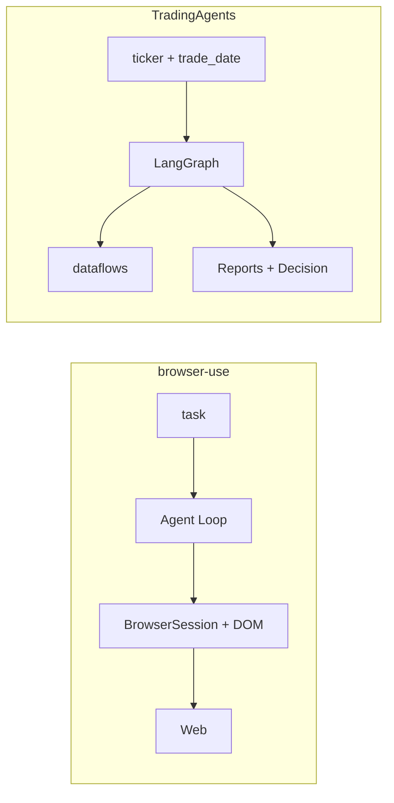
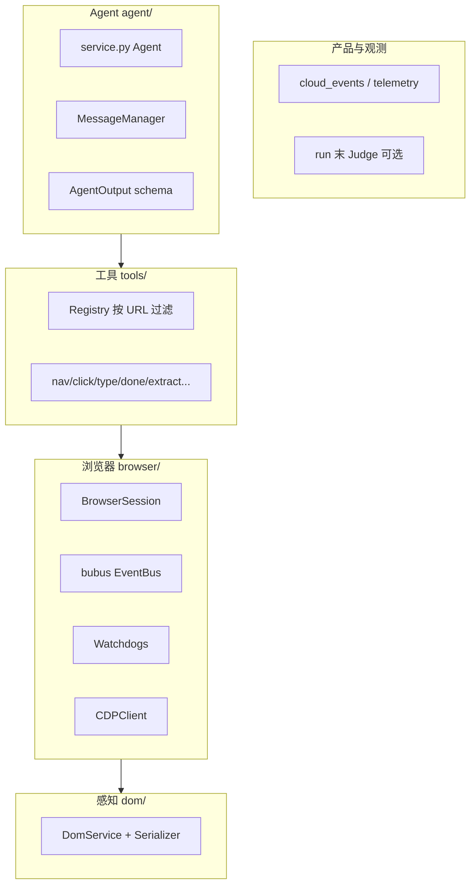
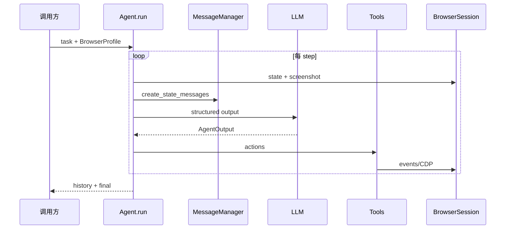
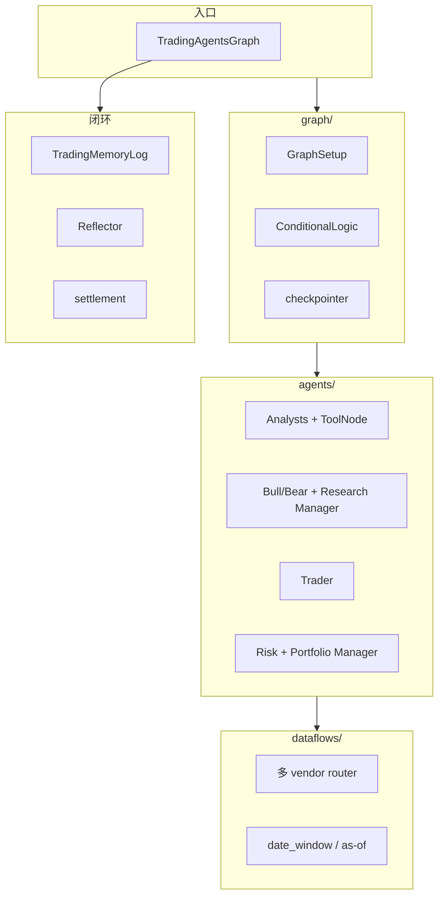
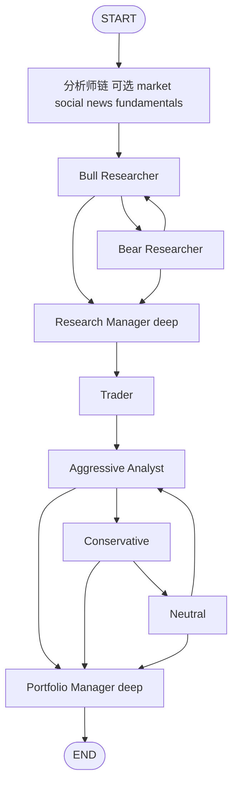
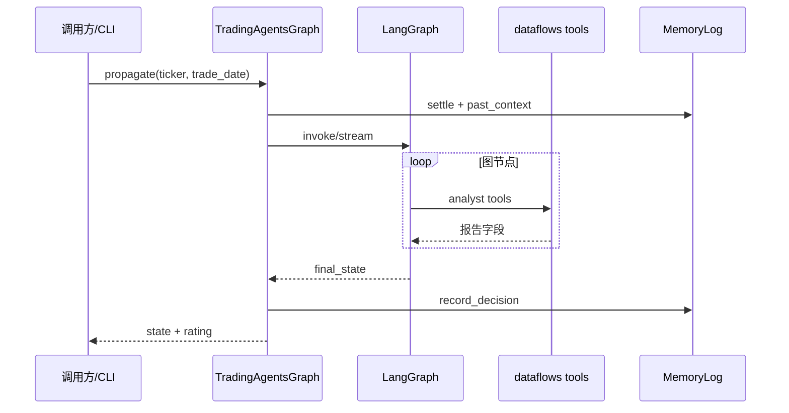

# browser-use 与 TradingAgents：整体设计对照

> **读法**：两篇 **垂类 Harness** 的完整架构与主流程，不是 Goal 专章。对照通用 Tier 1 时结合 [00-HARNESS-DESIGN-PHILOSOPHY](./00-HARNESS-DESIGN-PHILOSOPHY.md)、[03-runtime-loop-queue](./03-runtime-loop-queue.md)、[04-multi-agent](./04-multi-agent.md)、[18-quant-stock-agents](./18-quant-stock-agents.md)。  
> **仓库**：[browser-use/browser-use](https://github.com/browser-use/browser-use)（本 workspace `browser-use/`）· [TauricResearch/TradingAgents](https://github.com/TauricResearch/TradingAgents)（`TradingAgents/`）。  
> **不贴源码**；路径仅用于打开仓库核对。

---

## 目录

1. [定位：两类系统](#1-定位两类系统)
2. [browser-use 整体设计](#2-browser-use-整体设计)
3. [TradingAgents 整体设计](#3-tradingagents-整体设计)
4. [主流程对照](#4-主流程对照)
5. [与 Harness 五平面](#5-与-harness-五平面)
6. [选型与借鉴](#6-选型与借鉴)
7. [读源码最短路径](#7-读源码最短路径)

---

## 1. 定位：两类系统

| 维度 | **browser-use** | **TradingAgents** |
|------|-----------------|-------------------|
| **核心问题** | 在真实浏览器里完成开放域任务（导航、表单、多 Tab、验证码、下载） | 模拟投研机构流水线，对 **单一标的 + 交易日** 产出可审计交易观点 |
| **时间形态** | 在线、步进、可长时（数百 step） | 批处理 DAG 一次跑完（可 checkpoint 断点续跑） |
| **世界接口** | CDP + DOM 索引 + 截图 | 多 vendor 数据 API + **point-in-time / as-of** |
| **编排** | 单 Agent `run()` → `step()` 循环 | LangGraph `StateGraph` 固定拓扑 + 条件边 |
| **成功标准** | 用户 task + `done` + 可选 trace Judge | 图 `END` + `final_trade_decision` → 五档 rating |
| **商业** | 开源库 + CLI/Harness + Cloud | 开源研究框架 + 大量领域 fork |
| **Harness 族** | **环境型 computer-use**（Tier 2 垂直） | **领域多 Agent 图**（Tier 2 金融，见 [18](./18-quant-stock-agents.md)） |



**易错**：browser-use 的 `next_goal` / `evaluation_previous_goal` 是 **步内 ReAct 字段**，不是 [22-goal-mode](./22-goal-mode.md) 的会话 `/goal` 外环。TradingAgents 的一次 `propagate()` 是 **整条图**，不是用户 Turn 间自动续跑。

---

## 2. browser-use 整体设计

### 2.1 设计命题

把 **「浏览器环境」** 做成一等公民：Agent 只输出结构化 `action`；CDP、弹窗、下载、验证码、跨 iframe 感知下沉到 **BrowserSession + 事件总线 + Watchdog**。模型循环保持 **单脑 ReAct**，工程复杂度在 **感知压缩与工具注册表**。

### 2.2 分层



| 包 | 职责 |
|----|------|
| `agent/service.py` | `run` → `while n_steps` → `step` |
| `agent/message_manager/` | 每步 browser state、截图、plan、上步结果 → messages |
| `agent/views.py` | `AgentOutput`：`memory`、`next_goal`、`evaluation_previous_goal`、`action[]` |
| `browser/session.py` | Target/CDP、导航、`get_browser_state_summary` |
| `browser/watchdogs/` | DOM、下载、验证码、安全、storage、录屏等订阅事件 |
| `dom/service.py` | AX/DOM → 可点击 **index 表**（控 `max_clickable_elements_length`） |
| `tools/service.py` | 发 `ClickElementEvent` 等，不经 Agent 直写 CDP |
| `llm/` | 多提供商 `BaseChatModel` |
| `actor/` | 低层 `Page`/`Element`（可不经完整 Agent） |
| `filesystem/`、`skills/` | 工作区文件与 skill 生态（接 Cloud/CLI） |

README 三条产品线（Cloud / browser-harness+CLI / Python 库）共享 L0–L3。

### 2.3 单步流程（`step()`）

**流程详解（注释）**

```
Phase 0  可选 CAPTCHA wait → 写入 last_result
Phase 1  _prepare_context
         get_browser_state_summary(screenshot=True)
         按 URL 更新 action registry
         MessageManager.create_state_messages
         可选 message compaction（步数/字符阈值）
Phase 2  _get_next_action → AgentOutput
         _execute_actions → Tools → EventBus → CDP
Phase 3  _post_process（下载、历史、telemetry）
finally  _finalize
```

### 2.4 长任务与质量

| 机制 | 作用 |
|------|------|
| `max_steps` | 末步仅允许 `done` |
| `max_failures` + `final_response_after_failure` | 步级恢复 |
| `loop_detection_window` | 相似动作 nudge |
| `MessageCompactionSettings` | 控 context |
| `enable_planning` + `PlanItem` | 任务分解提示（≠ Plan 权限模式） |
| `use_judge` + `agent/judge.py` | 整段 trace + 截图事后验收 |

### 2.5 Watchdog 模式

`BrowserSession` 用事件解耦：新能力多为 **新 watchdog 订阅**（`dom_watchdog`、`captcha_watchdog`、`downloads_watchdog`、`security_watchdog`…），而非改 Agent prompt。

### 2.6 端到端（库路径）



---

## 3. TradingAgents 整体设计

### 3.1 设计命题

用 **固定 LangGraph** 复现「分析师 → 多空辩论 → 研究经理 → 交易员 → 风控三角 → 投资组合经理」的会议室流程；**数据层与 PIT 约束** 与 Agent 层同等重要，防止回测前视与数字幻觉。

### 3.2 分层



| 模块 | 职责 |
|------|------|
| `graph/trading_graph.py` | 组装双 LLM、`propagate`、checkpoint、`_run_graph`、`record_decision` |
| `graph/setup.py` | 编译 `StateGraph(AgentState)` |
| `graph/conditional_logic.py` | 辩论轮次与 speaker 轮转 |
| `graph/analyst_execution.py` | `AnalystNodeSpec` 注册表 → 图节点 |
| `agents/` | 角色 prompt + tools / structured 输出 |
| `dataflows/router.py` | Yahoo、SEC、FRED、Alpha Vantage、Polymarket… |
| `decision_log` + `reflection` + `settlement` | 跨 run 记忆与收益反思 |
| `backtest.py` | 日期网格批量跑 |

### 3.3 图拓扑（固定）



每个 analyst：**有 tools** 则 `agent ⇄ ToolNode ⇄ agent`，否则直连；段末 **`Msg Clear*`** 删 `messages`，报告写入 `market_report` 等黑板字段（防 context 爆炸）。

### 3.4 状态黑板

`AgentState`（`agents/state.py`）在 `MessagesState` 上扩展：

- 四份报告、`investment_debate_state`、`risk_debate_state`
- `instrument_context`、`trade_date`、`past_context`、`portfolio_context`
- `investment_plan`、`trader_investment_plan`、`final_trade_decision`

`resolve_instrument_context` / `get_verified_market_snapshot` 等把 **标的身份与数字真源** 钉在 run 入口。

### 3.5 双 LLM 与结构化终裁

- `quick_think_llm`：多数 analyst 与辩论节点  
- `deep_think_llm`：Research Manager、Portfolio Manager  
- `agents/structured.py`：`bind_structured` + schema 失败回退自由文本  

### 3.6 运行生命周期

**流程详解（注释）**

```
① create_run_state：settle_pending → past_context + instrument_context + portfolio_context
② begin_checkpoint（可选）：thread_id = ticker + date + 图签名（分析师/debate/portfolio）
③ graph.invoke 或 stream；resume 时 input=None（避免 message 重复 #1249）
④ _log_state JSON；record_decision；parse_rating → 五档或 REVIEW
⑤ 成功则 clear_checkpoint_on_success
⑥ 日后 settlement + Reflector 写教训回 log（跨 ticker 同标的下次注入）
```



更完整的项目矩阵与合规说明 → [_archive/18-quant-stock-agents.md](./_archive/18-quant-stock-agents.md)。

---

## 4. 主流程对照

| 阶段 | browser-use | TradingAgents |
|------|-------------|---------------|
| **输入** | 自然语言 task | ticker + `trade_date` (+ 可选 portfolio) |
| **单步/单节点** | 感知 → LLM → 多 action | LLM (+ ToolNode) → 写黑板或 messages |
| **并行** | 单 session 单脑 | 图内串行；无运行时 delegate |
| **停止** | `done` / max_steps / 取消 | 图 END / recursion_limit |
| **验收** | 可选 Judge（trace+截图） | PM 输出 + `parse_rating` |
| **持久化** | history、gif、cloud events | JSON log、report tree、checkpoint、decision log |
| **跨 run** | 无内置（靠 task 重开） | Reflector + settlement + past_context |

---

## 5. 与 Harness 五平面

简表对照 [21-session-message-architecture](./21-session-message-architecture.md) 直觉（非逐字段映射）：

| 平面 | browser-use | TradingAgents |
|------|-------------|---------------|
| **Session / 真源** | 单次 `Agent.run` 内存 history；BrowserProfile 会话 | LangGraph state + checkpoint thread_id；decision log |
| **Working / 消息** | MessageManager 每步 state message；compaction | Messages + **Msg Clear**；报告进结构化字段 |
| **Loop** | ReAct step 内多 action | 节点级 LLM；条件边辩论 |
| **Tools** | Registry + CDP 事件 | LangChain tools → dataflows router |
| **User/Channel** | 库/Cloud/CLI 嵌入方决定 | CLI/API `propagate`；无 IM gateway |

与 Tier 1 **多 Agent** 对照：[04-multi-agent](./04-multi-agent.md) — TradingAgents 属 **MA6 固定辩论图**；browser-use **非多 Agent**（单循环）。

与 **Goal**：[22-goal-mode](./22-goal-mode.md) — 两者均 **不是** A 类会话 `/goal` 外环（除非你在其外包一层宿主）。

---

## 6. 选型与借鉴

### 6.1 何时选哪条路线

| 你要做… | 更接近 |
|---------|--------|
| 网页操作、表单、抓取、Computer-use | browser-use |
| 投研报告、辩论式观点、回测日频流水线 | TradingAgents |
| 通用 coding agent + 长任务 Goal | Tier 1（Prime/Codex/Hermes §12），不是这两仓内核 |

### 6.2 可移植的设计课

| 从 browser-use 学 | 从 TradingAgents 学 |
|-------------------|---------------------|
| 环境事件总线 + watchdog 横切 | 固定图 + 轮次上限防发散 |
| DOM/index 动作空间 | 分析师段末清 messages、报告进黑板 |
| 步内 memory + compaction | 双 LLM 档位（快/深） |
| 按 URL 过滤工具 | 数据 router + verified snapshot 真源 |
| Run 末 Judge 验收轨迹 | checkpoint 签名 + resume 语义 |
| | decision log + 事后 reflection 闭环 |

### 6.3 反模式

- 把 TradingAgents **整图** 塞进 coding agent 的每次 PR——应抽「辩论/评审」为可选 **B 类** 质量环或外环，而非默认路径。  
- 把 browser-use 当 **唯一** 研报数据源——金融 PIT 与合规不在其内核。  
- 用 `next_goal` 类比 **Harness Goal**——语义不同，见 §1。

---

## 7. 读源码最短路径

### browser-use（建议 2–3 天）

1. `browser_use/agent/service.py` — `run` / `step` / `_prepare_context`  
2. `browser_use/agent/views.py` — `AgentOutput`、planning、flash  
3. `browser_use/browser/session.py` + 任一 `browser/watchdogs/*.py`  
4. `browser_use/dom/serializer/serializer.py` + `tools/service.py` 中 click 链路  

### TradingAgents（建议 2–3 天）

1. `tradingagents/graph/setup.py` + `conditional_logic.py`  
2. `graph/analyst_execution.py` + `agents/analysts/market_analyst.py`  
3. `agents/managers/research_manager.py` + `agents/structured.py`  
4. `graph/trading_graph.py` — `propagate`、checkpoint、`create_run_state`  
5. `dataflows/router.py` + `decision_log` / `graph/settlement.py` / `reflection.py`  

---

## 维护

- **2026-09-30**：初版；对照本 workspace `browser-use/`、`TradingAgents/` 源码整理。  
- 量化领域索引仍维护在 [18-quant-stock-agents](./18-quant-stock-agents.md)；browser 品类清单见 [GITHUB_BROWSER_AGENT_PROJECTS.md](../../GITHUB_BROWSER_AGENT_PROJECTS.md)。
