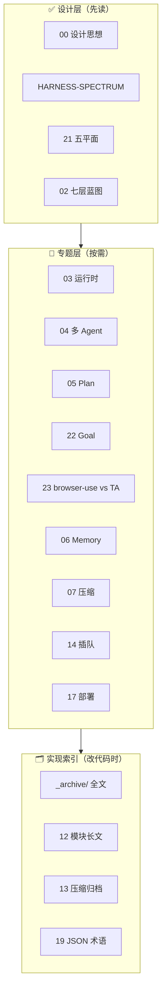

# Agent Harness 设计对比

`deepagents` 工作区内 Agent 项目的 **设计思想对比**——回答「Harness 在架构、流程、取舍上如何不同」，而不是罗列代码路径。

> **最后更新**：2026-09-14（新增 [22-goal-mode](./22-goal-mode.md)；全章瘦身原文仍在 `_archive/`）

---

## 先读什么（推荐）

| 优先级 | 文档 | 约 | 内容 |
|--------|------|-----|------|
| **1** | [**00-HARNESS-DESIGN-PHILOSOPHY.md**](./00-HARNESS-DESIGN-PHILOSOPHY.md) | 45min | Harness 定义、五张力、五平面、Loop/并发/多 Agent/安全、**十条设计原则** |
| **2** | [**HARNESS-SPECTRUM.md**](./HARNESS-SPECTRUM.md) | 20min | Tier 1 **设计光谱**（真源族 × Loop × 部署），无路径表 |
| **3** | [21-session-message-architecture.md](./21-session-message-architecture.md) | 30min | 五平面 S/W/L/T/U + **六族范式**（持久化专题） |
| **4** | [02-harness-blueprint.md](./02-harness-blueprint.md) | 1h | 七层自建蓝图、档位 A/B/C、反模式 |

单项目循序渐进导读见 [CROSS_AGENT_DESIGN_INDEX.md](../../CROSS_AGENT_DESIGN_INDEX.md)（Codex / Pi / OpenCode / OpenManus / MetaGPT …）。

---

## 文档分层（避免读错）

| 层级 | 读什么 | 跳过什么 |
|------|--------|----------|
| **设计** | 原理、范式、取舍、流程图 | — |
| **专题** | 原理图、对比表、设计法则 | — |
| **索引** | `_archive/` 全文搜索、12/13 长文 | 除非你要改某仓库 |

---

## 完整文档清单

### 设计层

| 文档 | 说明 |
|------|------|
| [00-HARNESS-DESIGN-PHILOSOPHY.md](./00-HARNESS-DESIGN-PHILOSOPHY.md) | **主入口**：Harness 设计思想 |
| [HARNESS-SPECTRUM.md](./HARNESS-SPECTRUM.md) | 框架设计光谱 |
| [21-session-message-architecture.md](./21-session-message-architecture.md) | Session/Message 五平面 |
| [02-harness-blueprint.md](./02-harness-blueprint.md) | 自建七层蓝图 |

### 专题层（设计章节为主）

| 编号 | 文档 | 设计主题 |
|------|------|----------|
| 03 | [03-runtime-loop-queue.md](./03-runtime-loop-queue.md) | 五柱运行时、Loop 范式 |
| 04 | [04-multi-agent.md](./04-multi-agent.md) | 委托 / Handoff / Crew / 图 |
| 05 | [05-plan-mode.md](./05-plan-mode.md) | Plan 三种语义 |
| 22 | [22-goal-mode.md](./22-goal-mode.md) | Goal 原理 + [图集](./22-goal-mode-atlas.md)（架构/类/流程/时序）+ 设计思想 |
| 23 | [23-browser-use-vs-trading-agents.md](./23-browser-use-vs-trading-agents.md) | **browser-use** 与 **TradingAgents** 整体架构与主流程对照 |
| 06 | [06-memory.md](./06-memory.md) | Memory 分层与选型 |
| 07 | [07-compression.md](./07-compression.md) | 压缩六层模型 |
| 08 | [08-mcp.md](./08-mcp.md) | MCP 封装策略 |
| 09 | [09-channels.md](./09-channels.md) | L7 渠道 |
| 10 | [10-openhands.md](./10-openhands.md) | 双平面 OpenHands |
| 11 | [11-product-deep-dives.md](./11-product-deep-dives.md) | 单产品叙述 |
| 14 | [14-loop-interjection.md](./14-loop-interjection.md) | steer / queue / interrupt |
| 16 | [16-prompt-templates.md](./16-prompt-templates.md) | Prompt 模式 |
| 17 | [17-deployment.md](./17-deployment.md) | 远端 / 多实例 |
| 18 | [18-quant-stock-agents.md](./18-quant-stock-agents.md) | 量化 Agent 领域 |
| 20 | [20-skill-mcp-modules.md](./20-skill-mcp-modules.md) | Skill/MCP 模块边界 |

### 选型与术语（设计级，仍属专题）

| 编号 | 文档 | 说明 |
|------|------|------|
| 01 | [01-overview.md](./01-overview.md) | Tier 1/2 + 十二维矩阵 + 选型树 |
| 19 | [19-session-message-model.md](./19-session-message-model.md) | JSON/术语（配合 21） |

### 实现索引层（路径向，后读）

| 编号 | 文档 | 说明 |
|------|------|------|
| — | [_archive/](./_archive/README.md) | **各章 2026-09-08 前全文**（路径、walkthrough） |
| 12 | [12-modules-reference.md](./12-modules-reference.md) | 单体长论证（指向归档） |
| 13 | [13-compression-source-archive.md](./13-compression-source-archive.md) | 压缩源码 walkthrough |
| — | [COMPRESSION_SCHEMES_COMPARISON.md](./COMPRESSION_SCHEMES_COMPARISON.md) | 压缩方案对照 |

---

## 阅读路径

### 对比 Harness 设计（约 2 小时）— **你的目标**

1. [00-HARNESS-DESIGN-PHILOSOPHY.md](./00-HARNESS-DESIGN-PHILOSOPHY.md) 全文  
2. [HARNESS-SPECTRUM.md](./HARNESS-SPECTRUM.md)  
3. [21-session-message-architecture.md](./21-session-message-architecture.md) §1–§3、§12  
4. 按兴趣跳 03 / 04 / 14 的 **设计法则** 节  

### 自建 Harness（约 4 小时）

1. 上栏 1–3  
2. [02-harness-blueprint.md](./02-harness-blueprint.md)  
3. [17-deployment.md](./17-deployment.md) + [06-memory.md](./06-memory.md) + [07-compression.md](./07-compression.md) 前两节  

### 查某个仓库的实现入口

→ [_archive/01-overview.md](./_archive/01-overview.md) §13–§14 · [_archive/11-product-deep-dives.md](./_archive/11-product-deep-dives.md) · [12-modules-reference.md](./12-modules-reference.md)

---

## 覆盖范围

- **Tier 1**（17+）：deepagents、deer-flow、OpenHarness、AgentScope、OpenManus、Hermes、OpenHands、OpenAI/Claude SDK、crewAI、smolagents、MetaGPT、AutoGen、Letta、nanobot、LangGraph、Codex、Pi、OpenCode …  
- **Tier 2**：见 [01-overview.md](./01-overview.md) §2.2  

---

## 维护说明

- **2026-09-08**：新增 `00`、`HARNESS-SPECTRUM`；**01–11、14、16–20 全章瘦身为设计导读**；原文移入 `_archive/`。  
- **2026-08-04–16**：01–21 合并自 40+ 分散文件；12/13 为归档恢复。  
- 旧文档 **不删除**（避免断链）；新读者 **默认从 00 开始**。

**维护者**: Deep Agents Community
