# Goal 模式：实现原理、流程与 Harness 对照

> **设计导读**  
> **总览**：[00-HARNESS-DESIGN-PHILOSOPHY](./00-HARNESS-DESIGN-PHILOSOPHY.md) · Plan：[05-plan-mode](./05-plan-mode.md) · 插队：[14-loop-interjection](./14-loop-interjection.md)  
> **深潜**：[Prime GOALS_AND_REFINE](../../prime-agent-architecture/GOALS_AND_REFINE.md) · [Codewhale goal_loop / MODES](../../codewhale-architecture/ARCHITECTURE.md) · [Hermes FEATURE_DESIGN_CATALOG](../../hermes-agent-architecture/FEATURE_DESIGN_CATALOG.md)

---

## 0. 本文解决什么问题

旧版容易犯的错：

1. **只列 G1–G4 用户语义**，没有拆 **实现机制**（P0–P7）与 **全仓 Tier1/2 项目表**（见 §5）。  
2. **把「harness」当成一种 Goal**——**harness-sdk（Strands）无 GoalState**；OpenHarness 仅 **P1 task_focus**；族① 另有 Prime、Codewhale、**Grok Build**、**nanobot**、OpenHands、OpenCode 插件等。  
3. **只写 Prime 一条实现线**——本仓至少 **7+ 套族① 产品级 Goal**（含 **DeepSeek Harness**、Judge 变体），且 **AgentScope GoalPipeline** 是族③，不能算 `/goal`。  
4. **把 Codex `needs_follow_up` 当成 Goal 续跑**——那是 **单 Turn 内 Step**，不是跨 Turn objective。  
5. **只画「真源 + 注入 + 续跑」**——缺 **通用七相流程（§4.5）** 与 **验收/Checker 分类（§4.6）** 时，无法对比 OpenHands Judge、Codewhale Verifier、Grok 双环验收、DSH 机械 blocked 阈值等。

下文顺序：**P 层 → G 轨 → 三块架构 → 七相流程 + V 验收族 → 全仓矩阵 → 代表时序**。

---

## 1. 一句话

**Goal 模式**（产品语义）= 跨很多 **Turn** 仍盯住 **同一条可审计的 objective**，并可选由 **Harness 在 Turn 结束后自动开下一轮**（G2），直到 **显式完成 / 阻塞 / 预算或熔断**。

它 **不是**：

| 常被误叫 Goal | 实际是什么 | 见 |
|---------------|------------|-----|
| `Agent.goal=`（crewAI/MetaGPT） | 角色 prompt 文案（G4） | §3 |
| `write_todos` / Plan ② | 同会话进度勾选 | [05](./05-plan-mode.md) |
| Codex `needs_follow_up` | **单 Turn** 内工具后继续采样 | §7 Codex |
| SoL-Pi `update_plan` | **单会话内**步骤表 + compact 经济决策 | §6 SoL-Pi |
| OpenHarness `task_focus_state` | 工具 metadata 里的「当前焦点句」 | §5 P1 |

---

## 2. 实现原理：P0–P7（比 G1–G4 更贴源码）

**这张表在讲什么？**  
§3 的 **G1–G4** 是产品话术（用户觉得「有没有 Goal 模式」）。**P0–P7** 是把同一句话拆成 **可在源码里对号的能力清单**：目标写在哪、每轮会不会自动带上、Turn 结束会不会自己开下一轮、谁说了算「做完了」、会不会无限续跑等。对比两个框架时，不要只比「都支持 Goal」，要比 **各自叠了哪些 P**（可叠加，不必从 P0 爬到 P7）。

**一句话例子**：用户 `/goal 修好登录 bug` 之后——  
- 只有 **P0**：system 里多一句「你的目标是…」，下一轮模型可能忘。  
- 有 **P2/P3**：会话/线程里仍有同一条 objective，每轮注入（≈ **G1**）。  
- 再加 **P4**：这一轮 assistant 停了你不用点「继续」，Harness 自动发下一轮（≈ **G2**）。  
- 再加 **P5/P7**：不能口头说做完就停续跑；要有 `complete`/Judge/Verifier，且 token 或 gap 触顶要停。

对比框架时，先问实现了哪些 **P 层**（可叠加）：

| 层 | 机制（工程上在干什么） | 若没有这一层 | 典型实现（本仓） |
|----|------------------------|--------------|------------------|
| **P0** | 仅 prompt 里的 goal 字段 | 没有跨 Turn 的「真源」，只是角色文案（**G4**） | crewAI `Agent.goal`、MetaGPT 职责 |
| **P1** | 侧车 metadata 注入 | 压缩/换 session 易丢；无 `complete` 合约 | OpenHarness `task_focus_state.goal` |
| **P2** | 会话树 **custom entry** + 每轮 **context 投影** | 重启后 objective 难与聊天历史一致恢复 | Prime `thread_goal_state`、`<goal_context>` |
| **P3** | **线程级**持久 + usage 记账 | 同 P2，但更偏服务端线程 API 与用量 | Codewhale thread goal、`thread/goal/*` |
| **P4** | **Turn 结束**续跑编排（admit continuation） | 只有 **G1**：每轮结束须用户手动「继续」 | Prime Autonomous；DSH `goal-round-driver` |
| **P5** | **完成门** + **验收族 V**（§4.6） | 续跑可能永远停不下来，或「感觉做完」就停 | `goal.complete`、Verifier、`judge_goal` |
| **P6** | **多工作项看板**（跨 Agent） | 单 session 只能盯一条 objective 表 | Hermes Durable Kanban（**G3**） |
| **P7** | **熔断**（次数 / token / 无进展） | **G2** 可能无限烧 token 或空转 | `tokenBudget`、`MAX_REPEATED_GAP_PASSES` |

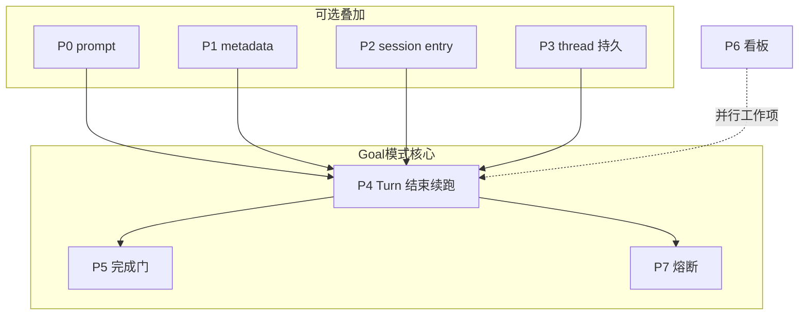

**G 轨与 P 层映射**（后文表格用此说话）：

| 用户轨 | 最少需要的 P |
|--------|----------------|
| **G1** 状态注入 | P2 或 P3 |
| **G2** 自治续跑 | G1 + **P4**（常 + P7） |
| **G3** 看板 | **P6**（常与 G1 并存） |
| **G4** 角色 goal | **P0** |

---

## 3. 用户语义：G1–G4（保留，但不对齐实现）

| 轨 | 用户感受 | 结束条件 |
|----|----------|----------|
| **G1** | `/goal` 后每轮还记得总目标 | `complete` / clear / blocked |
| **G2** | Turn 结束仍 active → 系统自动下一轮 | + 预算 / 熔断 |
| **G3** | 多卡片、可委派子 Agent | 卡片 Done |
| **G4** | system 里「你的 goal 是…」 | 模型自己停 |

**G2 以 G1（P2/P3）为前提**；没有持久 objective，续跑只是「再发一条用户消息」。

---

## 4. 标准架构：Harness 上的三块 + Loop 边界

典型 **G1+G2**（Prime / Codewhale）都符合：

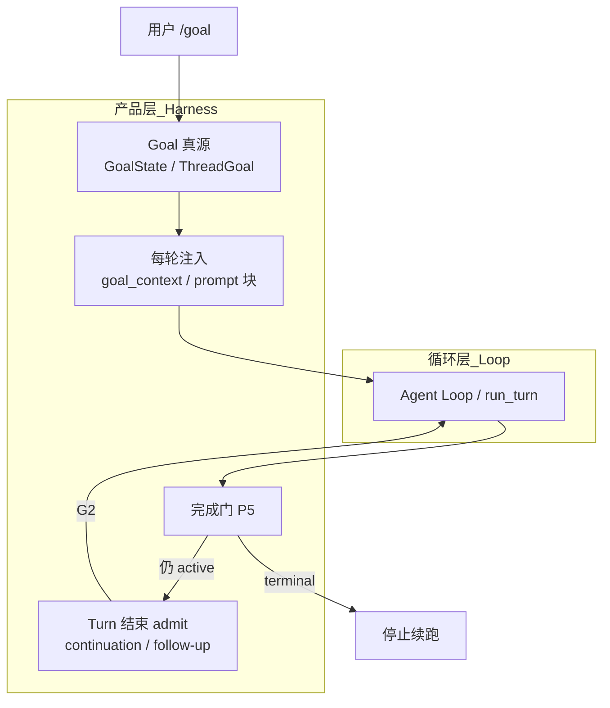

| 零件 | 职责 | **不应**放在 Loop 内核的原因 |
|------|------|------------------------------|
| **真源 GS** | 压缩、重启后 objective 仍在 | Loop 只应「跑完一轮」 |
| **注入 INJ** | objective 进 **L 平面**（模型可见上下文） | 避免只活在聊天里第一句 `/goal` |
| **续跑 ADM** | Turn 结束后是否 `SendMessage` / continuation | 与 Plan 模式、steer 的互斥在此裁决 |
| **完成门 GATE** | 禁止「感觉做完了」就停 G2 | 需要 API + 可选 verifier |

**Pi `pi-agent-core`**：无 GS/ADM——Prime 放在 **`AgentSession`（L3 产品层）**，与文档 [GOALS_AND_REFINE](../../prime-agent-architecture/GOALS_AND_REFINE.md) 一致。

**Codewhale**：`crates/runtime/goal_loop.rs` 提供 **纯函数** `decide_continuation`；**Engine**（`turn_loop.rs`）在 turn 末调用 `goal_continuation_message_if_needed`；真源在 **state + GoalState 工具**（`crates/tui/src/tools/goal.rs`）。

---

### 4.5 Goal 模式通用流程框架（七相 F0–F6）

族① **G1+G2** 产品在源码里拆法不同，但 **对外可观测生命周期** 可对齐下面七相。对比框架时：先标实现了哪些 **F**，再标 **F5 用哪条 V 验收族**（§4.6）。

| 相 | 名称 | 对应 P 层 | 典型触发 |
|----|------|-----------|----------|
| **F0** | **声明 objective** | P2/P3 | `/goal`、`create_goal`、`thread_goal_state`、`GoalController` 入参 |
| **F1** | **武装自治** | G2 前提 | Prime Autonomous；DSH `activation=armed`；nanobot `allow_goal_continue` |
| **F2** | **每 Turn 注入** | G1 | `<goal_context>`、`goal_state_runtime_lines()`、DSH `<goal_round>` 提示 |
| **F3** | **工作循环** | Loop 内 | 工具 / 子 Agent / ipython；**不是** Goal 专属 |
| **F4** | **Turn 收尾记账** | P3 可选 | usage、roundsStarted、`GoalProgress`、事件 `goal/changed` |
| **F5** | **验收门 GATE** | **P5** | `complete` / `blocked` / Judge / Verifier / 外部命令（§4.6） |
| **F6** | **续跑裁决 ADM** | P4 + P7 | `decide_continuation`、goal-round-driver、OpenHands 下一轮 `run()` |

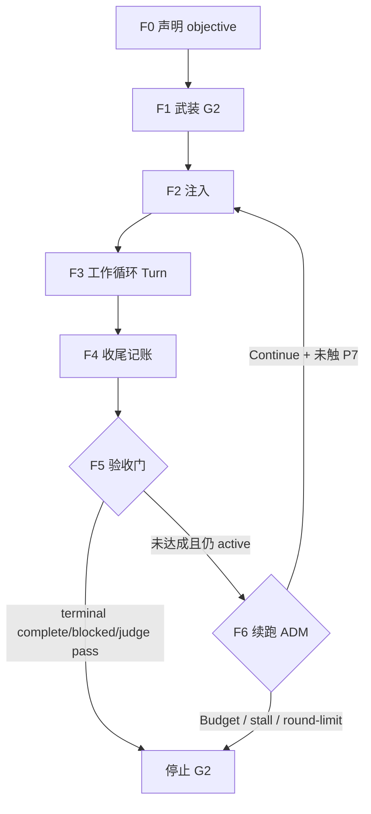

**与 §4 三块的关系**：F0 写 **GS**；F2 是 **INJ**；F5 是 **GATE**；F6 是 **ADM**。F3 单独属于 Loop，避免把「工具多轮」误写成 Goal。

**单 Turn 内质量环**（AgentScope `GoalPipeline`、Grok Turn 内 Verifier 面板）发生在 **F3 子循环**，**不替代** F5 的跨 Turn 合约——族③ 往往只有 F0（首条 Msg）+ F3 内 F5，没有 F6。

---

### 4.6 验收与校验机制分类（V0–V8）

**P5 完成门**在各家实现里差异最大。用 **V 族** 标注，可与 §5 矩阵列「完成 P5」对照。

| V 族 | 机制 | 谁裁决 | 本仓代表 |
|------|------|--------|----------|
| **V0** | 无合约门，模型自然停 | 模型 | G4 `Agent.goal`、纯 prompt |
| **V1** | **模型自报** `complete` / `blocked` API | 主模型 + Harness 持久化 | Prime `goal.complete()`、DSH `update_goal(complete\|blocked)`、nanobot long_task |
| **V2** | **Host 侧 objective 审计**（对照声明目标，非第三方） | Harness 在 complete 路径上检查 | Prime：完成须对照 objective，不能仅凭「感觉做完」（[GOALS_AND_REFINE](../../prime-agent-architecture/GOALS_AND_REFINE.md)） |
| **V3** | **独立 Judge LLM**（只读事件流，结构化 verdict） | 第二个 LLM | OpenHands `judge_goal`（[PART1 §Goal](../../openhands-sdk/ARCHITECTURE_PART1.md)） |
| **V4** | **Verifier Agent / critical review**（gap 集、achieved 布尔） | 专用 Agent 或 goal 工具角色 | Codewhale `GoalReviewRole::Critical` + Fleet **GoalGate**；AgentScope Executor↔Verifier schema；Grok **独立评估器 + Verifier 面板**（[grok-build ARCHITECTURE §Goal](../../grok-build-architecture/grok-build/ARCHITECTURE.md)） |
| **V5** | **机械规则 / 熔断**（不调用新模型） | 策略代码 | Codewhale `MAX_REPEATED_GAP_PASSES=3`；DSH `blockedAfterConsecutiveRounds`（默认 3 轮才允许 autonomous `blocked`）；DSH `round-limit`；Prime/CW **token / max_continuations** |
| **V6** | **外部命令 / CI**（测试、lint、自定义脚本） | 用户配置的 shell | Prime 产品层示例 `pnpm check` / `npm run check`（**非 Pi 内核强制**，见 [EXTERNAL_ARTICLES_SYNTHESIS](../../prime-agent-architecture/EXTERNAL_ARTICLES_SYNTHESIS.md)） |
| **V7** | **人机权威**（不等模型） | 用户 / UI | `/goal clear|pause|resume`；DSH 人类可立即停 goal；DSH resume/fork 后 **disarmed** 须显式武装 |
| **V8** | **工作流级 Gate**（多节点、依赖图） | Orchestrator + 多 Verifier | Codewhale Fleet `GoalGate.evaluate`（全部 critical Verifier `achieved` 才 PASS） |

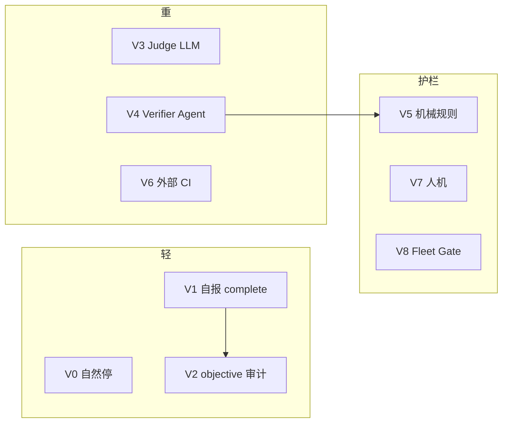

**选型提示**：

- 要 **可复现、可测**：至少 **V1 + V5** 或 **V4 + V5**；仅 V1 易被「口头完成」欺骗。  
- 要 **对抗式验收**：V3 或 V4（OpenHands / Grok / Codewhale Fleet 不同落点）。  
- **DeepSeek Harness** 默认 **V1 + V5**（blocked 阈值 + round cap），**无** 内置 V3/V4 Judge；与 Codewhale **V4+V5**、OpenHands **V3** 形成对照。  
- **AgentScope GoalPipeline** = **单次调用内的 V4**，没有跨 Turn F6。

| 项目 | F5 主 V 族 | 备注 |
|------|------------|------|
| Prime | V1 + V2（+ 可选 V6 配置） | Autonomous 仍靠 `complete()` 收口 |
| Codewhale | V1 + V4 critical + V5 gap | Advisory review 不触发 stall |
| OpenHands | **V3**（每轮 Turn 后） | 非 `goal.complete()` 单 API |
| Grok Build | V4 双环 + checklist + V5 Budget | Goal 外层循环 |
| DeepSeek Harness | V1 + V5 | `model-reported` blocked code |
| nanobot | V1（long_task 链） | 文档级 sustained goal |
| AgentScope | V4 only（族③） | 无 session GoalState |

---

## 5. 本仓库全量 Harness：Goal 能力矩阵

> 与 [01-overview §2 Tier 1](./01-overview.md)、[HARNESS-SPECTRUM](./HARNESS-SPECTRUM.md) 对齐。  
> 「Harness」= 本 monorepo 内 **多套独立产品**；**仅 Strands `create_harness()` 无 Goal**，不能代表全仓。

### 5.0 先分四族（避免「都叫 goal」）

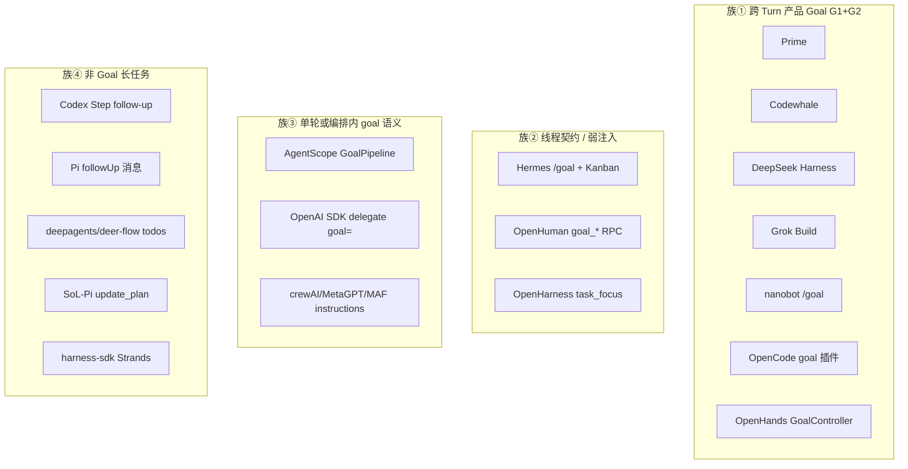

| 族 | 含义 | 选型时 |
|----|------|--------|
| **①** | 持久 objective + Turn 结束可续跑 + 完成门 | 要对标 Prime / Codewhale |
| **②** | 有 goal 字样，但 Kanban/RPC/metadata 为主 | 读 P 层，勿默认有 G2 |
| **③** | 一次调用或流水线内的 goal，**不是** session GoalState | AgentScope ≠ `/goal` |
| **④** | 用 Todo、Step、followUp、compact 扛长任务 | 见 [05-plan-mode](./05-plan-mode.md) |

### 5.1 Tier 1 — 完整 Agent Harness（有明确 loop）

| 项目 | 族 | G 轨 | P 层 | 真源 / 入口 | 续跑 P4 | 完成 P5 | 深潜 |
|------|-----|------|------|-------------|---------|---------|------|
| **Prime**（Pi 产品） | ① | G1+G2 | P2+P4+P5+P7 | JSONL `thread_goal_state` | Autonomous follow-up | V1+V2 `goal.complete()` | [GOALS_AND_REFINE](../../prime-agent-architecture/GOALS_AND_REFINE.md) |
| **Codewhale** | ① | G1+G2 | P3+P4+P5+P7 | thread goal + `GoalState` | `decide_continuation` | V4 critical + V5 gap | [codewhale-architecture](../../codewhale-architecture/ARCHITECTURE.md) |
| **DeepSeek Harness**（DSH） | ① | G1+G2 | P2+P4+P5+P7 | `ctx.goals` 事件溯源 + `GoalSnapshot` | `dsh-goal-round-driver` | V1+V5 blocked/round cap | [DSH goal 子系统](../../../deepseek-harness/docs/subsystems/goal.md) · [packages/goal](../../../deepseek-harness/packages/goal/README.md) |
| **Grok Build** | ① | G1+G2 | P2+P4+P5+P7 | SessionActor `GoalState`、GOAL.md | Goal 外层循环 | Completed/Blocked/Budget | [grok-build ARCHITECTURE](../../grok-build-architecture/grok-build/ARCHITECTURE.md) §Goal |
| **nanobot** | ① | G1+G2 | P2+P4+P5 | `session/goal_state.py` | `turn_continuation` + long_task | long_task 工具链 | [NANOBOT_ARCHITECTURE §6.3](../../nanobot/NANOBOT_ARCHITECTURE.md) |
| **OpenCode** | ①* | G1+G2* | 插件 | `opencode-goal-plugin` `/goal` auto-continue | 插件 admit | 插件约定 | [PLUGINS.md](../../opencode-architecture/PLUGINS.md) |
| **OpenHands** | ①变体 | G1+G2 | P2+P4+P5 | `GoalController` + 事件 | `run_goal` 多轮 | **V3** `judge_goal` | [openhands-sdk PART1 §Goal](../../openhands-sdk/ARCHITECTURE_PART1.md) |
| **Hermes** | ② | G1 弱+**G3** | P6 + 弱 P2 | `/goal` + **Durable Kanban** | gateway auto-resume | 卡片 Done | [FEATURE_DESIGN_CATALOG](../../hermes-agent-architecture/FEATURE_DESIGN_CATALOG.md) |
| **Codex** | ④ | 无产品 `/goal` | Step 内 P4 | `goals.db` 投影 | `needs_follow_up` | — | [codex-architecture](../../codex-architecture/README.md) |
| **OpenCode 核心** | ④ | 无（除非装插件） | — | EventV2 | Provider Turn | — | [opencode-architecture](../../opencode-architecture/ARCHITECTURE.md) |
| **Pi core** | ④ | 无 | — | JSONL 树 | `followUp` 队列 | — | [pi-agent](../../pi-agent/ARCHITECTURE.md) |
| **OpenHarness** | ② | 非 G1 | **P1** | `task_focus_state` | 无 | 无 | `OpenHarness/tests/.../demo_tool_metadata.py` |
| **harness-sdk**（Strands） | ④ | **无** | — | Session snapshot | 同 invocation tool 轮 | — | [harness-sdk-architecture](../../harness-sdk-architecture/ARCHITECTURE.md) |
| **deepagents** | ④ | 无 | — | graph checkpoint | 图内 step | — | 文档在 monorepo 外树或 middleware |
| **deer-flow** | ④ | 无 | — | 同 deepagents 系 | — | — | `.cursorignore` 外可参考上游 |
| **OpenManus** | ④ | 无 | Plan ① | PlanningFlow 步骤 | 用户逐步 | — | [openmanus-architecture](../../openmanus-architecture/ARCHITECTURE.md) |
| **MetaGPT** | ③ | G4 | P0 | Role 职责文案 | env 轮 | — | [metagpt-architecture](../../metagpt-architecture/ARCHITECTURE.md) |
| **crewAI** | ③ | G4 | P0 | `Agent.goal` | Crew 任务轮 | 任务结束 | [crewai-architecture](../../crewai-architecture/README.md) |
| **smolagents** | ④ | 无 | — | 最小 loop | — | — | [smolagents 文档](../../SmolAgents/) |
| **OpenAI Agents SDK** | ③ | 无模式 | — | `delegate` 的 `goal=` 参数字符串 | Runner turn | handoff | [openai-agent](../../openai-agent/OPENAI_AGENTS_SDK_ARCHITECTURE_DEEP_DIVE.md) |
| **Claude Agent SDK** | ④ | 无 | E 黑盒 | CLI | 厂商内 | — | [claude-code](../../claude-code/README.md) |
| **Agent Framework（MAF）** | ③ | G4 级 | P0 | `Agent.instructions` | Workflow superstep | — | [maf-agent](../../maf-agent/docs/README.md) |
| **AgentScope v2** | ③ | **非 G1** | 编排 | **`GoalPipeline`** executor↔verifier | **单条 pipeline 内**循环 | schema pass/impossible | [PIPELINE_AND_GOALS](../../agentscope/PIPELINE_AND_GOALS.md) |
| **LangGraph** | 自建 | 应用自定 | 自造 P2 | checkpoint 字段 | 自造 | 自造 | 库非 harness |
| **Letta** | ② | 无 slash | 记忆块 | block 可写目标句 | API step | — | agent-memory 系文档 |
| **AutoGen** | ④ | 无 | — | GroupChat thread | 路由发言 | — | 对比见 _archive/01 |

\* OpenCode **核心仓无内置 `/goal`**；Goal 能力来自 **goal 插件**，行为对齐族①，部署时需单独启用。

### 5.2 Tier 2 / 本仓其它 Agent 相关项目

| 项目 | 族 | Goal 相关能力 | 说明 |
|------|-----|---------------|------|
| **OpenHuman** | ② | `goal_set` / `goal_get` / `goal_complete` | 线程级契约；**不是** Grok SessionActor 那套 harness（见 [openhuman/ARCHITECTURE](../../openhuman/ARCHITECTURE.md)） |
| **DeepTutor** | ④ | `learning_goals` 记忆槽 | L3 用户画像，**不是** coding `/goal` |
| **LongHorizon-Harness** | ④ | 外环可选 Goal/Workflow | 强制 MEA 外环；见 [ARCHITECTURE_PART3](../../LongHorizon-Harness/ARCHITECTURE_PART3.md) |
| **SoL-Pi** | ④ | `update_plan.goal` 字段 | 步骤描述 + compact 经济；[sol-pi-architecture](../../sol-pi-architecture/ARCHITECTURE.md) |
| **Understand-Anything** | — | 无 | 分析流水线，非对话 Goal |
| **GenericAgent / TradingAgents / FastAgent** | ④/③ | 多为任务 prompt 或阶段目标 | 见 [CROSS_AGENT_DESIGN_INDEX](../../CROSS_AGENT_DESIGN_INDEX.md) |
| **agentmemory** | ② | 长期记忆竞品对比 | 非 harness loop；见 `agentmemory/README.md` |
| **四项目（Codewhale 等）** | 见上 | Codewhale 在 Tier1；另三项目无 `/goal` | [FOUR_PROJECT_ARCHITECTURE_INDEX](../../FOUR_PROJECT_ARCHITECTURE_INDEX.md) |

### 5.3 族① 补充：Grok / nanobot / OpenHands / OpenCode 插件

| 项目 | 架构要点（实现原理） |
|------|----------------------|
| **Grok Build** | `SessionActor` 内 **GoalState** 状态机（Running/Paused/Completed/Blocked/BudgetExhausted）；`/goal` 生成 checklist 落 GOAL.md；外层 Goal 循环 + 内层 Turn 复用同一消息管道（[grok-build ARCHITECTURE](../../grok-build-architecture/grok-build/ARCHITECTURE.md)） |
| **nanobot** | `goal_state.py` 持久 metadata + `goal_state_runtime_lines()` 注入 ContextBuilder；`long_task.py` 工具 + `turn_continuation.py` 在 assistant 结束后 **allow_goal_continue** 排水（[§6.3 Sustained Goals](../../nanobot/NANOBOT_ARCHITECTURE.md)） |
| **OpenHands** | **`GoalController`**：`objective` + `judge_llm` + `max_iterations`；每轮 `run()` 结束由 judge 判定是否达成；状态经 `ConversationStateUpdateEvent` 恢复——**P5 是外部 Judge 而非单一 `complete()` API** |
| **OpenCode 插件** | 社区/插件 **`opencode-goal-plugin`**：文档记载「目标常驻 + auto-continue」，对齐 Prime 式 G1+G2，**不在 OpenCode 核心二进制里** |

### 5.4 族③ 易混：AgentScope GoalPipeline

`GoalPipeline` = **Executor Agent ↔ Verifier Agent** 在**一次 `reply_stream` 调用内**循环，直到结构化 `VerificationResult` pass/impossible——这是 **编排层质量环**，**没有** JSONL `GoalState`、没有 Turn 结束 Autonomous。对比表：

| | Prime `/goal` | AgentScope `GoalPipeline` |
|--|---------------|---------------------------|
| 生命周期 | 跨多 Turn / 可恢复 | 单次 pipeline 调用 |
| 真源 | `thread_goal_state` | 无独立 GS；goal 在首条 `Msg` |
| 完成 | `goal.complete()` | Verifier schema |
| 文档 | [GOALS_AND_REFINE](../../prime-agent-architecture/GOALS_AND_REFINE.md) | [PIPELINE_AND_GOALS](../../agentscope/PIPELINE_AND_GOALS.md) |

### 5.5 harness-sdk（Strands）专节——**没有 Goal 模式**

| 能力 | 存在？ | 说明 |
|------|--------|------|
| 跨 turn `GoalState` | **否** | `harness-sdk` 源码无 goal / GoalState |
| 同轮多步 | 是 | `event_loop_cycle` 在 `stop_reason=tool_use` 时 **recurse** |
| 任务清单 | 弱 | `strands_harness/plugins/todos.py` 临时注入，**无** complete 合约 |
| Session 持久化 | 是 | `SessionManager` snapshot，**不**含 objective 状态机 |
| 长任务建议 | — | 应用层自建 P2/P3，或接 Prime/Codewhale 式产品层 |

### 5.6 OpenHarness 专节——**task_focus ≠ Goal**

`remember_user_goal(metadata, text)` 写入 `task_focus_state.goal` / `recent_goals`（见 `OpenHarness/tests/test_engine/demo_tool_metadata.py`）。这是 **P1：给工具/上下文读 metadata**，没有：

- 每轮固定注入块（P2）  
- Turn 结束 `decide_continuation`（P4）  
- `goal.complete()`（P5）  

长任务在文档里靠 **用户续聊、Coordinator/Swarm**，不是 G1+G2 合约。

### 5.7 Codewhale 专节——**与 Prime 同族但熔断语义不同**

**流程（简化）**：

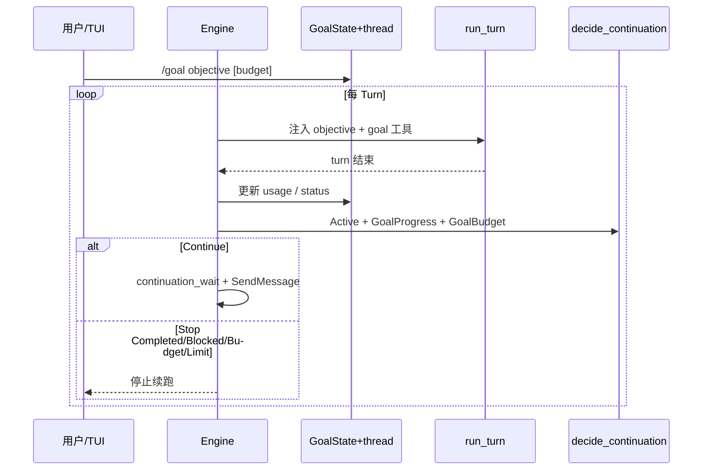

**`decide_continuation`  precedence**（`crates/runtime/src/goal_loop.rs`）：

1. 模型 **terminal**：`Completed` / `Blocked` → 停  
2. **Token 预算**：仅当 `[goal] enforce_token_budget=true` 时硬停；默认 **超限仍继续**（telemetry）  
3. **`max_continuations` > 0** 时续跑熔断（默认 `0` = 不限次数，靠 **无进展 stall**）  
4. 否则 **Continue**

**额外 P5**：`MAX_REPEATED_GAP_PASSES`（verifier 连续相同 gap）→ `Paused` / `NoProgress`，与 Prime 的纯 token 预算不同。

深潜：[codewhale-architecture/ARCHITECTURE.md](../../codewhale-architecture/ARCHITECTURE.md)（GoalBudget、`goal_continuation_message_if_needed`）、`Codewhale/docs/design/WORKFLOWS_GOAL_PARITY.md`。

### 5.8 DeepSeek Harness（DSH）专节——**Cordis 插件族①，对标 Prime 而非 Strands**

DSH 与本 monorepo 的 **harness-sdk（Strands）** 是两套产品：Strands **无** GoalState；DSH 在 `packages/goal/` 提供 **会话级 durable objective + 可选无人值守轮次**，在 benchmark 文档里常与 Strands 对照（`harness-sdk/site/.../strands-harness-benchmarks.html`）。

| 包 | 职责 |
|----|------|
| `@deepseek-ai/dsh-goal` | 真源服务：`GoalPhase`（active/paused/blocked/complete）、`maxGoalRounds`、CAS `GoalRef` |
| `@deepseek-ai/dsh-tool-goal` | 模型工具 `get_goal` / `create_goal` / `update_goal`；**V5** `blockedAfterConsecutiveRounds`（默认 3） |
| `@deepseek-ai/dsh-command-goal` | 人类 `/goal`（不占模型轮） |
| `@deepseek-ai/dsh-goal-round-driver` | **P4**：idle + armed + 有余量 → 排队 `<goal_round>` 用户消息；仅 **已进入历史的 goal 消息** 消耗 round |

**七相对照**：

- **F0**：人类顶层的 `create_goal` 或 `/goal`；自主轮可 `complete`/`blocked`（authority 见 tool-goal README）。  
- **F1**：`activation: armed`；resume/fork 后 **默认 disarmed**，须人类授权再武装（防静默复活）。  
- **F2**：每轮 driver 注入 JSON-quoted objective、round/cap。  
- **F5**：**V1** 模型 `complete`；**V5** 连续 N 轮同条件才允许 autonomous `blocked`（`model-reported`）；人类可随时停（**V7**）。  
- **F6**：round 用尽 → `round-limit` blocker；与 Prime 的 token budget 不同轴。

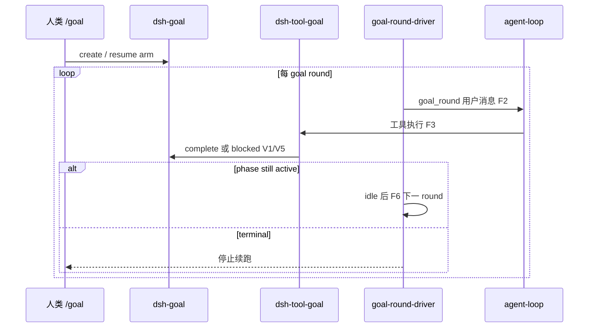

深潜：[deepseek-harness/docs/subsystems/goal.md](../../../deepseek-harness/docs/subsystems/goal.md) · [ARCHITECTURE_PART1](../../deepseek-harness/ARCHITECTURE_PART1.md) · [05-对照-Pi-与-DSH](../../deepseek-harness/05-对照-Pi-与-DSH.md)。

---

## 6. 各代表实现：端到端时序

### 6.1 Prime（G1+G2 标杆）

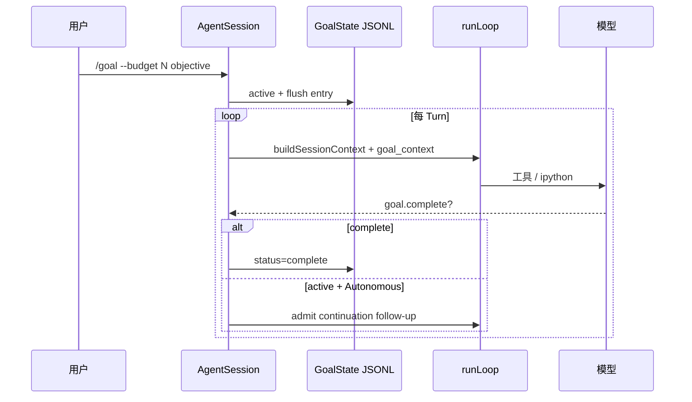

### 6.2 Codex（区分 Step follow-up vs Goal）

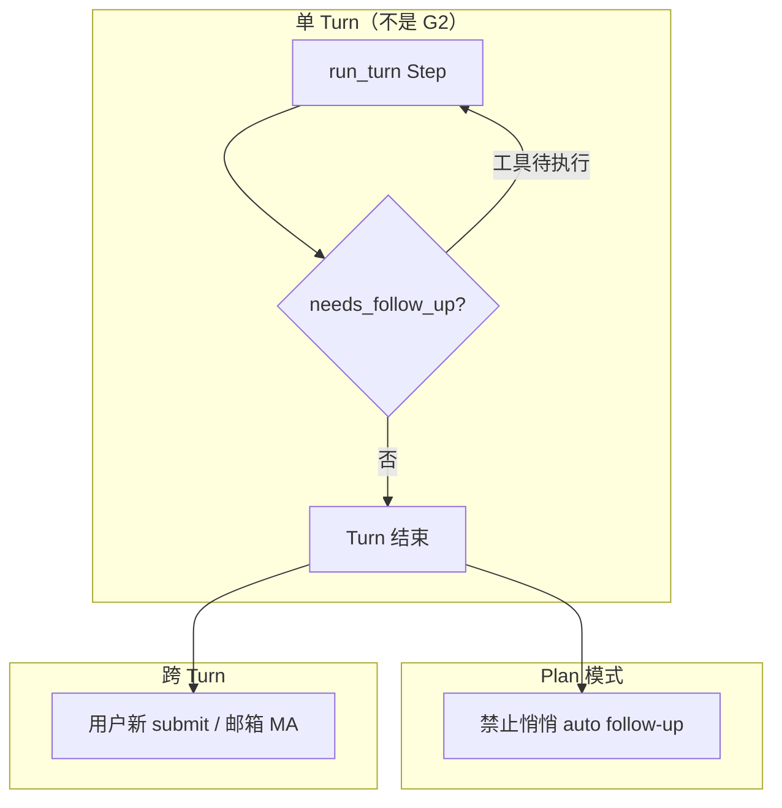

`goals.db` 是 **功能投影**，不是 Prime 式 `thread_goal_state` 合约；对比时分开写。

### 6.3 Hermes（G3 为主、G1 为辅）

- **P6 Durable Kanban**：跨 Agent 持久工作项（0.13 Tenacity）。  
- **`/goal`**：目标追踪（文档级 G1 弱）；与 **gateway auto-resume** 并用时，先分清是 **会话断线续跑** 还是 **objective 未完成续跑**。  
- 深潜：[FEATURE_DESIGN_CATALOG](../../hermes-agent-architecture/FEATURE_DESIGN_CATALOG.md) §0.13。

### 6.4 SoL-Pi（避免误判）

`update_plan` 的 `goal` 字段是 **步骤描述**（TypeBox schema），服务 **在线 compact 经济性**，**不是** P3 线程 objective。见 [sol-pi-architecture](../../sol-pi-architecture/ARCHITECTURE.md) §online-context-compact。

### 6.5 DeepSeek Harness（F2–F6 + V1/V5）

见 **§5.8** 序列图。对比 Prime：**无** JSONL `thread_goal_state` 树，而是 **Session 事件日志 + `goal/changed` 耐久**；对比 Codewhale：**无** Fleet Verifier（V4），验收以模型工具 + 机械 blocked 为主。

### 6.6 OpenHands（F5 = V3 Judge，非 complete API）

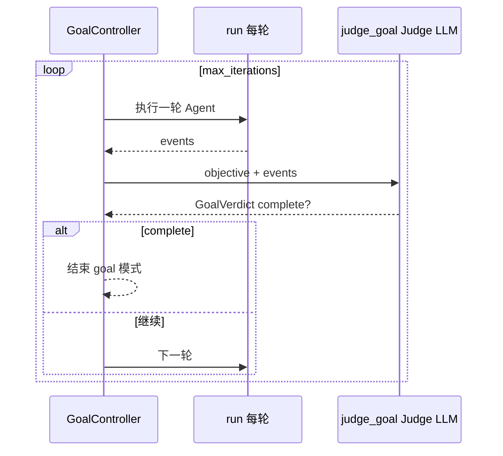

与 Prime **F5**：Prime 在 Turn 内由主模型调 `goal.complete()`（V1+V2）；OpenHands **Turn 结束后** 才做 V3，二者 **ADM（F6）** 都依赖「未 terminal 则再跑」，但 **Gate 位置不同**。

### 6.7 Grok Build（Goal 外环 + V4 双验收）

Goal 外层：**F0** `/goal` 写 checklist → GOAL.md；内层 Turn 仍走通用消息管道。Turn/Goal 末：**独立评估器** 决定是否 `Continue`；通过后再 **Verifier 面板**（对抗验收）——属于 **V4 + V5（Budget）**，与 Codewhale 单进程 critical review、OpenHands 单 Judge 不同。见 [grok-build ARCHITECTURE §Goal](../../grok-build-architecture/grok-build/ARCHITECTURE.md)。

### 6.8 Codewhale（V4 critical + V5 gap，可选 V8 Fleet）

单 Agent：**goal 工具** 提交 `GoalReview`（critical vs advisory）；`record_not_achieved` 对 **同一 gap set** 计数，达 `MAX_REPEATED_GAP_PASSES` → pause（V5）。多 Agent Fleet：**GoalGate** 汇总 critical Verifier 的 `achieved`（V8）。时序见 **§5.7**。

---

## 7. 与 Plan / Todo / 插队 正交表

| 机制 | 生命周期 | 与 G2 关系 |
|------|----------|------------|
| **Plan ③ 权限** | 模式开关 | **互斥** auto continuation（Codex 已固化） |
| **Plan ② Todo** | 同 Loop 勾选 | 无 P4；压缩后易漂移 |
| **Goal G1+G2** | 跨 Turn | **要** P4，常要 P5/P7 |
| **Steer** | 当前 Turn 内 | 在 ADM 边界与 pending_steers 协调 |
| **Compaction** | 历史压缩 | objective **不得**只活在 summary 里 |

---

## 8. 「这些 Harness 用了哪些？」——速查（全仓）

| 你若指的是… | 族 | 有没有真·G1+G2 | 备注 |
|-------------|-----|----------------|------|
| **harness-sdk `create_harness()`** | ④ | **否** | 仅 todos 插件；见 §5.5 |
| **OpenHarness QueryEngine** | ② | **否** | P1 task_focus；见 §5.6 |
| **Prime / Pi 产品** | ① | **是** | `/goal` + Autonomous |
| **Codewhale** | ① | **是** | V4+V5；`decide_continuation` |
| **DeepSeek Harness** | ① | **是** | Cordis goal 组 + round-driver；§5.8 |
| **Grok Build** | ① | **是** | SessionActor + V4 双环 |
| **nanobot** | ① | **是** | Sustained Goals `/goal` |
| **OpenCode + goal 插件** | ①* | **是*** | 核心无内置 |
| **OpenHands** | ①变体 | **部分** | V3 Judge 外环，非 `complete()` |
| **Hermes** | ② | **弱** + Kanban G3 | 勿与 gateway resume 混 |
| **AgentScope** | ③ | **否**（GoalPipeline≠/goal） | §5.4 |
| **Codex / Pi core** | ④ | **否** | Step / followUp |
| **deepagents / deer-flow / OpenManus** | ④ | **否** | Plan/Todo |
| **crewAI / MetaGPT / MAF** | ③ | **G4 文案** | `goal`/`instructions` |
| **OpenHuman** | ② | **RPC 契约** | `goal_set/complete` |
| **SoL-Pi / UA / Strands** | ④/— | **否** | 见 §5.2 |

完整表 → **§5.1–§5.2**；索引 → [CROSS_AGENT_DESIGN_INDEX](../../CROSS_AGENT_DESIGN_INDEX.md)。

---

## 9. 设计法则（实现向）

1. **先标 P 层再标 G 轨**——避免「支持 Goal」空话。  
2. **Loop 内核不吞 Goal**——续跑在 Turn **结束 admit**（P4）。  
3. **完成可审计**（P5）——标清 **V 族**（§4.6）；禁止仅靠自然语言「做完了」。  
4. **G2 必带 P7 之一**——token、续跑次数、或 stall/gap 检测。  
5. **Plan ③ 与 G2 默认互斥**——同一 Turn 管道不要既禁副作用又 auto 续跑。  
6. **多并行目标用 P6**——单 session 多 active Autonomous 易抢 Loop。  
7. **harness-sdk 集成 Goal**——在 **Agent 外包装产品层**（P2/P3），不要改 `event_loop_cycle` 语义去冒充 Goal。

---

## 10. 选型

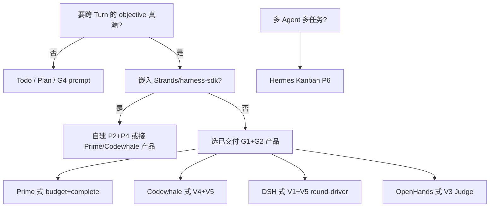

**OpenHarness 若要补真 Goal**：在 **Turn 完成回调** 加 P4，引入 P2/P3 真源与 P5 `complete`，且与 `PermissionMode.PLAN` 互斥——**不要**把 `task_focus_state` 改名为 GoalState 就完事。

---

## 11. 深潜索引（按项目）

| 项目 | 文档 |
|------|------|
| **Prime** | [GOALS_AND_REFINE](../../prime-agent-architecture/GOALS_AND_REFINE.md) · [ARCHITECTURE_GUIDE §6.7](../../prime-agent-architecture/ARCHITECTURE_GUIDE.md) |
| **Codewhale** | [ARCHITECTURE](../../codewhale-architecture/ARCHITECTURE.md) · `Codewhale/crates/runtime/src/goal_loop.rs` · `WORKFLOWS_GOAL_PARITY.md` |
| **DeepSeek Harness** | [goal 子系统](../../../deepseek-harness/docs/subsystems/goal.md) · [packages/goal](../../../deepseek-harness/packages/goal/README.md) · [ARCHITECTURE_PART1](../../deepseek-harness/ARCHITECTURE_PART1.md) |
| **Grok Build** | [grok-build ARCHITECTURE §Goal](../../grok-build-architecture/grok-build/ARCHITECTURE.md) |
| **nanobot** | [NANOBOT_ARCHITECTURE §6.3 / 第12章](../../nanobot/NANOBOT_ARCHITECTURE.md) |
| **OpenHands** | [openhands-sdk ARCHITECTURE_PART1 GoalController](../../openhands-sdk/ARCHITECTURE_PART1.md) |
| **OpenCode goal 插件** | [opencode PLUGINS](../../opencode-architecture/PLUGINS.md) |
| **Hermes** | [FEATURE_DESIGN_CATALOG](../../hermes-agent-architecture/FEATURE_DESIGN_CATALOG.md) |
| **OpenHuman** | [openhuman/ARCHITECTURE](../../openhuman/ARCHITECTURE.md) · `thread_goals` |
| **AgentScope** | [PIPELINE_AND_GOALS](../../agentscope/PIPELINE_AND_GOALS.md) |
| **Codex** | [SECURITY_ARCHITECTURE](../../codex-architecture/SECURITY_ARCHITECTURE.md) · [05-plan-mode](./05-plan-mode.md) |
| **harness-sdk** | [harness-sdk-architecture](../../harness-sdk-architecture/ARCHITECTURE.md) §2.1 |
| **OpenHarness** | `OpenHarness/tests/test_engine/demo_tool_metadata.py` |
| **横向 Harness** | [00-HARNESS-DESIGN-PHILOSOPHY](./00-HARNESS-DESIGN-PHILOSOPHY.md) · [HARNESS-SPECTRUM](./HARNESS-SPECTRUM.md) · [01-overview](./01-overview.md) |
| **全仓导航** | [CROSS_AGENT_DESIGN_INDEX](../../CROSS_AGENT_DESIGN_INDEX.md) |
