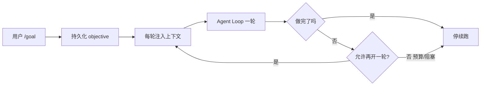
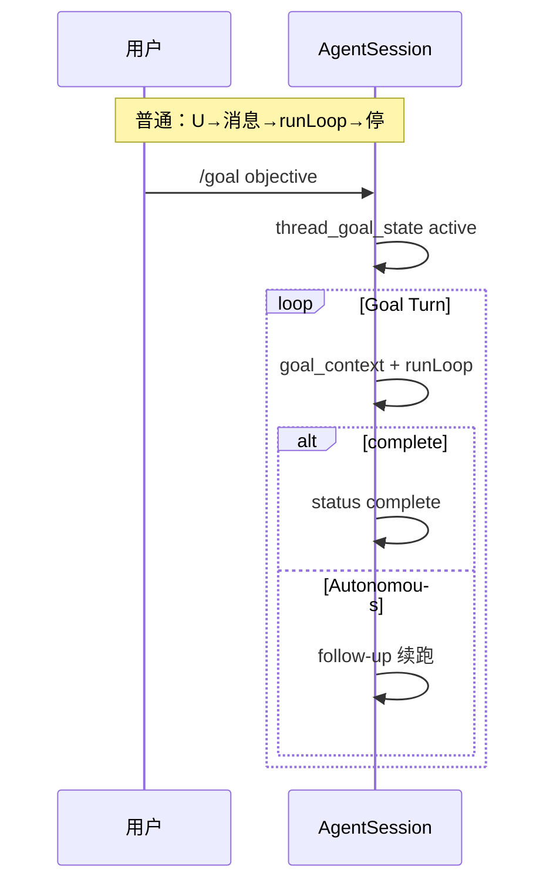
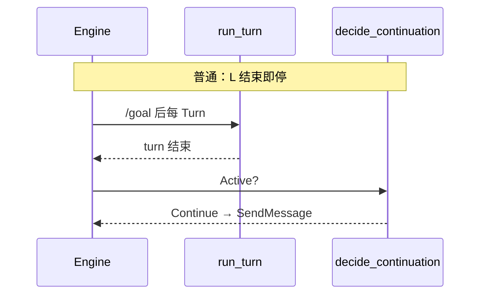
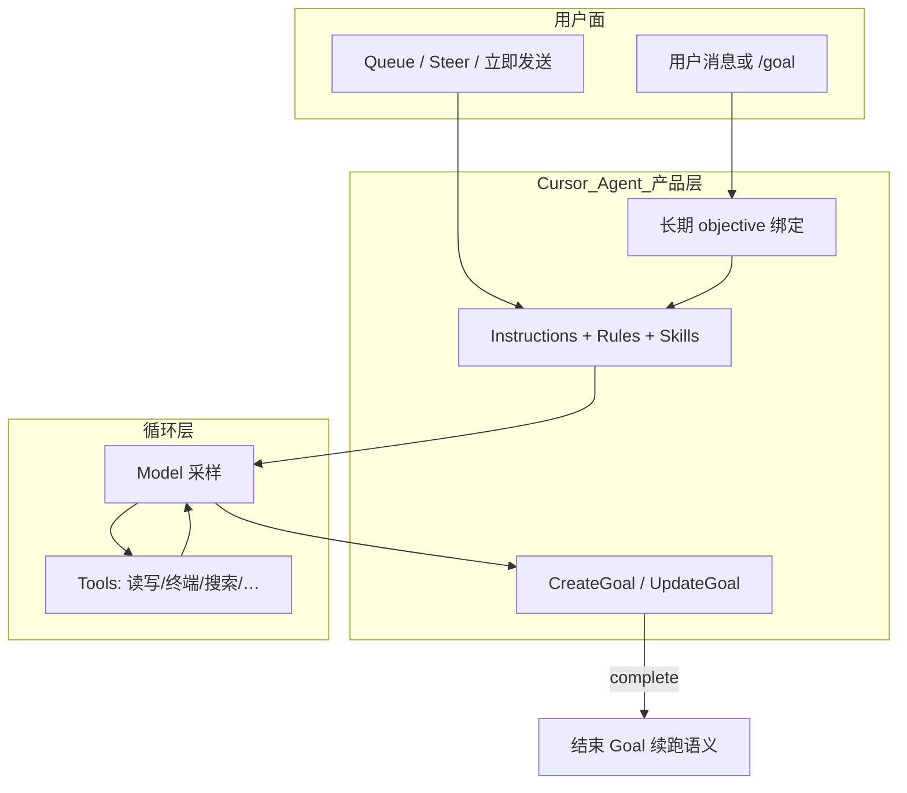
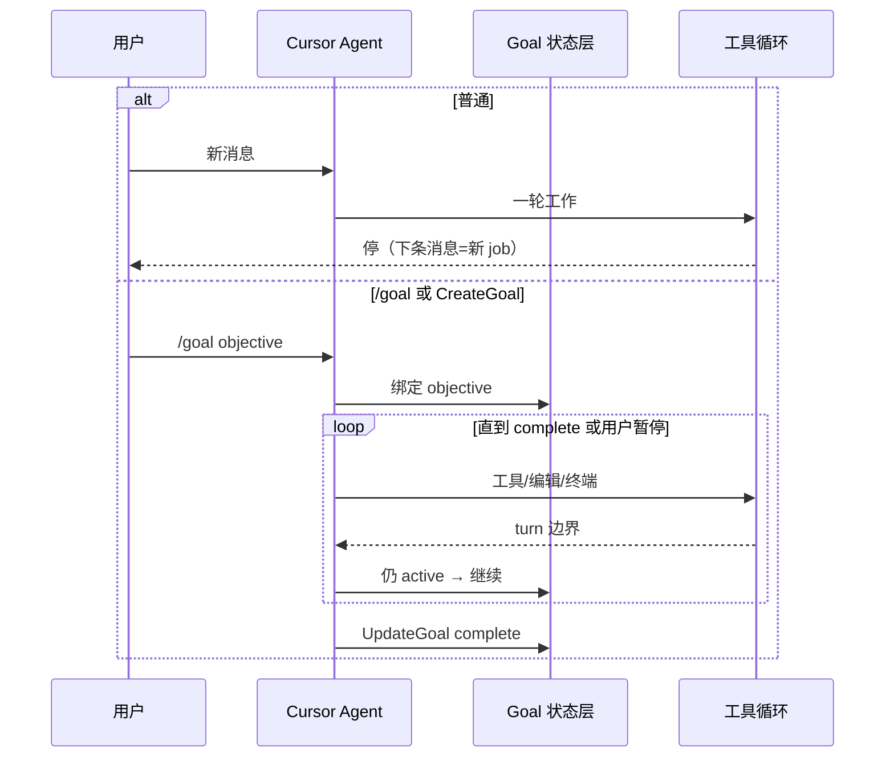
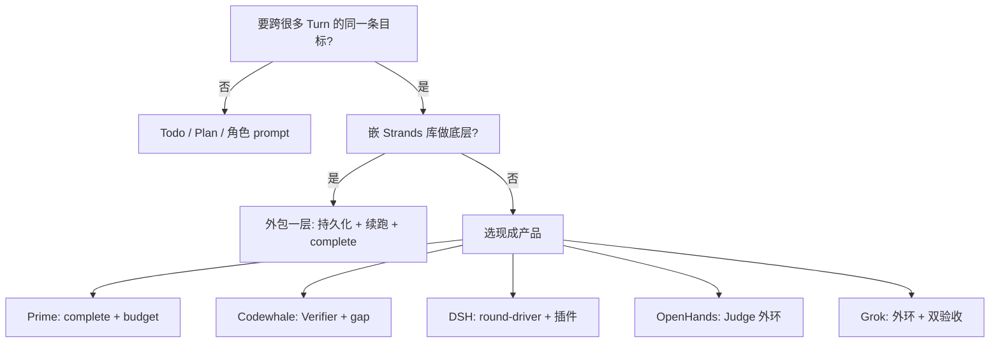

# Goal 模式：各 Harness 怎么实现、怎么验收

> **相关**：[05-plan-mode](./05-plan-mode.md)（Todo/Plan 别和 Goal 混）· [00-HARNESS-DESIGN-PHILOSOPHY](./00-HARNESS-DESIGN-PHILOSOPHY.md)  
> **旧版**（P/G/F/V 分层矩阵）：[_archive/22-goal-mode-P-G-F-taxonomy.md](./_archive/22-goal-mode-P-G-F-taxonomy.md)

---

## 目录

1. [先对齐：什么叫「真·Goal 模式」](#1-先对齐什么叫真goal-模式)  
   - [1.1 常被误叫 Goal 的东西](#11-常被误叫-goal-的东西)
2. [统一对照维度（怎么读每一节）](#2-怎么读每一节统一对照维度)
3. [分 Harness：普通 vs Goal](#3-分-harness普通模式-vs-goal-模式)  
   - [3.1 prime-agent](#31-prime-agentprime--pi-产品层) · [3.2 pi / pi-goal](#32-pi内核与-pi-goal-插件) · [3.3 CodeWhale](#33-codewhale)  
   - [3.4 deepseek-harness](#34-deepseek-harnessdsh) · [3.5 grok](#35-grokgrok-build) · [3.6 nanobot](#36-nanobot)  
   - [3.7 openhands / sdk](#37-openhands--openhands-sdk) · [3.8 penguin-harness](#38-penguin-harness) · [3.9 opencode](#39-opencode)  
   - [3.10 codex](#310-codex) · [3.11 hermes](#311-hermes) · [3.12 agentscope](#312-agentscope)  
   - [3.13 openharness / Strands](#313-openharness-与-harness-sdkstrands) · [3.14 GenericAgent](#314-genericagent) · [3.15 LongHorizon](#315-longhorizon-harness)  
   - [**3.17 Cursor（IDE / CLI Agent）**](#317-cursoride--cli-agent)  
   - [3.16 其余无真·Goal](#316-其余项目无真goal普通-vsgoal-字样)
4. [项目名 → 导航（本文 §3 + 各仓 Goal 专章）](#4-项目名--导航本文-3--各仓-goal-专章)
5. [通用设计与最佳实践](#5-通用设计与最佳实践)
6. [深潜索引](#6-深潜索引)

### 怎么读

- **要对某一个 Harness**：直接进 **§3.x**，每节都有 **普通模式表 + Goal 模式表 + 并排对照**（有 Goal 的）。  
- **只记得项目名、要去读原文**：**§4** 只做 **双链导航**（本文 §3.x ↔ 各项目文档里的 Goal 章节），不重复 §3 正文。  
- 正文片段亦在 [`_parts/22-goal-harness-sections.md`](./_parts/22-goal-harness-sections.md)（与 §3 同步，便于 diff）。

---

## 1. 先对齐：什么叫「真·Goal 模式」

用户说 Goal，通常指下面 **三件事一起成立**（本文明用 **跨 Turn 目标 / 自动续跑 / 完成门** 来说，不再用 P/G/F 编号）：

1. **跨 Turn 目标**：同一条 objective（例如「修好登录 bug」）写在 Harness 能恢复的地方，**每一轮**模型上下文里还能看到，而不是只在第一句聊天或 system 里提一次。  
2. **自动续跑**（可选但很常见）：一轮 assistant 正常结束后，若目标仍未结束，Harness **自己**再开下一轮，用户不必每次点「继续」。  
3. **完成门**：不能靠聊天里一句「我做完了」就停续跑；要有 **`complete` / `blocked`、Judge、Verifier、预算用尽** 等可审计出口。

**Agent Loop**（单轮里工具调来调去）只负责「干一轮活」。Goal 的 **存目标、注入、续跑、验收** 应放在 Loop **外面**的产品层——Prime 的 `AgentSession`、Codewhale 的 Engine、DSH 的 Cordis 插件，都是这个分工。

### 1.1 常被误叫 Goal 的东西

| 现象 | 实际 | 本仓例子 |
|------|------|----------|
| `Agent.goal=` 一段角色文案 | 没有跨 Turn 真源 | crewAI、MetaGPT |
| Todo / `write_todos` | 同会话勾选，易在压缩后漂移 | Codex Plan、deepagents |
| Turn 内 `needs_follow_up` | **同一 Turn** 里接着采样 | Codex Step |
| `task_focus` metadata | 工具可读的一句焦点，无 complete、无自动续跑 | OpenHarness |
| 单次 API 里的 Executor↔Verifier | 质量环在 **一次调用内**，不是 session `/goal` | AgentScope `GoalPipeline` |

---
## 2. 怎么读每一节：统一对照维度

下面每个 Harness 都用 **同一套表头** 对比 **普通对话** 与 **Goal 模式**（若该产品没有 Goal，则只写普通，并说明「goal 字样指什么」）。

| 维度 | 问什么 |
|------|--------|
| **用户入口** | 普通怎么发任务；Goal 怎么声明 objective |
| **会话真源** | 消息/事件写在哪；Goal 状态写在哪（与聊天是否分离） |
| **单轮边界** | 什么叫「一轮结束」（Turn / Task / `run()`） |
| **每轮多出来的上下文** | 除历史消息外，系统固定注入什么 |
| **轮结束后** | 会不会自动开下一轮；谁触发 |
| **模型侧工具/API** | 能否 `complete`、Judge、Verifier、long_task… |
| **验收** | 谁判定「整体做完」 |
| **熔断** | token、轮次、gap、blocked 阈值 |
| **与 Plan/Todo 关系** | 能否同时开；是否互斥 |

---

## 3. 分 Harness：普通模式 vs Goal 模式

---

### 3.1 prime-agent（Prime / Pi 产品层）

**定位**：Goal 在 **`AgentSession`（coding-agent 产品层）**，不在 `pi-agent-core`。普通 Pi 用户若只跑 core，没有下表 Goal 列。

#### 普通模式（默认聊天）

| 维度 | 行为 |
|------|------|
| 入口 | 用户直接发消息或 slash（非 `/goal`） |
| 真源 | JSONL 会话树（消息 + 其它 custom entry），**无** `thread_goal_state` |
| 单轮 | `runLoop`：一次 LLM↔tools 直到本 turn 结束 |
| 注入 | `buildSessionContext`：**无** `<goal_context>` |
| 轮结束后 | **停**；续聊靠用户下一条消息，或内存队列 **`followUp`**（仍是「用户/产品显式塞消息」，不是 objective 合约） |
| 工具 | 常规 coding 工具 + skills；**无** goal skill 合约 |
| 验收 | 无「整任务完成」门；模型停即停 |
| 熔断 | 会话级 token/步数由产品配置，**与 Goal budget 无关** |

#### Goal 模式（`/goal` + 可选 Autonomous）

| 维度 | 行为 |
|------|------|
| 入口 | `/goal [--budget &lt;tokens&gt;] &lt;objective&gt;`；`clear` / `pause` / `resume` / `status` |
| 真源 | **`thread_goal_state`** custom entry（flush 后可恢复）；字段含 `status`、`objective`、`tokenBudget`、`tokensUsed`、`continuationsUsed` |
| 单轮 | 同上 `runLoop`，但每轮记得总目标 |
| 注入 | **`createGoalContextMessage()`** → `customType: goal_context`（明确：结束本轮 ≠ 完成总目标） |
| 轮结束后 | 若仍 `active` 且 **Autonomous**：**admit continuation follow-up**（自动再开一轮）；若用了 `rlm.run()` 等子 agent，常等 quiet 后再续 |
| 工具 | **goal skill**：`goal.get` / `goal.create` / `goal.complete` → `handleGoalHostRequest()`；须在 ipython **`await goal.complete()`** |
| 验收 | **模型调 complete** + 文档要求 **对照 objective 审计**；可选产品层 `pnpm check`（用户配置） |
| 熔断 | `tokenBudget` 用尽 → `budget_limited`；可 pause |

#### 并排对照

| 维度 | 普通 | Goal |
|------|------|------|
| 跨 Turn 总目标 | 无结构化字段 | `thread_goal_state.objective` |
| Turn 末自动续跑 | 否（除非手动 followUp） | Autonomous → 是 |
| 完成门 | 无 | `goal.complete()` |
| 与 `/refine` | 正交：refine 改 harness 能力，goal 改「要办完什么」 | 见 [GOALS_AND_REFINE](../../prime-agent-architecture/GOALS_AND_REFINE.md) |

**深潜**：[GOALS_AND_REFINE](../../prime-agent-architecture/GOALS_AND_REFINE.md) · `packages/coding-agent/src/core/goals.ts`

---

### 3.2 pi（内核）与 pi-goal 插件

| | **Pi 内核**（`pi-agent-core`） | **pi-goal 插件** | **Prime 产品** |
|--|-------------------------------|------------------|----------------|
| 普通 | `prompt` → `runLoop`；steer/followUp 队列 | 同左 + 可装插件 | 同 Prime §3.1 普通列 |
| Goal | **无** | `/goal`；JSON 文件存会话目录；continuation 在 turn 干净结束时注入；`update_goal(complete)` | **§3.1 Goal 列**（更完整：JSONL 真源 + Autonomous） |
| 验收 | — | complete + 部分 fork 用 **evaluator 模型**在 `agent_end` 判 Met/Impossible | `goal.complete()` + 审计 |

**深潜**：[pi-plugins-design §5](../../pi-agent/pi-plugins-design.md)

---

### 3.3 CodeWhale

**定位**：Goal 在 **Engine + thread state + GoalState 工具**；`decide_continuation` 是纯函数（`crates/runtime/src/goal_loop.rs`）。

#### 普通模式

| 维度 | 行为 |
|------|------|
| 入口 | TUI/客户端正常发消息；**未** `/goal` |
| 真源 | thread 消息历史；**无** active 的持久 goal 状态机驱动续跑 |
| 模式 | **Agent / Plan / Fleet** 等 `AppMode`；Plan 只读、禁写工具 |
| 单轮 | `run_turn` 跑完即停 |
| 轮结束后 | **不会** `goal_continuation_message_if_needed`（无 active goal） |
| 验收 | 无 Goal 合约 |

#### Goal 模式

| 维度 | 行为 |
|------|------|
| 入口 | `/goal &lt;objective&gt;` [budget 相关配置] |
| 真源 | **thread goal** + **`GoalState` 工具**（`crates/tui/src/tools/goal.rs`） |
| 注入 | 每 Turn 注入 objective + goal 工具面 |
| 单轮 | 同上 `run_turn` |
| 轮结束后 | **`decide_continuation`**：Completed/Blocked → 停；可选 **enforce_token_budget**；`max_continuations`；否则 **Continue** → `continuation_wait` + **SendMessage** |
| 验收 | **GoalReview**：**critical** 记 gap；同一 gap set **3 次** → pause；Fleet **GoalGate** + critical Verifier |
| 熔断 | gap stall、续跑次数、可选 token 硬停（默认 token 超限常仅 telemetry） |

#### 并排对照

| 维度 | 普通 Agent Turn | Goal |
|------|-----------------|------|
| Turn 末自动消息 | 否 | `decide_continuation` → 可能 SendMessage |
| Verifier | Fleet 任务可用，非 session `/goal` 语义 | goal 工具 + critical gap |
| Plan 模式 | 可开 Plan 只读 | 与 Prime 类似：长任务自治与 Plan 权限需产品层互斥设计 |

**深潜**：[codewhale-architecture](../../codewhale-architecture/ARCHITECTURE.md) · `WORKFLOWS_GOAL_PARITY.md`

---

### 3.4 deepseek-harness（DSH）

**定位**：Goal 是 **Cordis 插件组**；与 **harness-sdk（Strands）** 无关。普通 session 可完全不挂 `dsh-goal`。

#### 普通模式（未挂 goal 或未 create）

| 维度 | 行为 |
|------|------|
| 入口 | 人类 `followup` / 聊天 |
| 真源 | Session **事件日志**；messages 为投影 |
| 驱动 | `ReactLoopAgent`：idle → kick → turn/step |
| 轮结束后 | **idle**；**无** `goal-round-driver` 则不会自动 goal 轮 |
| Goal 工具 | 未挂载则无 `create_goal` |

#### Goal 模式（`dsh-goal` + `dsh-tool-goal` + 可选 `dsh-goal-round-driver`）

| 维度 | 行为 |
|------|------|
| 入口 | 人类顶层 **`create_goal`** 或 **`/goal`**（`dsh-command-goal`）；自主轮可 `complete`/`blocked` |
| 真源 | **`ctx.goals`**：`GoalSnapshot`（phase、objective、`maxGoalRounds`）、`goal/changed` 事件 |
| 武装 | **`activation: armed`** 才自动续跑；resume/fork 后 **disarmed**，须人再武装 |
| 单轮 | driver 在 idle 排队 **`<goal_round>`** 用户消息（带 objective、round/cap） |
| 轮结束后 | idle + armed + 有余量 → 下一 goal round；用尽 → **`round-limit`** blocker |
| 验收 | **`update_goal(complete|blocked)`**；autonomous **blocked** 须连续 **N 轮**（默认 3，`blockedAfterConsecutiveRounds`） |
| 权限 | create/edit/pause 须 **人类顶层 turn**；complete/blocked 可在 goal round |

#### 并排对照

| 维度 | 普通 DSH session | Goal |
|------|------------------|------|
| 跨 Turn objective | 无服务字段 | `GoalSnapshot` |
| Turn 末自动开轮 | 仅 inbox 里还有人消息 | **round-driver** |
| 与 Pi | 见 [05-对照-Pi-与-DSH](../../deepseek-harness/05-对照-Pi-与-DSH.md) | DSH 真源是 **事件**，不是 Pi 的 `AgentMessage[]` 为主 |

**深潜**：[goal 子系统](../../../deepseek-harness/docs/subsystems/goal.md) · [tool-goal README](../../../deepseek-harness/packages/goal/tool-goal/README.md)

---

### 3.5 grok（Grok Build）

**定位**：**Plan mode** 与 **Goal harness** 是 **两条正交路径**（文档 II.4.2–II.4.3）。

#### 普通主 Session（非 Goal）

| 维度 | 行为 |
|------|------|
| 入口 | 用户消息；可 **Shift+Tab Plan**、`task` 子 session |
| 驱动 | 单 SessionActor **一个** `running_task`；Turn 内工具循环 |
| Plan | 只改 plan 文件、**ask_user**、用户批准 **exit_plan_mode** 后才能写代码 |
| 结束 | 模型停或用户停；**无** Goal 外环 |

#### Goal harness

| 维度 | 行为 |
|------|------|
| 入口 | `/goal` 类；写 **checklist → GOAL.md**（与压缩隔离） |
| 结构 | **外层 Goal 循环** + 内层 Turn **同一消息管道** |
| 角色 | Planner（验收契约）→ Implementer（**禁止追问用户**）→ **Verifier 面板** → 卡住 → Strategist（只改 HOW） |
| 验收 | **独立评估器** + Verifier；**BudgetExhausted** 等终态 |
| 与 Plan | Plan=人拍板；Goal=自动推进+验收，**不能当 Plan 用** |

| 对比 | 普通 + Plan | Goal |
|------|-------------|------|
| 用户是否参与方案 | **是**（ask_user、批 plan） | **否**（Goal 禁止追问） |
| 自动续跑到完成 | 否 | **外环 Continue** |

**深潜**：[grok-build ARCHITECTURE §Goal](../../grok-build-architecture/grok-build/ARCHITECTURE.md) · Plan vs Goal 表 §II.4.2

---

### 3.6 nanobot

#### 普通模式

| 维度 | 行为 |
|------|------|
| 入口 | IM/WebUI 消息；slash 非 `/goal` |
| 真源 | Session **JSONL** |
| 单轮 | `TurnContext` FSM + `AgentRunner` 内多 iteration |
| 轮结束后 | **停**；等下一条 inbound |
| 注入 | Runtime Context（时间、channel…）；**无** goal 行 |

#### Goal 模式（Sustained Goals）

| 维度 | 行为 |
|------|------|
| 入口 | **`/goal`**（`command/builtin.py`） |
| 真源 | **`session/goal_state.py`** → session metadata |
| 注入 | **`goal_state_runtime_lines()`** → ContextBuilder |
| 工具 | **`long_task.py`** 生命周期 |
| 轮结束后 | **`turn_continuation.py`**：`allow_goal_continue=True` 时可排水续跑；**wall-clock** `runner_wall_llm_timeout_s` |
| 验收 | long_task / goal 工具链（Codex 式长程描述） |

| 对比 | 普通 Turn | Goal |
|------|-----------|------|
| metadata.goal | 无/idle | active objective |
| assistant 结束后 | 结束 Runner | 可能注入 continuation |

**深潜**：[NANOBOT §6.3 / 第12章](../../nanobot/NANOBOT_ARCHITECTURE.md)

---

### 3.7 openhands / openhands sdk

**说明**：**openhands** 产品与 **software-agent-sdk** 共用 **`GoalController` / `run_goal` / `judge_goal`** 文档线。

#### 普通模式

| 维度 | 行为 |
|------|------|
| 入口 | `conversation.send_message` + **`run()`** |
| 单轮 | 一次 **`run()`** = 内部多 step 直到停 |
| 轮结束后 | **停**；无 Judge 外环 |
| 多 Agent | **`delegate` tool**（父 LLM 决定派工） |

#### Goal 模式（`run_goal`）

| 维度 | 行为 |
|------|------|
| 入口 | **`run_goal(conv, objective, judge_llm)`** 或 agent-server **`/goal`** |
| 外环 | **GoalController**：每轮 `run()` 结束 → **`judge_goal(objective, events)`** |
| 真源 | 同一 **Conversation 事件流**；状态经 **`ConversationStateUpdateEvent`** 恢复 |
| 续跑 | Judge 未 complete → 把缺失项作 followup → 再 `run()` |
| 验收 | **独立 Judge LLM**（非主模型 `complete()`） |
| 熔断 | **`max_iterations`** |
| 与 Critic | **Critic** = 单次 `run()` **内**微调；**GoalController** = **多次 run** 外环 |

| 对比 | `conversation.run()` | `run_goal` |
|------|----------------------|------------|
| 完成谁说了算 | 主 agent 停 | **Judge LLM** |
| 会话 | 同一 Conversation | 同一（不 fork） |

**深潜**：[openhands-sdk PART1 §7](../../openhands-sdk/ARCHITECTURE_PART1.md)

---

### 3.8 penguin-harness

#### 普通模式

| 维度 | 行为 |
|------|------|
| 入口 | `session.run(messages)` **无** `opts.goal` |
| 路径 | **`runTask`** → **ContextEngine** 单 Task ReAct |
| 结束 | Task 终态即停 |

#### Goal 模式

| 维度 | 行为 |
|------|------|
| 入口 | `session.run(..., { goal: { budget } })`；CLI/Web **`/goal`** |
| 路径 | **`runGoalLoop` 外环**；每轮仍是 **普通 Task**（内环不变） |
| 真源 | 启动写 **`GOAL.yaml`**（objective 真值在 **外环内存** + 每轮 `[goal]` 块）；模型只可写 status **complete/blocked** |
| 终态 | 流事件 **`goal_finished`**；budget_limited 等 **不写回 YAML** |
| 验收 | 轮次预算 + 硬帽；解析失败 → **blocked** 停 |

| 对比 | `runTask` | `runGoal` |
|------|-----------|-----------|
| Session API | `run(msgs)` | `run(msgs, { goal })` |
| 内环引擎 | ContextEngine | **相同** |

**深潜**：[ARCHITECTURE_PART2 §4](../../penguin-harness/ARCHITECTURE_PART2.md)

---

### 3.9 opencode

| | **OpenCode 核心** | **+ goal 插件** |
|--|-------------------|-----------------|
| 普通 | EventV2 Provider Turn；用户消息驱动 | 同左 |
| Goal | **无内置 `/goal`** | 文档：**常驻目标 + auto-continue**（对齐 Prime 式） |
| 对比 | 每 Turn 由用户/产品触发 | 插件在 Turn 末 **admit** 续跑 |

**深潜**：[PLUGINS](../../opencode-architecture/PLUGINS.md)

---

### 3.10 codex

| | **普通跨 Turn 聊天** | **单 Turn 内** | **Goal 相关产品态** |
|--|----------------------|----------------|---------------------|
| 行为 | 用户新 submit / 邮箱 | **`needs_follow_up`** 工具链未清则继续 **Step** | `goals.db` 等投影；**非** Prime `thread_goal_state` |
| vs Goal | Turn 结束 **不**应悄悄 auto 跨 Turn follow-up（Plan 模式禁止） | **不是** Goal 的「自动续跑」 | **pi-goal** 文档称移植 **Codex goal spec** |

**深潜**：[codex-architecture](../../codex-architecture/README.md) · [05-plan-mode](./05-plan-mode.md)

---

### 3.11 hermes

| | **普通 gateway 会话** | **`/goal` + Kanban** |
|--|----------------------|----------------------|
| 焦点 | 单会话消息 + 工具 | **Durable Kanban** 多卡片（G3） |
| `/goal` | — | 文档级 **弱** 目标追踪 |
| 续跑 | **gateway auto-resume** 常为 **断线重连** | 勿与「objective 未完成」混 |
| 验收 | — | 卡片 **Done** |

**深潜**：[FEATURE_DESIGN_CATALOG](../../hermes-agent-architecture/FEATURE_DESIGN_CATALOG.md)

---

### 3.12 agentscope

| | **普通 `reply_stream`** | **`GoalPipeline`** |
|--|-------------------------|-------------------|
| 范围 | 一次调用 | **同一调用内** Executor↔Verifier 循环 |
| session GoalState | 无 | 无 |
| 验收 | 无 | **VerificationResult** schema |
| vs `/goal` | — | **不是** 跨 Turn Autonomous |

**深潜**：[PIPELINE_AND_GOALS](../../agentscope/PIPELINE_AND_GOALS.md)

---

### 3.13 openharness 与 harness-sdk（Strands）

| | **OpenHarness** | **Strands `create_harness()`** |
|--|-----------------|--------------------------------|
| 普通 | QueryEngine 多轮；用户续聊 | `event_loop_cycle` 同 invocation 多 tool step |
| `goal` 字样 | **`task_focus_state`** metadata | **无** |
| 注入 | 工具读 metadata，**无**固定每轮 goal 块 | todos 插件临时清单 |
| Goal 模式 | **本仓无** | **本仓无** |

---

### 3.14 GenericAgent

| | **普通 CL 任务** | **Goal Hive** |
|--|------------------|---------------|
| 入口 | `CL(..., goal="任务句")` 一次任务 | **goal_state.json** + master/worker SOP |
| 性质 | 单通道任务描述 | **多 worker 协议**（非单一二进制 `/goal`） |
| 验收 | 任务完成即停 | **done_prompt** + `goal_hive_master_duty.md` |

**深潜**：[RUNTIME_PROMPT_AND_MEMORY_ZH](../../GenericAgent/RUNTIME_PROMPT_AND_MEMORY_ZH.md)

---

### 3.15 LongHorizon-Harness

| | **内环（外部 CLI Agent）** | **外环 MEA** |
|--|---------------------------|--------------|
| 普通 | Adapter 驱动一轮 CLI | 经理 **next_step** 循环 |
| Goal | 内环 **无** session `/goal` | 外环 **可选 Goal/Workflow**；验收靠 **Auditor + 门禁**（非 Judge API 一种） |
| vs DSH | 不拥有 loop | 对比见 [PART3 §6](../../LongHorizon-Harness/ARCHITECTURE_PART3.md) |

---

### 3.17 Cursor（IDE / CLI Agent）

**定位**：Cursor 是 **闭源产品**，本 monorepo **没有** Cursor Agent 内核源码。下面根据 **官方公开文档** + **当前 Agent 运行时对外暴露的工具契约**（Composer / Cloud Agent 会话里可见的 `CreateGoal` / `UpdateGoal`）整理，便于和 Prime、DSH 等开源 Harness 对照。细节以 [Cursor 文档](https://cursor.com/docs/agent/overview) 为准。

#### 两层入口（用户 vs Agent 工具）

| 层 | 谁触发 | 机制 |
|----|--------|------|
| **用户指令** | 人在聊天或 CLI 输入 | **`/goal` + 目标文案** — 文档称：给 Agent 一个 **长期 objective**，持续做到「fully complete」为止（[Goals with /goal](https://cursor.com/docs/agent/overview#goals-with-goal)） |
| **Agent 工具** | 模型在会话中调用（仅当场景需要） | **`CreateGoal({ objective })`** — 说明写明：**仅当用户明确要求**创建长期 goal 时使用，**不得**用于普通一次性任务 |
| **状态更新** | 模型 | **`UpdateGoal({ status: "active" \| "complete" })`** — `complete` 仅当 objective **确已达成**；**不能**用工具 pause（pause 由 **用户**控制）；用户 pause 后若要求继续，可设回 `active` |

公开文档 **未**列出 `CreateGoal` / `UpdateGoal` 名称；它们在 **Cursor Agent 工具面**（与 `Task`、`TodoWrite` 等同属产品运行时），不在 `@cursor/sdk` 的 `mode: "agent" | "plan"` 文档里。

#### 普通 Agent 对话 vs Goal

| 维度 | 普通模式 | Goal 模式 |
|------|----------|-----------|
| **文档语义** | 「Agent reads each message as a **new job**」 | `/goal` 绑定 **long-lived objective**，跨多轮做到完成 |
| **用户入口** | 直接打字 / 其它 slash | `/goal …`；CLI **Ctrl+C 暂停 goal**（非子命令文档） |
| **单轮边界** | 一次用户消息（或 queue/steer）驱动一轮 Agent 工作 | 同一 objective 下 **多轮**工具/编辑/终端 |
| **轮结束后** | 默认 **停**；下一条消息是新 job | 产品层 **继续朝 objective 推进**（公开文档未写注入字段名） |
| **续跑增强** | **Queue**（顺序跟进）、**Steer**（下 tool 边界插队）、**Cmd+Enter** 立即跟进 | 可与 **Custom Mode**（长 playbook）、**`/loop` skill**（定周期或 Agent 自选唤醒）组合 |
| **验收** | 无全局 complete API（用户满意即停） | 文档：**直到 fully complete**；工具面：**`UpdateGoal(complete)`**（模型自报完成，**无**公开 Judge/Verifier 合约） |
| **持久化** | 会话 transcript + Checkpoints（**文件快照**，非 goal 真源） | Goal 状态 **实现未公开**（是否跨重启、如何 compaction 保留 objective 均无说明） |
| **与 Plan** | **Plan mode**：先计划、再 Build（[plan-mode](https://cursor.com/docs/agent/plan-mode)） | Goal：**结果导向长任务**；与 Plan **不同产品开关** |
| **与 Projects** | — | [Projects](https://cursor.com/docs/agent/projects) = 协调器 + 多 Cloud Agent 委派，**不是** `/goal` 同义 |

#### 架构（可观测分层，非源码）

- **Loop 内核**仍是「模型 ↔ 工具」；Goal 在 **产品层**改的是：**会话是否仍对同一 objective 负责**、何时允许模型 **`UpdateGoal(complete)`**，而不是换一套 ReAct 引擎。  
- **Checkpoints** 只撤销 **文件**改动，**不**等价于清除 goal（[overview · Checkpoints](https://cursor.com/docs/agent/overview)）。  
- **上下文压缩**会摘要旧 turn；官方 **未**说明 objective 是否像 Prime `thread_goal_state` 一样独立真源——对比开源 Harness 时按 **「有 slash + 有 complete 工具，但无公开 schema/Verifier」** 理解。

#### 流程（概念时序）

#### 与本仓其它 Harness 对照（一句话）

| 对比 | Cursor | 更接近 |
|------|--------|--------|
| 用户 `/goal` + 跨轮 | 有（文档） | Prime / DSH **产品语义** |
| `CreateGoal` / `UpdateGoal` | 有（运行时工具） | DSH `create_goal` / `update_goal(complete)`，但 **无** 公开 round-driver 文档 |
| 独立 Judge / Verifier | **公开无** | OpenHands / Codewhale / Grok |
| 源码可核对 | **无** | monorepo 内各 Harness |

**官方 Goal 文档**：[Agent overview · Goals with /goal](https://cursor.com/docs/agent/overview#goals-with-goal) · [Slash commands](https://cursor.com/docs/cli/reference/slash-commands) · [Skills · /loop](https://cursor.com/docs/skills)  
**第三方**：npm 等社区的 `cursor-goal` 插件 **不是** Cursor 官方 API，勿与原生 `/goal` 混谈。

---

### 3.16 其余项目（无真·Goal：普通 vs「goal 字样」）

| 项目 | 普通怎么用 | 名叫 goal 的东西 | Goal 模式 |
|------|------------|------------------|-----------|
| **claudecode** | CLI/SDK 对话 | 厂商内策略，仓内未展开 | **无** 对标 Prime 的文档 |
| **mag（MAF）** | Workflow + Agent turn | `instructions` 人设 | **无** |
| **openai** SDK | `Runner.run` | `delegate(goal="...")` **参数字符串** | **无** session 模式 |
| **crewai** | Crew 任务轮 | `Agent.goal` 角色 prompt | **无** |
| **openhuman** | 对话 + RPC | `goal_set/get/complete` **线程契约** | **非** Grok/Prime 整套 |
| **deeptutor** | 教学对话 | `learning_goals` **画像槽** | **无** coding `/goal` |
| **deer-flow / deepagents** | 图节点 step | Todo/checkpoint | **无** thread_goal_state |
| **metagpt** | env 轮 | `Plan.goal` 规划总述 | **无** Autonomous |
| **openmanus** | PlanningFlow | 步骤计划 | **无** |
| **smolagents** | 最小 loop | — | **无** |
| **SoL-Pi** | `update_plan` | 字段 **`goal`**=步骤描述 | **无** |

---

## 4. 项目名 → 导航（本文 §3 + 各仓 Goal 专章）

**这一节是干什么的？**  
§3 已经写了「普通 vs Goal」对照。**§4 不再重复技术结论**，只做 **查表跳转**：

1. **本文**：[§3.x 普通 vs Goal](#3-分-harness普通模式-vs-goal-模式)（框架对比视角的一页摘要）  
2. **各项目自己的文档**：该仓里 **专门讲 Goal / 长任务 / 验收** 的章节（或写明 **无专章** 时应读什么）

若某项目 **没有** 独立 Goal 专章，表中会标 **「无 Goal 专章」** 并给出最接近的段落（例如 `needs_follow_up`、Planner、`task_focus`），避免链到整本 ARCHITECTURE 却找不到 Goal。

| # | 项目名 | 判定 | 本文对照 | 项目内 Goal / 相关专章 |
|---|--------|------|----------|------------------------|
| 1 | codex | ◐ 非跨 Turn Goal | [§3.10](#310-codex) | [DESIGN_THINKING · needs_follow_up](../../codex-architecture/DESIGN_THINKING_SERIES.md)（**无** `/goal` 专章；`goals.db` 见 [PART3 存储](../../codex-architecture/ARCHITECTURE_PART3.md)） |
| 2 | claudecode | ✗ | [§3.16](#316-其余项目无真goal普通-vsgoal-字样) | **无 Goal 专章** · [claude-code README](../../claude-code/README.md) |
| 3 | openhands | 真·Goal | [§3.7](#37-openhands--openhands-sdk) | [openhands-sdk PART1 · GoalController](../../openhands-sdk/ARCHITECTURE_PART1.md#goalcontroller-完整说明openhands-software-agent-sdk) · [§7 多 Agent](../../openhands-sdk/ARCHITECTURE_PART1.md#第7章多-agent-模式与编排) |
| 4 | pi | ◐ 插件 | [§3.2](#32-pi内核与-pi-goal-插件) | 内核 **无** · [pi-plugins-design **§5 pi-goal**](../../pi-agent/pi-plugins-design.md#第五章-pi-goal-持久目标与自治续跑) |
| 5 | agentscope | ◐ Pipeline | [§3.12](#312-agentscope) | [**PIPELINE_AND_GOALS**（全文）](../../agentscope/PIPELINE_AND_GOALS.md) · [README 索引](../../agentscope/README.md) |
| 6 | openhands sdk | 真·Goal | 同 #3 | 同 #3（实现位于 `software-agent-sdk`） |
| 7 | mag（MAF） | ✗ | [§3.16](#316-其余项目无真goal普通-vsgoal-字样) | **无 Goal 专章**（`instructions`≈人设）· [ARCHITECTURE_PART1](../../maf-agent/docs/ARCHITECTURE_PART1.md) |
| 8 | openai Agents SDK | ✗ | [§3.16](#316-其余项目无真goal普通-vsgoal-字样) | **无 Goal 模式** · `delegate(goal=)` 见 [DEEP_DIVE · delegate](../../openai-agent/OPENAI_AGENTS_SDK_ARCHITECTURE_DEEP_DIVE.md) |
| 9 | crewai | ✗ | [§3.16](#316-其余项目无真goal普通-vsgoal-字样) | **无 Goal 专章** · `Agent.goal` 见 [crewai-architecture](../../crewai-architecture/README.md) |
| 10 | openharness | ✗ | [§3.13](#313-openharness-与-harness-sdkstrands) | **无 Goal** · `task_focus` 见 `OpenHarness/tests/test_engine/demo_tool_metadata.py` |
| 11 | openhuman | ◐ RPC | [§3.16](#316-其余项目无真goal普通-vsgoal-字样) | [ARCHITECTURE · goal_set/get/complete](../../openhuman/ARCHITECTURE.md)（线程契约，非 Grok Goal harness） |
| 12 | grok | 真·Goal | [§3.5](#35-grokgrok-build) | [ARCHITECTURE · 轨 B Goal harness](../../grok-build-architecture/grok-build/ARCHITECTURE.md#轨-bgoal-harness自动驾驶) · [Plan vs Goal](../../grok-build-architecture/grok-build/ARCHITECTURE.md#plan-vs-goal) · [RUNTIME_PROMPTS · Goal](../../grok-build-architecture/grok-build/GROK_RUNTIME_PROMPTS.md) |
| 13 | hermes | ◐ | [§3.11](#311-hermes) | [FEATURE_DESIGN_CATALOG · `/goal` + Kanban](../../hermes-agent-architecture/FEATURE_DESIGN_CATALOG.md)（搜 `/goal`、0.13 Tenacity） |
| 14 | prime-agent | 真·Goal | [§3.1](#31-prime-agentprime--pi-产品层) | [**GOALS_AND_REFINE**（`/goal` 全文）](../../prime-agent-architecture/GOALS_AND_REFINE.md) · [图解 goals](../../prime-agent-architecture/diagrams/prime-agent-goals.html) |
| 15 | deeptutor | ✗ | [§3.16](#316-其余项目无真goal普通-vsgoal-字样) | **无 coding `/goal`** · `learning_goals` 画像见 [DESIGN_THINKING](../../deeptutor-architecture/DESIGN_THINKING_SERIES.md) |
| 16 | opencode | ◐ 插件 | [§3.9](#39-opencode) | 核心 **无** · [PLUGINS · opencode-goal-plugin](../../opencode-architecture/PLUGINS.md) |
| 17 | GenericAgent | ◐ Hive | [§3.14](#314-genericagent) | [RUNTIME_ZH · Goal Hive / goal_state.json](../../GenericAgent/RUNTIME_PROMPT_AND_MEMORY_ZH.md#goal_statejson-规范) |
| 18 | penguin-harness | 真·Goal | [§3.8](#38-penguin-harness) | [ARCHITECTURE_PART2 **§4 Goal**](../../penguin-harness/ARCHITECTURE_PART2.md#4-goal-模式外环多-task内环仍是-contextengine) |
| 19 | LongHorizon-Harness | ◐ 外环 | [§3.15](#315-longhorizon-harness) | [PART3 **§6 对照**（外环 Goal / Auditor）](../../LongHorizon-Harness/ARCHITECTURE_PART3.md#6-对照表系统级) |
| 20 | CodeWhale | 真·Goal | [§3.3](#33-codewhale) | [ARCHITECTURE · **I.4.3 Goal Continuation**](../../codewhale-architecture/ARCHITECTURE.md#i43-goal-continuation-机制) · [II.11.4 Goal Gate](../../codewhale-architecture/ARCHITECTURE.md#ii114-fleet-verifier-与-goal-gate) · 源码 `goal_loop.rs` / `tools/goal.rs` |
| 21 | deer-flow | ✗ | [§3.16](#316-其余项目无真goal普通-vsgoal-字样) | **无 Goal 专章**（deepagents 系）；仓内 `.cursorignore` |
| 22 | deepagents | ✗ | [§3.16](#316-其余项目无真goal普通-vsgoal-字样) | **无 Goal 专章** · Todo/图 checkpoint 见各产品 middleware 文档 |
| 23 | deepseek-harness | 真·Goal | [§3.4](#34-deepseek-harnessdsh) | [goal 子系统](../../../deepseek-harness/docs/subsystems/goal.md) · [packages/goal](../../../deepseek-harness/packages/goal/README.md) · [对照 Pi vs DSH](../../deepseek-harness/05-对照-Pi-与-DSH.md) |
| 24 | metagpt | ✗ | [§3.16](#316-其余项目无真goal普通-vsgoal-字样) | **无 `/goal`** · `Plan.goal` 见 [ARCHITECTURE · Planner](../../metagpt-architecture/ARCHITECTURE.md) |
| 25 | openmanus | ✗ | [§3.16](#316-其余项目无真goal普通-vsgoal-字样) | **无 Goal 专章** · [openmanus-architecture](../../openmanus-architecture/ARCHITECTURE.md) |
| 26 | nanobot | 真·Goal | [§3.6](#36-nanobot) | [§6.3 Sustained Goals](../../nanobot/NANOBOT_ARCHITECTURE.md#63-sustained-goalsgoal) · [第12章](../../nanobot/NANOBOT_ARCHITECTURE.md#第12章sustained-goals) |
| 27 | smolagents | ✗ | [§3.16](#316-其余项目无真goal普通-vsgoal-字样) | **无 Goal 专章** · [SmolAgents](../../SmolAgents/) |
| — | **Cursor**（IDE/CLI） | 真·Goal（产品） | [§3.17](#317-cursoride--cli-agent) | [官方 · Goals with /goal](https://cursor.com/docs/agent/overview#goals-with-goal) · 运行时 `CreateGoal`/`UpdateGoal`（**无**公开专章） |

**补充（常混名）**：**harness-sdk（Strands）** — 无 Goal，[§3.13](#313-openharness-与-harness-sdkstrands) · [harness-sdk-architecture](../../harness-sdk-architecture/ARCHITECTURE.md)

**锚点说明**：带 `#` 的链接依赖 Markdown 渲染器对标题 slug 的规则；若点不开，用目标页内搜索表中的章节标题（如 `Goal Continuation`、`GoalController`）。

---

## 5. 通用设计与最佳实践

这些是读完上面各实现后 **可以带走** 的共识，不依赖任何编号体系。

### 5.1 分层

- **Loop 只跑一轮**（工具、子 Agent、采样）。  
- **Goal 放在产品层**：存 objective、每轮注入、Turn 结束后是否再开一轮、是否允许标完成。  
- Pi **core** 故意没有 Goal；Prime 在 `AgentSession` 上补，这是正常做法，不是「Pi 缺功能」。

### 5.2 三条硬规则

1. **Objective 要有真源**：压缩、重启、fork 之后还能找回同一条目标；不要只依赖聊天里第一条 `/goal` 或 summary。  
2. **自动续跑要有出口**：token/轮次上限、blocked、gap 检测、Judge/Verifier 至少选几种，避免无限空转。  
3. **完成要可审计**：`complete` API、独立 Judge、Verifier、或 CI 命令——避免纯自然语言「做完了」就停 G2。

### 5.3 验收方式怎么选

| 你需要… | 常见做法 | 本仓参考 |
|---------|----------|----------|
| 简单、模型自觉 | `complete()` + Host 对照 objective | Prime |
| 对抗、怕糊弄 | 每轮或每阶段 **第二个 LLM Judge** | OpenHands |
| 工程可测、要列 gap | **Verifier Agent** + critical/advisory | Codewhale；Fleet GoalGate |
| 重 UI/自主、checklist | 外环评估 + Verifier 面板 | Grok Build |
| 插件化、round 可控 | 工具 complete/blocked + **连续 N 轮** 才能报 blocked + round cap | DeepSeek Harness |
| 编排内质量环（非 session Goal） | Executor↔Verifier 单次调用 | AgentScope |

可选：**外部 `npm run check`** 等作为产品 gate（Prime 文档示例）——由项目配置，不是内核默认。

### 5.4 和 Plan / Todo 的关系

- **Plan 权限模式**（只读协作）与 **自动续跑** 往往 **互斥**（Codex 已固化）：一边禁副作用，一边悄悄续跑会打架。  
- **Todo** 适合同会话进度；**Goal** 适合「一条总目标扛很多 Turn」。可以并存，但语义要分开。  
- **Compaction** 时：objective 必须在真源里，不能只活在被压掉的旧消息里。

### 5.5 选型简图

### 5.6 若要自己补 Goal（例如 OpenHarness）

1. 加 **持久 objective**（不止 metadata 一句）。  
2. 每轮 **固定注入** 到模型上下文。  
3. Turn **结束回调**里决定是否发 continuation。  
4. 提供 **`complete` / `blocked`** 或 Judge/Verifier。  
5. 与 **Plan 模式** 划清互斥。  

不要把 `task_focus_state` 改名成 GoalState 就宣称支持 Goal。

---

## 6. 深潜索引

**真·Goal 项目原文入口**（与 §4 表「项目内专章」列一致，便于打印）：

| 项目 | 链接 |
|------|------|
| prime-agent | [GOALS_AND_REFINE](../../prime-agent-architecture/GOALS_AND_REFINE.md) |
| CodeWhale | [ARCHITECTURE](../../codewhale-architecture/ARCHITECTURE.md) |
| deepseek-harness | [goal 子系统](../../../deepseek-harness/docs/subsystems/goal.md) |
| grok | [grok-build §Goal](../../grok-build-architecture/grok-build/ARCHITECTURE.md) |
| nanobot | [NANOBOT_ARCHITECTURE](../../nanobot/NANOBOT_ARCHITECTURE.md) |
| openhands / sdk | [openhands-sdk PART1](../../openhands-sdk/ARCHITECTURE_PART1.md) |
| penguin-harness | [ARCHITECTURE_PART2 §4](../../penguin-harness/ARCHITECTURE_PART2.md) |
| opencode 插件 | [PLUGINS](../../opencode-architecture/PLUGINS.md) |
| **Cursor** | [官方 Goals with /goal](https://cursor.com/docs/agent/overview#goals-with-goal) · 本文 [§3.17](#317-cursoride--cli-agent) |
| 横向 | [00-HARNESS-DESIGN-PHILOSOPHY](./00-HARNESS-DESIGN-PHILOSOPHY.md) · [01-overview](./01-overview.md) |
