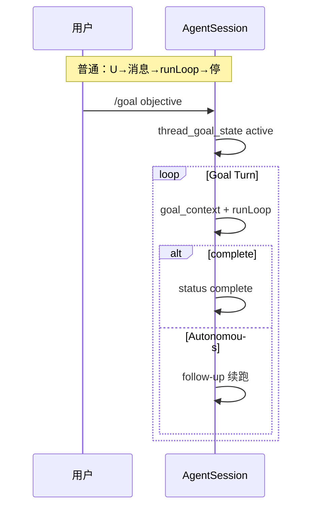
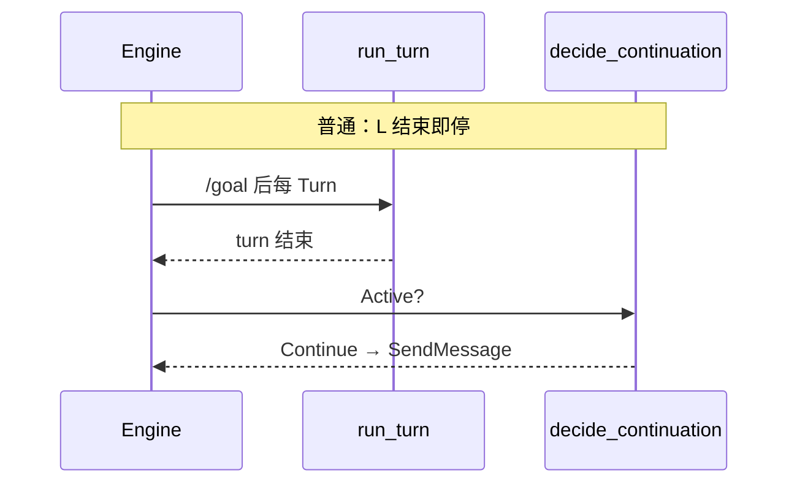

## 2. 怎么读每一节：统一对照维度

下面每个 Harness 都用 **同一套表头** 对比 **普通对话** 与 **Goal 模式**（若该产品没有 Goal，则只写普通，并说明「goal 字样指什么」）。

| 维度 | 问什么 |
|------|--------|
| **用户入口** | 普通怎么发任务；Goal 怎么声明 objective |
| **会话真源** | 消息/事件写在哪；Goal 状态写在哪（与聊天是否分离） |
| **单轮边界** | 什么叫「一轮结束」（Turn / Task / `run()`） |
| **每轮多出来的上下文** | 除历史消息外，系统固定注入什么 |
| **轮结束后** | 会不会自动开下一轮；谁触发 |
| **模型侧工具/API** | 能否 `complete`、Judge、Verifier、long_task… |
| **验收** | 谁判定「整体做完」 |
| **熔断** | token、轮次、gap、blocked 阈值 |
| **与 Plan/Todo 关系** | 能否同时开；是否互斥 |

---

## 3. 分 Harness：普通模式 vs Goal 模式

---

### 3.1 prime-agent（Prime / Pi 产品层）

**定位**：Goal 在 **`AgentSession`（coding-agent 产品层）**，不在 `pi-agent-core`。普通 Pi 用户若只跑 core，没有下表 Goal 列。

#### 普通模式（默认聊天）

| 维度 | 行为 |
|------|------|
| 入口 | 用户直接发消息或 slash（非 `/goal`） |
| 真源 | JSONL 会话树（消息 + 其它 custom entry），**无** `thread_goal_state` |
| 单轮 | `runLoop`：一次 LLM↔tools 直到本 turn 结束 |
| 注入 | `buildSessionContext`：**无** `<goal_context>` |
| 轮结束后 | **停**；续聊靠用户下一条消息，或内存队列 **`followUp`**（仍是「用户/产品显式塞消息」，不是 objective 合约） |
| 工具 | 常规 coding 工具 + skills；**无** goal skill 合约 |
| 验收 | 无「整任务完成」门；模型停即停 |
| 熔断 | 会话级 token/步数由产品配置，**与 Goal budget 无关** |

#### Goal 模式（`/goal` + 可选 Autonomous）

| 维度 | 行为 |
|------|------|
| 入口 | `/goal [--budget &lt;tokens&gt;] &lt;objective&gt;`；`clear` / `pause` / `resume` / `status` |
| 真源 | **`thread_goal_state`** custom entry（flush 后可恢复）；字段含 `status`、`objective`、`tokenBudget`、`tokensUsed`、`continuationsUsed` |
| 单轮 | 同上 `runLoop`，但每轮记得总目标 |
| 注入 | **`createGoalContextMessage()`** → `customType: goal_context`（明确：结束本轮 ≠ 完成总目标） |
| 轮结束后 | 若仍 `active` 且 **Autonomous**：**admit continuation follow-up**（自动再开一轮）；若用了 `rlm.run()` 等子 agent，常等 quiet 后再续 |
| 工具 | **goal skill**：`goal.get` / `goal.create` / `goal.complete` → `handleGoalHostRequest()`；须在 ipython **`await goal.complete()`** |
| 验收 | **模型调 complete** + 文档要求 **对照 objective 审计**；可选产品层 `pnpm check`（用户配置） |
| 熔断 | `tokenBudget` 用尽 → `budget_limited`；可 pause |

#### 并排对照

| 维度 | 普通 | Goal |
|------|------|------|
| 跨 Turn 总目标 | 无结构化字段 | `thread_goal_state.objective` |
| Turn 末自动续跑 | 否（除非手动 followUp） | Autonomous → 是 |
| 完成门 | 无 | `goal.complete()` |
| 与 `/refine` | 正交：refine 改 harness 能力，goal 改「要办完什么」 | 见 [GOALS_AND_REFINE](../../prime-agent-architecture/GOALS_AND_REFINE.md) |

**深潜**：[GOALS_AND_REFINE](../../prime-agent-architecture/GOALS_AND_REFINE.md) · `packages/coding-agent/src/core/goals.ts`

---

### 3.2 pi（内核）与 pi-goal 插件

| | **Pi 内核**（`pi-agent-core`） | **pi-goal 插件** | **Prime 产品** |
|--|-------------------------------|------------------|----------------|
| 普通 | `prompt` → `runLoop`；steer/followUp 队列 | 同左 + 可装插件 | 同 Prime §3.1 普通列 |
| Goal | **无** | `/goal`；JSON 文件存会话目录；continuation 在 turn 干净结束时注入；`update_goal(complete)` | **§3.1 Goal 列**（更完整：JSONL 真源 + Autonomous） |
| 验收 | — | complete + 部分 fork 用 **evaluator 模型**在 `agent_end` 判 Met/Impossible | `goal.complete()` + 审计 |

**深潜**：[pi-plugins-design §5](../../pi-agent/pi-plugins-design.md)

---

### 3.3 CodeWhale

**定位**：Goal 在 **Engine + thread state + GoalState 工具**；`decide_continuation` 是纯函数（`crates/runtime/src/goal_loop.rs`）。

#### 普通模式

| 维度 | 行为 |
|------|------|
| 入口 | TUI/客户端正常发消息；**未** `/goal` |
| 真源 | thread 消息历史；**无** active 的持久 goal 状态机驱动续跑 |
| 模式 | **Agent / Plan / Fleet** 等 `AppMode`；Plan 只读、禁写工具 |
| 单轮 | `run_turn` 跑完即停 |
| 轮结束后 | **不会** `goal_continuation_message_if_needed`（无 active goal） |
| 验收 | 无 Goal 合约 |

#### Goal 模式

| 维度 | 行为 |
|------|------|
| 入口 | `/goal &lt;objective&gt;` [budget 相关配置] |
| 真源 | **thread goal** + **`GoalState` 工具**（`crates/tui/src/tools/goal.rs`） |
| 注入 | 每 Turn 注入 objective + goal 工具面 |
| 单轮 | 同上 `run_turn` |
| 轮结束后 | **`decide_continuation`**：Completed/Blocked → 停；可选 **enforce_token_budget**；`max_continuations`；否则 **Continue** → `continuation_wait` + **SendMessage** |
| 验收 | **GoalReview**：**critical** 记 gap；同一 gap set **3 次** → pause；Fleet **GoalGate** + critical Verifier |
| 熔断 | gap stall、续跑次数、可选 token 硬停（默认 token 超限常仅 telemetry） |

#### 并排对照

| 维度 | 普通 Agent Turn | Goal |
|------|-----------------|------|
| Turn 末自动消息 | 否 | `decide_continuation` → 可能 SendMessage |
| Verifier | Fleet 任务可用，非 session `/goal` 语义 | goal 工具 + critical gap |
| Plan 模式 | 可开 Plan 只读 | 与 Prime 类似：长任务自治与 Plan 权限需产品层互斥设计 |

**深潜**：[codewhale-architecture](../../codewhale-architecture/ARCHITECTURE.md) · `WORKFLOWS_GOAL_PARITY.md`

---

### 3.4 deepseek-harness（DSH）

**定位**：Goal 是 **Cordis 插件组**；与 **harness-sdk（Strands）** 无关。普通 session 可完全不挂 `dsh-goal`。

#### 普通模式（未挂 goal 或未 create）

| 维度 | 行为 |
|------|------|
| 入口 | 人类 `followup` / 聊天 |
| 真源 | Session **事件日志**；messages 为投影 |
| 驱动 | `ReactLoopAgent`：idle → kick → turn/step |
| 轮结束后 | **idle**；**无** `goal-round-driver` 则不会自动 goal 轮 |
| Goal 工具 | 未挂载则无 `create_goal` |

#### Goal 模式（`dsh-goal` + `dsh-tool-goal` + 可选 `dsh-goal-round-driver`）

| 维度 | 行为 |
|------|------|
| 入口 | 人类顶层 **`create_goal`** 或 **`/goal`**（`dsh-command-goal`）；自主轮可 `complete`/`blocked` |
| 真源 | **`ctx.goals`**：`GoalSnapshot`（phase、objective、`maxGoalRounds`）、`goal/changed` 事件 |
| 武装 | **`activation: armed`** 才自动续跑；resume/fork 后 **disarmed**，须人再武装 |
| 单轮 | driver 在 idle 排队 **`<goal_round>`** 用户消息（带 objective、round/cap） |
| 轮结束后 | idle + armed + 有余量 → 下一 goal round；用尽 → **`round-limit`** blocker |
| 验收 | **`update_goal(complete|blocked)`**；autonomous **blocked** 须连续 **N 轮**（默认 3，`blockedAfterConsecutiveRounds`） |
| 权限 | create/edit/pause 须 **人类顶层 turn**；complete/blocked 可在 goal round |

#### 并排对照

| 维度 | 普通 DSH session | Goal |
|------|------------------|------|
| 跨 Turn objective | 无服务字段 | `GoalSnapshot` |
| Turn 末自动开轮 | 仅 inbox 里还有人消息 | **round-driver** |
| 与 Pi | 见 [05-对照-Pi-与-DSH](../../deepseek-harness/05-对照-Pi-与-DSH.md) | DSH 真源是 **事件**，不是 Pi 的 `AgentMessage[]` 为主 |

**深潜**：[goal 子系统](../../../deepseek-harness/docs/subsystems/goal.md) · [tool-goal README](../../../deepseek-harness/packages/goal/tool-goal/README.md)

---

### 3.5 grok（Grok Build）

**定位**：**Plan mode** 与 **Goal harness** 是 **两条正交路径**（文档 II.4.2–II.4.3）。

#### 普通主 Session（非 Goal）

| 维度 | 行为 |
|------|------|
| 入口 | 用户消息；可 **Shift+Tab Plan**、`task` 子 session |
| 驱动 | 单 SessionActor **一个** `running_task`；Turn 内工具循环 |
| Plan | 只改 plan 文件、**ask_user**、用户批准 **exit_plan_mode** 后才能写代码 |
| 结束 | 模型停或用户停；**无** Goal 外环 |

#### Goal harness

| 维度 | 行为 |
|------|------|
| 入口 | `/goal` 类；写 **checklist → GOAL.md**（与压缩隔离） |
| 结构 | **外层 Goal 循环** + 内层 Turn **同一消息管道** |
| 角色 | Planner（验收契约）→ Implementer（**禁止追问用户**）→ **Verifier 面板** → 卡住 → Strategist（只改 HOW） |
| 验收 | **独立评估器** + Verifier；**BudgetExhausted** 等终态 |
| 与 Plan | Plan=人拍板；Goal=自动推进+验收，**不能当 Plan 用** |

| 对比 | 普通 + Plan | Goal |
|------|-------------|------|
| 用户是否参与方案 | **是**（ask_user、批 plan） | **否**（Goal 禁止追问） |
| 自动续跑到完成 | 否 | **外环 Continue** |

**深潜**：[grok-build ARCHITECTURE §Goal](../../grok-build-architecture/grok-build/ARCHITECTURE.md) · Plan vs Goal 表 §II.4.2

---

### 3.6 nanobot

#### 普通模式

| 维度 | 行为 |
|------|------|
| 入口 | IM/WebUI 消息；slash 非 `/goal` |
| 真源 | Session **JSONL** |
| 单轮 | `TurnContext` FSM + `AgentRunner` 内多 iteration |
| 轮结束后 | **停**；等下一条 inbound |
| 注入 | Runtime Context（时间、channel…）；**无** goal 行 |

#### Goal 模式（Sustained Goals）

| 维度 | 行为 |
|------|------|
| 入口 | **`/goal`**（`command/builtin.py`） |
| 真源 | **`session/goal_state.py`** → session metadata |
| 注入 | **`goal_state_runtime_lines()`** → ContextBuilder |
| 工具 | **`long_task.py`** 生命周期 |
| 轮结束后 | **`turn_continuation.py`**：`allow_goal_continue=True` 时可排水续跑；**wall-clock** `runner_wall_llm_timeout_s` |
| 验收 | long_task / goal 工具链（Codex 式长程描述） |

| 对比 | 普通 Turn | Goal |
|------|-----------|------|
| metadata.goal | 无/idle | active objective |
| assistant 结束后 | 结束 Runner | 可能注入 continuation |

**深潜**：[NANOBOT §6.3 / 第12章](../../nanobot/NANOBOT_ARCHITECTURE.md)

---

### 3.7 openhands / openhands sdk

**说明**：**openhands** 产品与 **software-agent-sdk** 共用 **`GoalController` / `run_goal` / `judge_goal`** 文档线。

#### 普通模式

| 维度 | 行为 |
|------|------|
| 入口 | `conversation.send_message` + **`run()`** |
| 单轮 | 一次 **`run()`** = 内部多 step 直到停 |
| 轮结束后 | **停**；无 Judge 外环 |
| 多 Agent | **`delegate` tool**（父 LLM 决定派工） |

#### Goal 模式（`run_goal`）

| 维度 | 行为 |
|------|------|
| 入口 | **`run_goal(conv, objective, judge_llm)`** 或 agent-server **`/goal`** |
| 外环 | **GoalController**：每轮 `run()` 结束 → **`judge_goal(objective, events)`** |
| 真源 | 同一 **Conversation 事件流**；状态经 **`ConversationStateUpdateEvent`** 恢复 |
| 续跑 | Judge 未 complete → 把缺失项作 followup → 再 `run()` |
| 验收 | **独立 Judge LLM**（非主模型 `complete()`） |
| 熔断 | **`max_iterations`** |
| 与 Critic | **Critic** = 单次 `run()` **内**微调；**GoalController** = **多次 run** 外环 |

| 对比 | `conversation.run()` | `run_goal` |
|------|----------------------|------------|
| 完成谁说了算 | 主 agent 停 | **Judge LLM** |
| 会话 | 同一 Conversation | 同一（不 fork） |

**深潜**：[openhands-sdk PART1 §7](../../openhands-sdk/ARCHITECTURE_PART1.md)

---

### 3.8 penguin-harness

#### 普通模式

| 维度 | 行为 |
|------|------|
| 入口 | `session.run(messages)` **无** `opts.goal` |
| 路径 | **`runTask`** → **ContextEngine** 单 Task ReAct |
| 结束 | Task 终态即停 |

#### Goal 模式

| 维度 | 行为 |
|------|------|
| 入口 | `session.run(..., { goal: { budget } })`；CLI/Web **`/goal`** |
| 路径 | **`runGoalLoop` 外环**；每轮仍是 **普通 Task**（内环不变） |
| 真源 | 启动写 **`GOAL.yaml`**（objective 真值在 **外环内存** + 每轮 `[goal]` 块）；模型只可写 status **complete/blocked** |
| 终态 | 流事件 **`goal_finished`**；budget_limited 等 **不写回 YAML** |
| 验收 | 轮次预算 + 硬帽；解析失败 → **blocked** 停 |

| 对比 | `runTask` | `runGoal` |
|------|-----------|-----------|
| Session API | `run(msgs)` | `run(msgs, { goal })` |
| 内环引擎 | ContextEngine | **相同** |

**深潜**：[ARCHITECTURE_PART2 §4](../../penguin-harness/ARCHITECTURE_PART2.md)

---

### 3.9 opencode

| | **OpenCode 核心** | **+ goal 插件** |
|--|-------------------|-----------------|
| 普通 | EventV2 Provider Turn；用户消息驱动 | 同左 |
| Goal | **无内置 `/goal`** | 文档：**常驻目标 + auto-continue**（对齐 Prime 式） |
| 对比 | 每 Turn 由用户/产品触发 | 插件在 Turn 末 **admit** 续跑 |

**深潜**：[PLUGINS](../../opencode-architecture/PLUGINS.md)

---

### 3.10 codex

| | **普通跨 Turn 聊天** | **单 Turn 内** | **Goal 相关产品态** |
|--|----------------------|----------------|---------------------|
| 行为 | 用户新 submit / 邮箱 | **`needs_follow_up`** 工具链未清则继续 **Step** | `goals.db` 等投影；**非** Prime `thread_goal_state` |
| vs Goal | Turn 结束 **不**应悄悄 auto 跨 Turn follow-up（Plan 模式禁止） | **不是** Goal 的「自动续跑」 | **pi-goal** 文档称移植 **Codex goal spec** |

**深潜**：[codex-architecture](../../codex-architecture/README.md) · [05-plan-mode](./05-plan-mode.md)

---

### 3.11 hermes

| | **普通 gateway 会话** | **`/goal` + Kanban** |
|--|----------------------|----------------------|
| 焦点 | 单会话消息 + 工具 | **Durable Kanban** 多卡片（G3） |
| `/goal` | — | 文档级 **弱** 目标追踪 |
| 续跑 | **gateway auto-resume** 常为 **断线重连** | 勿与「objective 未完成」混 |
| 验收 | — | 卡片 **Done** |

**深潜**：[FEATURE_DESIGN_CATALOG](../../hermes-agent-architecture/FEATURE_DESIGN_CATALOG.md)

---

### 3.12 agentscope

| | **普通 `reply_stream`** | **`GoalPipeline`** |
|--|-------------------------|-------------------|
| 范围 | 一次调用 | **同一调用内** Executor↔Verifier 循环 |
| session GoalState | 无 | 无 |
| 验收 | 无 | **VerificationResult** schema |
| vs `/goal` | — | **不是** 跨 Turn Autonomous |

**深潜**：[PIPELINE_AND_GOALS](../../agentscope/PIPELINE_AND_GOALS.md)

---

### 3.13 openharness 与 harness-sdk（Strands）

| | **OpenHarness** | **Strands `create_harness()`** |
|--|-----------------|--------------------------------|
| 普通 | QueryEngine 多轮；用户续聊 | `event_loop_cycle` 同 invocation 多 tool step |
| `goal` 字样 | **`task_focus_state`** metadata | **无** |
| 注入 | 工具读 metadata，**无**固定每轮 goal 块 | todos 插件临时清单 |
| Goal 模式 | **本仓无** | **本仓无** |

---

### 3.14 GenericAgent

| | **普通 CL 任务** | **Goal Hive** |
|--|------------------|---------------|
| 入口 | `CL(..., goal="任务句")` 一次任务 | **goal_state.json** + master/worker SOP |
| 性质 | 单通道任务描述 | **多 worker 协议**（非单一二进制 `/goal`） |
| 验收 | 任务完成即停 | **done_prompt** + `goal_hive_master_duty.md` |

**深潜**：[RUNTIME_PROMPT_AND_MEMORY_ZH](../../GenericAgent/RUNTIME_PROMPT_AND_MEMORY_ZH.md)

---

### 3.15 LongHorizon-Harness

| | **内环（外部 CLI Agent）** | **外环 MEA** |
|--|---------------------------|--------------|
| 普通 | Adapter 驱动一轮 CLI | 经理 **next_step** 循环 |
| Goal | 内环 **无** session `/goal` | 外环 **可选 Goal/Workflow**；验收靠 **Auditor + 门禁**（非 Judge API 一种） |
| vs DSH | 不拥有 loop | 对比见 [PART3 §6](../../LongHorizon-Harness/ARCHITECTURE_PART3.md) |

---

### 3.16 其余项目（无真·Goal：普通 vs「goal 字样」）

| 项目 | 普通怎么用 | 名叫 goal 的东西 | Goal 模式 |
|------|------------|------------------|-----------|
| **claudecode** | CLI/SDK 对话 | 厂商内策略，仓内未展开 | **无** 对标 Prime 的文档 |
| **mag（MAF）** | Workflow + Agent turn | `instructions` 人设 | **无** |
| **openai** SDK | `Runner.run` | `delegate(goal="...")` **参数字符串** | **无** session 模式 |
| **crewai** | Crew 任务轮 | `Agent.goal` 角色 prompt | **无** |
| **openhuman** | 对话 + RPC | `goal_set/get/complete` **线程契约** | **非** Grok/Prime 整套 |
| **deeptutor** | 教学对话 | `learning_goals` **画像槽** | **无** coding `/goal` |
| **deer-flow / deepagents** | 图节点 step | Todo/checkpoint | **无** thread_goal_state |
| **metagpt** | env 轮 | `Plan.goal` 规划总述 | **无** Autonomous |
| **openmanus** | PlanningFlow | 步骤计划 | **无** |
| **smolagents** | 最小 loop | — | **无** |
| **SoL-Pi** | `update_plan` | 字段 **`goal`**=步骤描述 | **无** |

---
